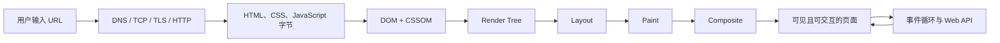

# 前端基础面试指南

> 本文根据本目录中的英文讲义整理为中文面试笔记。它不是逐句直译，而是围绕“概念是什么、为什么、如何落地、面试容易追问什么”重新组织。每节标题都链接到对应英文原文，便于继续深挖。

## 使用方式

- 第一轮先看“全局知识地图”和每节“核心结论”，建立完整框架。
- 第二轮遮住“面试回答”，尝试在 60～90 秒内自己讲清楚。
- 第三轮做文末 25 道自测题，并针对回答不完整的主题回看原文。
- 面试回答不要只背定义，应至少包含：工作原理、实际取舍、一个常见陷阱。

## 全局知识地图

| 主线 | 核心问题 | 重点主题 |
| --- | --- | --- |
| 平台基础 | 浏览器如何表示页面并响应用户操作？ | 语义化 HTML、DOM、事件、表单、Web Components |
| 渲染与交付 | 代码如何变成像素，HTML 在哪里生成？ | 关键渲染路径、事件循环、CSR/SSR/SSG/ISR、PWA |
| 网络与存储 | 数据如何传输、缓存、跨域和持久化？ | HTTP、TLS、REST、Fetch、CORS、Cookie、缓存、IndexedDB |
| 横切能力 | 如何让页面更快、更安全、更通用？ | 无障碍、性能、安全、SEO、响应式、国际化、字符编码 |



---

## 一、平台基础

### 1. [从 URL 到页面渲染](topics/how-the-web-works-request-render.md)

**核心结论：** 一个 URL 变成像素分为两段：先通过 DNS、TCP、TLS、HTTP 拿到字节，再把 HTML/CSS/JS 转换为 DOM、CSSOM、渲染树，依次完成布局、绘制和合成。

完整链路可以这样描述：

1. 浏览器解析 URL，检查缓存、Service Worker 和 HSTS。
2. DNS 将域名解析为 IP，浏览器与服务器建立 TCP 连接；HTTPS 还要完成 TLS 握手。
3. 浏览器发送 HTTP 请求，服务器或 CDN 返回状态码、响应头和响应体。
4. HTML 解析器流式构建 DOM；预加载扫描器提前发现 CSS、JS、图片等资源。
5. CSS 构建 CSSOM；DOM 与 CSSOM 合成渲染树。
6. 浏览器计算元素几何位置（layout），生成绘制指令（paint），最后由合成器组合图层（composite）。

**面试回答：** “我会把过程分成网络和渲染两半。网络侧是 DNS → TCP → TLS → HTTP，并考虑缓存和 CDN；渲染侧是 HTML/CSS 分别生成 DOM/CSSOM，再经过 render tree → layout → paint → composite。CSS 阻塞渲染，同步脚本阻塞 HTML 解析；因此优化重点是减少关键请求和字节、`defer` 非关键脚本、预加载真正关键的资源，并避免运行时强制同步布局。”

**高频陷阱：** CSS 本身不阻塞 HTML 解析，但位于样式表之后的同步脚本可能读取计算样式，所以脚本必须等待 CSSOM，CSS 会间接阻塞解析。HTTP/2 只解决 HTTP 层的队头阻塞，丢失一个 TCP 包仍会阻塞全部流，这也是 HTTP/3 使用 QUIC 的原因之一。

### 2. [语义化 HTML](topics/semantic-html.md)

**核心结论：** 语义化是按照内容的含义选择元素，而不是按照默认样式选择元素。正确元素会免费提供键盘行为、焦点能力、无障碍角色和浏览器默认行为。

- 页面地标优先使用 `header`、`nav`、`main`、`aside`、`footer`。
- 独立、可单独分发的内容用 `article`；有主题且通常有标题的分区用 `section`；没有语义时才用 `div`。
- 导航到另一个地址用 `a`，触发当前页面动作使用 `button`。
- 标题级别表达结构，不表达字号；样式交给 CSS。
- 装饰图片使用 `alt=""`，信息图片提供能替代图片内容的 `alt`。

**面试回答：** “语义化 HTML 的主要价值是无障碍和原生行为，SEO 是附加收益。比如原生 `button` 自带角色、焦点、Enter/Space 激活和禁用语义，而 `div onclick` 需要重写这些能力且很容易遗漏。我遵循原生元素优先、ARIA 补充语义、CSS 控制外观的顺序。”

**高频陷阱：** 没有可访问名称的 `section` 通常不会成为 `region` 地标；`b/i` 偏展示，`strong/em` 表达重要性和强调；省略 `alt` 与显式写 `alt=""` 含义不同。

### 3. [DOM](topics/the-dom.md)

**核心结论：** DOM 是浏览器根据 HTML 构建的、存在于内存中的对象树，也是 JavaScript 读写页面的接口。HTML 源码、DOM 和最终像素不是同一个东西：解析器会修正 HTML，脚本会修改 DOM，CSS 则决定 DOM 节点如何显示。

- `Node` 是基础接口，`Element`、`Text`、`Document` 都是不同节点类型。
- `childNodes` 包含文本和注释节点，`children` 只包含元素。
- `querySelectorAll` 返回静态 `NodeList`；`getElementsBy*` 通常返回动态 `HTMLCollection`。
- `textContent` 读取节点文本且不关心布局；`innerText` 读取可见文本，可能触发布局计算；不可信内容不要交给 `innerHTML`。

**面试回答：** “DOM 是浏览器提供的实时对象树，不等于 HTML 源码。解析器可能自动补出 `tbody`，JavaScript 也能在加载后修改节点，因此 view-source 和 Elements 面板会不同。操作时我会区分节点与元素、静态与动态集合，并尽量用 `textContent` 和结构化 DOM API，避免把不可信字符串交给 `innerHTML`。”

**高频陷阱：** `NodeList` 不是数组；空白也会形成 `Text` 节点；`document.write()` 在文档加载后执行可能清空整个页面；DOM 是浏览器宿主 API，不是 JavaScript 语言本身的一部分。

### 4. [DOM 操作与遍历](topics/dom-manipulation-traversal.md)

**核心结论：** DOM 操作的性能关键不是某个选择器快几微秒，而是不要交错进行布局读取和样式写入。写入后立刻读取 `offsetHeight`、`getBoundingClientRect()` 等布局属性会迫使浏览器同步刷新布局，循环中这样做就是 layout thrashing。

```js
// 差：每次写入后马上读取，可能触发 N 次同步布局
items.forEach((item) => {
  item.style.width = `${container.offsetWidth / 2}px`;
});

// 好：先完成所有读取，再统一写入
const width = container.offsetWidth / 2;
items.forEach((item) => {
  item.style.width = `${width}px`;
});
```

批量插入节点时可使用 `DocumentFragment` 或一次性追加；高频视觉更新放到 `requestAnimationFrame`；需要表达移动和透明度变化时优先修改 `transform`、`opacity`。

**面试回答：** “浏览器会批处理 DOM 写入，但读取布局相关属性时必须返回当前准确值，于是会强制结算之前的样式和布局。我的优化方法是阶段分离：先读完全部尺寸，再统一写；批量插入先在离屏的 `DocumentFragment` 中构建，最后一次挂载。”

### 5. [事件处理、冒泡与委托](topics/event-handling-bubbling-delegation.md)

**核心结论：** DOM 事件依次经历捕获阶段（根到目标）、目标阶段和冒泡阶段（目标到根）。事件委托利用冒泡，只在稳定祖先上注册一个监听器，再通过 `event.target.closest()` 找到实际操作元素。

```js
list.addEventListener('click', (event) => {
  const button = event.target.closest('[data-action="delete"]');
  if (!button || !list.contains(button)) return;
  removeItem(button.dataset.id);
});
```

- `target` 是事件最初发生的节点，`currentTarget` 是当前监听器绑定的节点。
- `stopPropagation()` 阻止继续传播；`preventDefault()` 阻止默认行为，两者不是一回事。
- `focus`、`blur` 不冒泡，可改用 `focusin`、`focusout` 或捕获阶段。
- 委托适合大量或动态节点，但并非所有事件都冒泡，复杂边界也可能降低可读性。

**面试回答：** “委托的主要收益不只是减少监听器，还包括自动支持后来插入的节点。我会把监听器放在稳定容器上，用 `closest` 处理按钮内部图标成为 `target` 的情况，并检查匹配节点确实属于当前容器。”

### 6. [虚拟 DOM](topics/virtual-dom.md)

**核心结论：** 虚拟 DOM 是描述目标 UI 的轻量 JavaScript 对象树。框架比较新旧树并把必要变更提交到真实 DOM。它的价值是让声明式编程的成本可接受，而不是比精心编写的原生 DOM 操作更快。

- 通用树比较复杂度可达 O(n³)，框架依靠“不同类型视为不同子树”和稳定 `key` 等假设把常见比较降到 O(n)。
- `key` 表示节点身份，不是消除警告的字段。列表插入、删除或排序时使用索引会让状态落到错误项目上。
- 组件重新执行不等于真实 DOM 一定变更，更不等于浏览器一定重绘。
- React 并发能力使渲染工作可中断和分优先级，不会让 diff 本身凭空变快。

**面试回答：** “虚拟 DOM 不是性能魔法，而是框架为声明式 UI 支付的一层比较成本。真正的收益是框架能集中调度并批量提交最少的 DOM 变化。列表 `key` 必须代表稳定业务身份，否则位置变化后组件状态会错配。”

**高频陷阱：** Virtual DOM 与 Shadow DOM 完全无关，前者是框架的协调策略，后者是浏览器原生封装边界。

### 7. [Shadow DOM 与 Web Components](topics/shadow-dom-web-components.md)

**核心结论：** Web Components 主要由 Custom Elements、Shadow DOM 和 `template` 三项浏览器能力组成，用于构建可复用、自包含的原生组件。Shadow DOM 隔离选择器和样式规则，但继承属性仍可穿过边界。

```js
class UserCard extends HTMLElement {
  connectedCallback() {
    const root = this.attachShadow({ mode: 'open' });
    root.innerHTML = `<style>:host { display: block }</style><slot></slot>`;
  }
}
customElements.define('user-card', UserCard);
```

- 自定义元素名称必须包含连字符。
- `slot` 让宿主页面把 Light DOM 内容投射进组件。
- 外部可通过 CSS 自定义属性和 `::part()` 提供受控主题能力。
- 跨越 Shadow DOM 边界时事件会被重定向；用 `composedPath()` 查看真实路径，自定义事件需要 `composed: true` 才能穿出边界。

**高频陷阱：** `mode: 'closed'` 只是 API 可见性限制，不是安全边界；普通 `document.querySelector()` 无法直接进入 shadow root，这会影响测试和埋点。

### 8. [表单与校验](topics/forms-validation.md)

**核心结论：** 原生 `form`、`label` 和约束校验 API 已经提供 Enter 提交、自动填充、键盘操作和基础校验。客户端校验只改善用户体验，服务器必须再次校验所有输入。

```html
<form id="signup" novalidate>
  <label for="email">邮箱</label>
  <input id="email" name="email" type="email" required
         aria-describedby="email-error">
  <span id="email-error" role="alert"></span>
  <button type="submit">注册</button>
</form>
```

- `name` 决定字段是否进入 `FormData` 和原生提交数据。
- `novalidate` 关闭浏览器自带提示气泡，但不会移除 `validity`、`checkValidity()`、`setCustomValidity()` 等 API。
- 错误状态使用 `aria-invalid`，错误说明通过 `aria-describedby` 关联；提交失败后聚焦第一个无效字段。
- 合理时机是失焦后首次校验，已处于错误状态的字段再随输入实时复检。

**高频陷阱：** `placeholder` 不是 label；按钮在表单内默认通常是 `submit`；`role="alert"` 节点最好预先存在，再更新内容以确保辅助技术播报。

---

## 二、渲染与交付

### 9. [渲染策略：CSR、SSR、SSG 与 ISR](topics/rendering-strategies-csr-ssr-ssg-isr.md)

**核心结论：** 四种策略的区别是 HTML 在哪里、何时生成。

| 策略 | 生成时机 | 优点 | 主要代价 | 适用场景 |
| --- | --- | --- | --- | --- |
| CSR | 浏览器运行时 | 服务器简单，页面切换灵活 | 首屏依赖 JS，SEO 和低端设备体验较弱 | 登录后的交互型应用 |
| SSR | 每次请求时 | 内容新鲜，首屏 HTML 完整 | TTFB 和服务器成本增加，还需水合 | 个性化、实时公开页面 |
| SSG | 构建时 | CDN 直出，速度快、稳定 | 内容更新要重建 | 文档、博客、营销页 |
| ISR | 构建后按时间或请求刷新 | 接近静态性能且可更新 | 可能读到旧内容，失效模型更复杂 | 大规模内容站、电商详情 |

**面试回答：** “我不会说 SSR 一定更快。它通常改善 FCP/LCP，却可能增加 TTFB，且页面在水合完成前未必可交互。选择时看内容新鲜度、个性化、SEO、构建规模和基础设施成本；一个应用也可以按路由混合使用多种策略。”

**高频陷阱：** SSG 不等于零 JavaScript；服务端和客户端输出受时间、随机数、浏览器 API 影响时会产生 hydration mismatch；Google 能执行 JS 不代表纯 CSR 对所有爬虫都可靠。

### 10. [关键渲染路径](topics/critical-rendering-path.md)

**核心结论：** 关键渲染路径是浏览器将 HTML、CSS、JS 变成首屏像素的过程：DOM + CSSOM → render tree → layout → paint → composite。优化目标是减少阻塞首次渲染的资源数量、体积和依赖深度。

- CSS 阻塞渲染；内联少量首屏关键 CSS，其余样式合理拆分和加载。
- 普通同步脚本阻塞解析；保持依赖顺序的脚本用 `defer`，互不依赖的脚本才考虑 `async`。
- `preload` 用于当前导航确定需要的高优先级资源，滥用会与真正关键资源争带宽。
- 运行阶段把 DOM 读取与写入分批；动画优先使用 `transform` 和 `opacity`，尽量停留在合成阶段。

**高频陷阱：** `display: none` 节点不会进入渲染树，`visibility: hidden` 仍占布局空间；布局影响几何，绘制生成像素，合成只组合已有图层，三者成本不同。

### 11. [事件循环](topics/event-loop.md)

**核心结论：** JavaScript 主线程只有一个调用栈。当前任务执行完、栈清空后，事件循环会清空整个微任务队列，然后浏览器才有机会渲染，再处理下一个任务。

```js
console.log('A');
setTimeout(() => console.log('B'), 0);
Promise.resolve().then(() => console.log('C'));
console.log('D');
// A, D, C, B
```

- 微任务：Promise 回调、`await` 后续、`queueMicrotask`、MutationObserver。
- 任务（常称宏任务）：定时器、I/O、UI 事件、`MessageChannel`。
- `requestAnimationFrame` 在绘制前执行，适合视觉更新；`requestIdleCallback` 利用空闲时间。
- 微任务清空过程中新增的微任务也要继续执行，所以无限微任务链会让页面无法绘制。

**面试回答：** “一轮中先把当前任务运行到结束，再清空全部微任务，然后浏览器才可能渲染，之后取下一个任务。因此 Promise 回调早于零延迟定时器。超过约 50ms 的长任务会伤害 INP，我会把工作切片并让出主线程，或把纯计算移到 Web Worker。”

**高频陷阱：** `setTimeout(fn, 0)` 不是立即执行；`await` 即使等待已完成值，也会把后续部分排入微任务；Web Worker 能并行计算，但不能直接操作 DOM。

### 12. [SEO 基础](topics/seo-fundamentals.md)

**核心结论：** 前端 SEO 可以归纳为三个目标：页面可抓取、内容可渲染、含义可理解。

- 使用真实 `<a href>` 和可返回正确 HTTP 状态码的路由。
- 为页面提供唯一、准确的 `title`、description、canonical 和社交分享元数据。
- 用语义 HTML、标题结构和 JSON-LD 结构化数据帮助理解内容。
- sitemap 帮助发现 URL；`robots.txt` 控制抓取；meta robots 的 `noindex` 控制索引，三者职责不同。
- 处理重复 URL、重定向、分页和 Core Web Vitals。

**面试回答：** “我先保证重要内容能通过真实链接到达，并在初始 HTML 中可读；然后用正确状态码、canonical、meta 和结构化数据表达页面含义。最后检查 LCP、INP、CLS。`robots.txt` 不是删除索引的工具，已经被索引的页面需要允许抓取到 `noindex`。”

**高频陷阱：** 客户端渲染的“未找到”页面若仍返回 200，就是 soft 404；没有真实 `href` 的点击处理器不利于爬虫发现；首屏主图不应懒加载。

### 13. [渐进式 Web 应用（PWA）](topics/progressive-web-apps-pwa.md)

**核心结论：** PWA 是普通网站叠加 Service Worker、Web App Manifest 和 HTTPS 后获得的可安装、可离线平台能力，不是某个框架。

- Service Worker 运行在独立线程中，可拦截请求并实现缓存策略，但不能操作 DOM。
- Manifest 描述名称、图标、启动地址、显示模式等安装信息。
- 常用缓存策略包括 cache-first、network-first 和 stale-while-revalidate，应按资源性质选择。
- 新 Service Worker 安装后通常进入 waiting，旧页面关闭后才激活；更新流程需要明确设计。

**面试回答：** “我把 Service Worker 看作浏览器里的可编程网络代理。静态指纹资源可 cache-first，实时 API 常用 network-first，容忍短暂旧数据的内容适合 stale-while-revalidate。离线并非自动获得，每类响应都要明确缓存、版本和清理策略。”

**高频陷阱：** 除 localhost 外必须 HTTPS；Service Worker 的控制范围由脚本路径决定，通常应注册在站点根路径；`skipWaiting()` 会加快升级，但新旧页面资源协议不兼容时可能出错。

### 14. [渐进增强](topics/progressive-enhancement.md)

**核心结论：** 先构建单靠 HTML 就能完成核心任务的基础层，再用 CSS 改善呈现、用 JavaScript 增强交互。上层失败时，下层仍然可用。

```html
<!-- 没有 JS 仍能正常访问，JS 只负责增强为局部导航 -->
<a href="/products/42" data-enhance>查看商品</a>
```

渐进增强从可靠的最低能力向上构建；优雅降级则先实现完整体验，再为缺失能力补回退。现代应用即使必须使用 JS，也存在 HTML 已显示但水合尚未完成的时间窗口，因此基础语义仍然重要。

**高频陷阱：** 使用特性检测 `CSS.supports()`、`@supports`、`'IntersectionObserver' in window`，不要依赖 User-Agent 猜浏览器；如果表单的服务器路由根本不能处理原生提交，就不是真正的渐进增强。

### 15. [响应式设计](topics/responsive-design.md)

**核心结论：** 响应式设计用流式尺寸、Flexbox/Grid、媒体查询和容器查询构建一套可适配不同空间的布局。现代组件更应询问“容器有多宽”，而不只询问“屏幕有多宽”。

```html
<meta name="viewport" content="width=device-width, initial-scale=1">
```

```css
.cards { container-type: inline-size; }
@container (min-width: 36rem) {
  .card { grid-template-columns: 10rem 1fr; }
}
```

- 默认采用 mobile-first，再用 `min-width` 增强。
- 图片使用 `max-width: 100%`，需要响应式资源选择时组合 `srcset` 与 `sizes`。
- 媒体查询和字号使用 `rem` 能尊重用户字体设置。
- 移动端动态地址栏场景优先考虑 `dvh`，不要盲目依赖 `100vh`。

**高频陷阱：** 容器查询必须先声明 `container-type`；只有 `srcset` 的 `w` 描述符却没有 `sizes` 时，浏览器会默认图片占 `100vw`；响应式是一套流式布局，自适应设计则通常在断点切换几套固定布局。

---

## 三、网络与存储

### 16. [HTTP 基础](topics/http-fundamentals.md)

**核心结论：** HTTP 是无状态的请求/响应协议。客户端发送方法、URL、请求头和可选请求体，服务器返回状态码、响应头和响应体。认证、缓存、内容协商和跨域都建立在这套消息模型上。

常见方法语义：

| 方法 | 语义 | 安全 | 幂等 |
| --- | --- | :---: | :---: |
| GET | 获取资源 | 是 | 是 |
| POST | 创建资源或执行动作 | 否 | 否 |
| PUT | 完整替换指定资源 | 否 | 是 |
| PATCH | 局部修改资源 | 否 | 通常否 |
| DELETE | 删除资源 | 否 | 是 |

状态码按类别理解：`2xx` 成功、`3xx` 重定向或缓存、`4xx` 客户端问题、`5xx` 服务端问题。`401` 表示尚未认证，`403` 表示身份已知但没有权限；`304` 没有响应体，客户端复用本地缓存。

**面试回答：** “HTTP 自身无状态，登录态来自客户端在每次请求中重复携带 Cookie 或 token。安全方法不能改变服务器状态，幂等方法重复执行应产生相同最终结果，这些语义会影响缓存、预取和失败重试。POST 重试可能重复创建，因此支付等接口要使用幂等键。”

### 17. [HTTPS 与 TLS](topics/https-tls.md)

**核心结论：** HTTPS 是运行在 TLS 安全通道中的 HTTP。TLS 提供加密、完整性和服务器身份认证。握手阶段使用非对称密码和证书建立信任、协商会话密钥，后续大量数据使用更快的对称加密。

简化握手过程：客户端发送支持的版本和算法；服务器返回证书与密钥交换信息；客户端验证证书链、域名和有效期；双方推导相同会话密钥；之后加密传输 HTTP 数据。TLS 1.3 将常规握手缩短到 1-RTT，并默认使用具备前向保密性的临时密钥交换。

**面试回答：** “HTTPS 不只是保密，还防篡改并确认我连接的确实是目标域名。非对称密码只用于认证和建立共享密钥，实际流量用对称密码。证书由受信任 CA 签发，浏览器沿证书链验证到本地信任根。”

**高频陷阱：** 锁图标只说明连接加密且域名通过验证，不代表业务内容可信；IP、DNS 查询和通常的 SNI 主机名仍可能暴露，但 URL path、query、请求头、Cookie 和响应体都在 TLS 内；HTTP 资源混入 HTTPS 页面会产生 mixed content 问题。

### 18. [REST 与 JSON API](topics/rest-json-apis.md)

**核心结论：** REST 是以资源为中心的架构风格，不是“通过 HTTP 返回 JSON”的同义词。URL 表达名词资源，HTTP 方法表达动作，并正确利用状态码、缓存和无状态约束。

```text
GET    /users/42        获取用户
POST   /users           创建用户
PUT    /users/42        完整替换用户
PATCH  /users/42        局部更新用户
DELETE /users/42        删除用户
```

- 列表 API 需要分页、过滤、排序和稳定游标。
- 错误应使用真实 HTTP 状态码和一致的机器可读结构，不能总返回 `200` 再把失败藏在正文。
- API 演进可通过向后兼容字段、URL/header 版本或媒体类型管理。
- REST 容易过度获取或获取不足；复杂页面可考虑 BFF 或 GraphQL，但会增加另一套复杂度。

**高频陷阱：** PUT 语义是完整替换，用部分对象做 PUT 可能清空其他字段；DELETE 幂等指重复执行后的最终状态一致，不要求每次都返回相同状态码；多数所谓 REST API 实际混合了 RPC 风格，这本身不一定错误，但要准确描述。

### 19. [Fetch 与 AJAX](topics/fetch-ajax.md)

**核心结论：** `fetch()` 的 Promise 在响应头到达时完成，响应体是需要另行异步消费的流。它只在网络层失败时 reject，`404`、`500` 仍会 resolve，必须主动检查 `response.ok`。

```js
async function getJSON(url, { signal } = {}) {
  const response = await fetch(url, {
    signal: signal ?? AbortSignal.timeout(8000),
    headers: { Accept: 'application/json' },
  });

  if (!response.ok) {
    throw new Error(`HTTP ${response.status}`);
  }
  return response.json();
}
```

- 响应体通常只能消费一次；需要重复读取时先 `response.clone()`。
- `fetch` 默认没有超时，用 `AbortController` 或 `AbortSignal.timeout()` 取消。
- 跨域携带 Cookie 需设置 `credentials: 'include'`，服务端也必须返回匹配的 CORS 响应头。
- `fetch` 支持下载流，但浏览器端上传进度仍常需 `XMLHttpRequest`。

**面试回答：** “我把 fetch 看成两阶段：先拿响应头，再异步消费 body stream。统一请求封装至少要处理 `response.ok`、超时和取消、解析失败、认证及错误格式。GET 等幂等请求可以有限重试，POST 不能无条件自动重试。”

### 20. [CORS](topics/cors.md)

**核心结论：** 同源策略限制页面 JavaScript 读取其他源的响应；CORS 是服务器用响应头明确允许指定源读取响应的机制，由浏览器执行。它保护浏览器中的用户数据，不是 API 的认证或授权机制，`curl` 不受 CORS 限制。

同源要求 scheme、host、port 都相同。满足特定条件的“简单请求”可直接发送；使用 JSON、自定义请求头或 PUT/DELETE 等非简单请求时，浏览器通常先发送 `OPTIONS` 预检，询问允许的源、方法和请求头。

```http
Access-Control-Allow-Origin: https://app.example.com
Access-Control-Allow-Credentials: true
Vary: Origin
Access-Control-Max-Age: 600
```

**面试回答：** “CORS 错误通常要在服务端配置响应头，而不是在前端请求里添加 `Access-Control-Allow-Origin`。带凭证请求不能搭配通配符 `*`，服务端必须返回具体 Origin，并加 `Allow-Credentials`。动态反射 Origin 时必须先检查白名单并返回 `Vary: Origin`。”

**高频陷阱：** CORS 主要控制响应能否被脚本读取，请求本身往往已经到达服务端，因此它不是 CSRF 防护；`no-cors` 不会绕过限制，只会得到几乎不可读的 opaque response。

### 21. [HTTP 与浏览器缓存](topics/caching-http-browser.md)

**核心结论：** 缓存要区分新鲜度和协商验证：`Cache-Control: max-age` 决定能否完全跳过网络；`ETag`/`Last-Modified` 决定过期后发起验证时返回轻量 `304` 还是完整正文。

```http
# 带内容哈希的静态资源：URL 变即内容变，可长期缓存
Cache-Control: public, max-age=31536000, immutable

# HTML 入口：允许保存，但每次使用前必须验证
Cache-Control: no-cache
ETag: "page-v42"

# 私有用户数据
Cache-Control: private, no-store
```

- `no-cache` 意味着使用前必须验证，不是“不存储”；真正禁止存储是 `no-store`。
- 强 ETag 表示字节一致，弱 ETag `W/` 表示语义等价。
- `stale-while-revalidate` 可先返回稍旧缓存，同时后台刷新。
- 共享 CDN 缓存必须正确设置 `Vary`，绝不能把个性化响应意外标记为 `public`。

**面试回答：** “我的默认策略是两类资源：带内容哈希的 JS/CSS/图片使用一年 `max-age` 加 `immutable`，部署后新内容产生新 URL；HTML 使用 `no-cache` 每次验证，以便及时引用新哈希资源。验证仍要付一次往返延迟，`304` 只省正文传输。”

### 22. [浏览器存储](topics/browser-storage-cookies-localstorage-indexeddb.md)

**核心结论：** 存储方案要按访问模式选择，而不是习惯性都放 `localStorage`。

| 方案 | 容量与数据 | API | 是否随请求发送 | 典型用途 |
| --- | --- | --- | --- | --- |
| Cookie | 约 4KB，字符串 | 同步/服务端设置 | 是 | 会话、服务端需要的小状态 |
| localStorage | 通常数 MB，字符串 | 同步 | 否 | 少量非敏感偏好 |
| sessionStorage | 通常数 MB，字符串 | 同步、按标签页 | 否 | 单标签页临时状态 |
| IndexedDB | 较大、结构化数据 | 异步、事务 | 否 | 离线数据、大量应用数据 |

**面试回答：** “服务器每次请求都需要的会话状态用 Cookie，并优先让认证 Cookie 为 `HttpOnly`。少量、不敏感且读取很轻的偏好可用 localStorage。真正的结构化应用数据或离线数据用异步、事务化的 IndexedDB。它们都可能因配额压力被清理，所以通常应视为服务器真相的缓存。”

**高频陷阱：** localStorage 是同步 API，大量序列化或读写会阻塞主线程；它只能存字符串；任何页面脚本都能读取其中的 token，一旦发生 XSS 就容易被窃取；隐私模式和浏览器策略下的行为不应被当作持久性承诺。

### 23. [Cookie 属性与 SameSite](topics/cookies-attributes-samesite.md)

**核心结论：** Cookie 的安全性主要由属性决定：`HttpOnly` 防止 JavaScript 读取，`Secure` 限制只通过 HTTPS 发送，`SameSite` 控制跨站请求是否携带 Cookie。

```http
Set-Cookie: __Host-session=abc123; Path=/; Secure; HttpOnly; SameSite=Lax
```

- `SameSite=Lax` 是常用默认值：跨站顶层 GET 导航通常携带，跨站 POST/fetch 通常不携带。
- `Strict` 更严格，但用户从外站链接进入时可能表现为未登录。
- `None` 允许第三方场景，必须同时设置 `Secure`。
- `Domain` 决定可发送到哪些子域；省略时是更安全的 host-only cookie；`Path` 不是安全边界。
- `__Host-` 前缀要求 `Secure`、`Path=/` 且不能设置 `Domain`，可防止子域覆盖。

**面试回答：** “会话 Cookie 由服务器设置为 `HttpOnly; Secure; SameSite=Lax`，必要时再配合 CSRF token。HttpOnly 只能降低 XSS 窃取 Cookie 的后果，并不能阻止恶意脚本以当前用户身份发请求；SameSite 是 CSRF 的纵深防御，不应替代服务端校验。”

### 24. [Intersection、Resize 与 Mutation Observer](topics/web-apis-intersection-resize-mutation-observer.md)

**核心结论：** 三类 Observer 分别替代高频滚动测量、窗口 resize 加循环测量和 DOM 轮询。它们异步、批量通知，并避免业务代码反复强制同步布局。

- `IntersectionObserver` 观察元素与视口或滚动容器的交叉，用于懒加载、无限滚动、曝光统计。`rootMargin` 可提前或延后触发。
- `ResizeObserver` 观察元素自身尺寸变化，不仅是视口变化，适合组件级响应。
- `MutationObserver` 观察 DOM 结构、属性或文本变化，回调以微任务方式批量执行。

**面试回答：** “图片懒加载和无限滚动优先用 IntersectionObserver，因为滚动回调里持续调用 `getBoundingClientRect()` 可能每帧强制布局。组件因内容、Grid 或 Flex 改变尺寸时 `window.resize` 不会触发，应使用 ResizeObserver。监听第三方 DOM 变化时才用 MutationObserver，并严格缩小观察范围。”

**高频陷阱：** IntersectionObserver 在开始观察时会用当前状态立即回调一次；在 ResizeObserver 回调里再次修改被观察元素尺寸可能形成反馈循环；MutationObserver 不是同步逐次触发。

### 25. [地理位置、通知与剪贴板 API](topics/geolocation-notifications-clipboard-apis.md)

**核心结论：** 这三类 API 都属于强能力，通常受安全上下文、权限状态和短暂用户激活三重约束。产品设计应先解释用途，再由用户动作触发请求，不能页面一加载就弹权限框。

- 权限通常有 `granted`、`denied`、`prompt` 三态；`denied` 后 JavaScript 不能自行重新弹窗，只能引导用户修改浏览器设置。
- 地理位置务必指定 `timeout`，默认可能无限等待；不需要 GPS 级精度时保持 `enableHighAccuracy: false` 以节省时间和电量。
- 页面内 `new Notification()` 与后台 Web Push 不同；标签页关闭后仍接收通知需要 Push 服务和 Service Worker。
- 剪贴板写入通常要求用户激活；读取权限更敏感，能围绕原生 `paste` 事件设计时更稳妥。

**高频陷阱：** 非 HTTPS 环境中相关 API 可能直接不存在，localhost 是开发例外；iframe 还需要父页面通过 Permissions Policy 明确授权；剪贴板写入成功后应通过 `aria-live` 给辅助技术用户反馈。

---

## 四、横切能力

### 26. [无障碍基础](topics/accessibility-basics.md)

**核心结论：** 浏览器除了渲染树，还根据 DOM 生成 accessibility tree，辅助技术通过这棵树理解界面。语义 HTML 能直接提供正确角色、名称、状态和行为；ARIA 只修改无障碍语义，不会自动补上键盘交互。

推荐顺序：

1. 优先使用原生 HTML 元素。
2. 只在 HTML 无法表达时使用 ARIA，例如复杂自定义组件、live region 和额外关系。
3. 保证所有交互均可用键盘完成，焦点顺序符合视觉和逻辑顺序。
4. 对话框打开时把焦点移入，关闭时还原；不要使用正数 `tabindex` 强行编排顺序。
5. 自动化检查后仍要手动完成键盘、缩放和屏幕阅读器测试。

```html
<button aria-describedby="delete-help">删除</button>
<p id="delete-help">此操作不可撤销</p>
<div aria-live="polite" id="status"></div>
```

**面试回答：** “我把无障碍树看作渲染树的同级产物。一个原生 button 同时包含角色、焦点、Enter/Space 行为和禁用语义，换成 div 后这些都要重写。我的原则是原生元素优先、ARIA 仅补语义；同时管理焦点和动态播报，并把自动化工具当作底线而不是完整证明。”

**高频陷阱：** `aria-label` 会覆盖元素已有名称；`aria-hidden="true"` 的内容不应包含可聚焦元素；图标按钮必须有可访问名称；`outline: none` 必须有清晰的替代焦点样式；添加 `role="button"` 不会自动获得按钮行为。

### 27. [性能基础与 Core Web Vitals](topics/performance-basics-core-web-vitals.md)

**核心结论：** Core Web Vitals 用真实用户体验衡量加载、响应和视觉稳定性，并以真实用户第 75 百分位数判断是否达标。

| 指标 | 含义 | 良好阈值 | 常见优化 |
| --- | --- | --- | --- |
| LCP | 最大内容元素完成显示，反映加载 | ≤ 2.5s | 降低 TTFB、预加载首图、压缩资源、移除渲染阻塞 |
| INP | 整个访问期间交互响应，反映响应性 | ≤ 200ms | 拆分长任务、减少主线程 JS、优化事件处理和渲染 |
| CLS | 意外布局偏移累计，反映稳定性 | ≤ 0.1 | 为图片/广告预留尺寸、避免在已有内容上方插入内容 |

- 实验室数据便于复现和调试，真实用户监控（RUM）反映实际设备、网络和用户分布，两者要结合。
- 性能预算应覆盖 JS 体积、图片、字体、第三方脚本和关键指标，而不是只在上线后跑一次 Lighthouse。
- 不要懒加载首屏 LCP 图片；可用 `fetchpriority="high"`、预加载和响应式图片提高发现与下载优先级。

**面试回答：** “我先用 RUM 看 p75 的 LCP、INP、CLS，再用性能面板和实验室工具定位。LCP 从服务器响应、资源发现和渲染链路拆解；INP 查事件处理、主线程长任务和下一次绘制；CLS 查未预留尺寸和动态插入。平均值不能代表尾部用户。”

**高频陷阱：** INP 已在 2024 年取代只看首次输入的 FID；LCP 元素可能随页面加载变化；用户交互后短时间内的预期位移通常不计入 CLS；`content-visibility: auto` 不应误用于首屏关键内容。

### 28. [安全基础：XSS 与 CSRF](topics/security-basics-xss-csrf-overview.md)

**核心结论：** XSS 是攻击者的 JavaScript 在你的源中执行，破坏机密性和完整性；CSRF 是诱导已登录用户的浏览器发送非本人意图的认证请求，滥用用户权限。两者成因和防御不同。

| 威胁 | 根因 | 主要防御 |
| --- | --- | --- |
| 存储型/反射型 XSS | 不可信数据进入可执行上下文 | 按上下文输出编码、避免危险 DOM API、可信净化、CSP |
| DOM XSS | 前端把不可信输入交给 `innerHTML` 等 sink | `textContent`、安全 DOM API、Trusted Types |
| CSRF | 浏览器自动携带认证 Cookie | SameSite Cookie、CSRF token、Origin/Referer 校验 |

- 输出编码必须与 HTML、属性、URL、JavaScript 字符串等上下文匹配。
- CSP 是纵深防御，不应替代安全编码；使用 nonce/hash 的严格策略比大范围 `unsafe-inline` 有效。
- 状态修改使用非 GET 方法，并校验请求来源和 CSRF token。

**面试回答：** “XSS 的攻击代码运行在受信任源中，所以能读取页面数据并以用户身份操作；核心修复是让不可信数据永远不进入可执行上下文，再用 CSP/Trusted Types 限制损害。CSRF 不需要读响应，只利用浏览器自动携带 Cookie，因此用 SameSite、不可预测且绑定会话的 token 和 Origin 校验防御。”

**高频陷阱：** HttpOnly 只防止脚本直接读取 Cookie，不会阻止 XSS 发起认证请求；React 默认转义文本插值，但 `dangerouslySetInnerHTML`、不安全 URL 和手动 `innerHTML` 仍可能造成 XSS；CORS 控制读响应，不是 CSRF 防御。

### 29. [国际化（i18n）基础](topics/internationalization-i18n-basics.md)

**核心结论：** 国际化不是简单替换字符串，而是把语言、复数规则、数字/日期/货币格式、时区、文本方向和排序规则都作为显式数据。i18n 是使产品支持多地区的工程能力，l10n 是为具体地区准备翻译与本地内容。

```js
const locale = 'zh-CN';
const amount = new Intl.NumberFormat(locale, {
  style: 'currency',
  currency: 'CNY',
}).format(12345.67);

const date = new Intl.DateTimeFormat(locale, {
  dateStyle: 'long',
  timeZone: 'Asia/Shanghai',
}).format(new Date());
```

- 不要拼接翻译片段，完整句子使用具名占位符和 ICU MessageFormat。
- 复数不能写成 `count === 1`，不同语言的 CLDR 复数类别可能超过两种。
- RTL 布局使用 `dir="rtl"` 与 `margin-inline`、`padding-inline` 等逻辑属性；图标和视觉方向仍需单独审查。
- locale、语言、货币和时区是可独立选择的维度。

**面试回答：** “日期、数字、相对时间和排序都交给 `Intl`，并显式传 locale 和 timeZone。消息以完整句子为翻译单元，复数交给 ICU/PluralRules。SSR 和客户端必须使用相同地区参数，避免默认运行环境不同导致水合不一致；高频路径会缓存 Intl formatter 实例。”

### 30. [字符编码：UTF-8 与 Unicode](topics/character-encoding-utf-8-unicode.md)

**核心结论：** Unicode 是字符到码点的统一目录，UTF-8 是把码点编码为字节的一种可变长度方案。还要区分用户感知字符（grapheme）、Unicode 码点、UTF-16 code unit 和实际编码字节。

```js
'😀'.length;                 // 2：JavaScript 按 UTF-16 code unit 计数
[...'😀'].length;            // 1：按 Unicode code point 迭代

const segmenter = new Intl.Segmenter('zh-CN', { granularity: 'grapheme' });
[...segmenter.segment('👨‍👩‍👧‍👦')].length; // 1：按用户感知字符分段
```

- UTF-8 对 ASCII 使用 1 字节，对其他码点使用最多 4 字节；它与 ASCII 兼容且具备良好的自同步性质。
- JavaScript 字符串内部按 UTF-16 code unit 表示，辅助平面字符使用 surrogate pair。
- 同一个可见字符可能有 NFC、NFD 等不同码点组合；比较和持久化前可使用 `normalize()`。
- mojibake（乱码）通常来自用错误字符集解码字节；Web 页面应声明 `<meta charset="utf-8">`，HTTP 响应也应给出一致 charset。

**面试回答：** “Unicode 定义码点，UTF-8 定义这些码点如何变成字节；JavaScript 又用 UTF-16 code unit 表示字符串，所以 emoji 的 length 可能是 2。用户看到的一个字形甚至能由多个码点组成，因此面向用户的截断、计数和光标处理应用 `Intl.Segmenter`，不能按字符串下标硬切。”

---

## 五、必须熟悉的 Web API

面试不要求背出全部方法，但应能说明它解决什么问题、在哪个线程或阶段工作，以及权限和性能边界。

| API | 典型用途 | 面试关键词 |
| --- | --- | --- |
| IntersectionObserver | 懒加载、无限滚动、曝光统计 | 异步几何观察、`rootMargin`、不强制布局 |
| ResizeObserver | 组件响应式、图表重排 | 元素尺寸，不等于 `window.resize` |
| MutationObserver | 观察第三方 DOM 变化 | 微任务批处理、缩小 subtree 范围 |
| PerformanceObserver | 采集 LCP、长任务等 | RUM、entry types、缓冲条目 |
| `requestAnimationFrame` | 绘制前视觉更新 | 跟随刷新率、读写分批 |
| `requestIdleCallback` | 非关键后台工作 | 不保证及时执行、必须有 timeout/回退 |
| History API | SPA 路由 | `pushState`、`popstate`、真实 URL |
| Page Visibility API | 页面隐藏时暂停工作 | `visibilitychange`、节电 |
| Clipboard API | 复制与粘贴 | HTTPS、用户激活、权限 |
| Web Share API | 调用系统分享面板 | 移动端、能力检测 |
| File、Blob、Streams | 上传、预览、流式处理 | object URL 释放、背压、避免整文件入内存 |
| Drag and Drop API | 文件或元素拖放 | `dataTransfer`、键盘替代方案 |
| BroadcastChannel | 跨标签页同步 | 同源、消息广播、不能替代持久存储 |
| Notifications / Push | 系统通知 | 权限、Service Worker、用户订阅 |
| Geolocation | 定位 | timeout、精度、电量和隐私 |
| Fullscreen API | 沉浸式媒体 | 用户激活、退出状态处理 |
| Web Storage | 小型偏好 | 同步、字符串、主线程阻塞 |
| IndexedDB | 离线结构化数据 | 异步、事务、版本升级 |
| Service Worker / Cache | 离线与网络代理 | 生命周期、作用域、缓存版本 |
| Web Worker | CPU 密集计算 | 真并行、消息传递、不能操作 DOM |
| WebSocket | 双向实时通信 | 长连接、重连、心跳、背压 |
| Canvas | 位图绘制 | immediate mode、可访问性需额外处理 |
| Web Audio | 音频处理图 | AudioContext、用户激活、实时节点 |
| WebRTC | 音视频与点对点数据 | ICE/STUN/TURN、信令不在规范内 |
| Scroll restoration | 路由返回时恢复位置 | `history.scrollRestoration`、异步内容 |

---

## 六、25 道中文自测题

练习时先口述答案，再打开题目后的主题链接核对。合格答案应包含一个原理、一个实际用法和一个陷阱。

### HTML 语义（7 题）

1. 为什么 `article`、`nav`、`main` 等语义元素的价值不只是样式？（[语义化 HTML](topics/semantic-html.md)）
2. 块级元素、行内元素有什么区别？`inline-block` 处于什么位置？（[语义化 HTML](topics/semantic-html.md)）
3. 什么时候应该使用 `button`、`a`，什么时候才考虑带点击事件的 `div`？（[语义化 HTML](topics/semantic-html.md)）
4. `section`、`article` 和 `div` 的语义分别是什么？（[语义化 HTML](topics/semantic-html.md)）
5. 文档标题结构如何工作，为什么 `h1`～`h6` 的顺序重要？（[语义化 HTML](topics/semantic-html.md)）
6. `data-*` 属性适合存什么？如何分别在 JavaScript 和 CSS 中读取？（[DOM](topics/the-dom.md)）
7. DOM 和 HTML 源码有什么区别，它们会在什么时候产生差异？（[DOM](topics/the-dom.md)）

### 表单与输入（6 题）

8. 与完全用 JavaScript 处理相比，真实 `form` 元素带来哪些能力？（[表单与校验](topics/forms-validation.md)）
9. label 的 `for/id` 关联和用 label 包裹 input 有什么区别？（[表单与校验](topics/forms-validation.md)）
10. 原生表单校验怎样工作？`required`、`pattern` 和不同 `type` 分别提供什么？（[表单与校验](topics/forms-validation.md)）
11. 表单使用 GET 和 POST 提交有什么区别？（[HTTP 基础](topics/http-fundamentals.md)）
12. 如何以无障碍方式把错误信息与输入框关联，并在提交失败后处理焦点？（[表单与校验](topics/forms-validation.md)）
13. 受控和非受控输入有什么区别？这个概念如何映射到原生 HTML？（[表单与校验](topics/forms-validation.md)）

### Web 工作原理（6 题）

14. 在地址栏输入 URL 并回车后，从网络到像素依次发生什么？（[从 URL 到页面渲染](topics/how-the-web-works-request-render.md)）
15. DNS 是什么，它把什么解析成什么？浏览器会在哪些层级缓存结果？（[从 URL 到页面渲染](topics/how-the-web-works-request-render.md)）
16. HTTP 与 HTTPS 有什么区别？TLS 提供哪三项能力？（[HTTPS 与 TLS](topics/https-tls.md)）
17. URL 的 scheme、host、port、path、query、fragment 分别是什么？fragment 会发送到服务器吗？（[HTTP 基础](topics/http-fundamentals.md)）
18. 客户端、源服务器和 CDN 分别承担什么职责？（[从 URL 到页面渲染](topics/how-the-web-works-request-render.md)）
19. HTTP 状态码是什么？`200`、`301`、`304`、`404`、`500` 分别表示什么？（[HTTP 基础](topics/http-fundamentals.md)）

### 资源、元数据与 SEO（6 题）

20. 浏览器如何结合 `srcset` 和 `sizes` 决定加载哪种尺寸的图片？如何通过 `picture` 选择格式？（[响应式设计](topics/responsive-design.md)）
21. `meta viewport` 有什么作用？缺少它时移动端布局为什么看起来被缩小？（[响应式设计](topics/responsive-design.md)）
22. Open Graph 标签是什么？为什么链接分享到社交平台时需要它？（[SEO 基础](topics/seo-fundamentals.md)）
23. `robots.txt`、meta robots 和 sitemap 对 SEO 的职责有何区别？（[SEO 基础](topics/seo-fundamentals.md)）
24. `loading="lazy"` 如何工作，有哪些限制，为什么不能用于首屏主图？（[性能基础](topics/performance-basics-core-web-vitals.md)）
25. 服务端渲染和客户端渲染的 HTML 对爬虫分别意味着什么？（[渲染策略](topics/rendering-strategies-csr-ssr-ssg-isr.md)）

---

## 七、面试前检查清单

- 能在 90 秒内完整讲出 URL 到页面渲染的链路。
- 能准确区分 DOM、render tree、layout、paint、composite。
- 能解释 Promise、`await`、`setTimeout` 和渲染的先后顺序。
- 能根据内容新鲜度、SEO 和成本选择 CSR、SSR、SSG 或 ISR。
- 能区分 HTTP 安全方法、幂等方法，以及 `401`/`403`、`no-cache`/`no-store`。
- 能解释 TLS 的加密、完整性、身份认证，以及对称/非对称密码各自作用。
- 能区分 CORS、同源策略、CSRF 和 XSS，不把其中一个当作另一个的防御。
- 能为 Cookie、localStorage、sessionStorage、IndexedDB 选择合理场景。
- 能说出 LCP、INP、CLS 的含义、阈值和一种针对性优化。
- 能说明语义 HTML、键盘操作、焦点管理和 ARIA 的使用顺序。

## 原始资料入口

- [英文分类总览](README.md)
- [英文题库](question-bank/README.md)
- [仓库总目录](../README.md)

建议以这份中文指南建立框架，再通过各节链接阅读英文原文中的完整代码、权衡分析和延伸资源。
