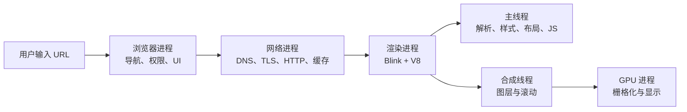
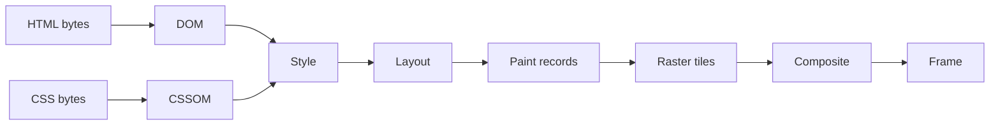
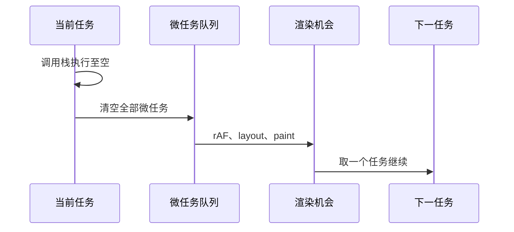

# 浏览器原理面试指南

> 本文是本模块英文资料的中文总结。重点不是背 Chromium 名词，而是建立“进程隔离 → 主线程流水线 → 调度 → 内存”的因果模型。标题链接可打开英文原文。

## 一张图理解浏览器架构

多进程架构用内存和 IPC 成本换取隔离、稳定性与安全性。通常每个站点实例运行在受沙箱限制的渲染进程中；浏览器进程管理窗口、导航和权限，网络进程处理连接与缓存，GPU 进程统一访问显卡。

## 架构与 JavaScript 引擎

| 主题 | 必须掌握的结论 |
| --- | --- |
| [浏览器多进程架构](topics/browser-high-level-architecture-multi-process.md) | 进程隔离能限制崩溃和漏洞影响；Site Isolation 以站点为安全边界，但会增加内存与 IPC。 |
| [渲染器、GPU、网络进程与线程](topics/process-thread-model-renderer-gpu-network.md) | 渲染进程内仍有主线程、合成线程、栅格线程等；“JS 单线程”不等于浏览器只有一个线程。 |
| [Blink 渲染引擎](topics/blink-rendering-engine.md) | Blink 负责 HTML/CSS、DOM、布局、绘制和 Web API；V8 负责 JavaScript 执行，两者通过绑定连接。 |
| [V8 与 JIT](topics/v8-jit-compilation.md) | 源码经解析生成 AST/字节码，解释器先快速启动，热点代码由优化编译器生成机器码；错误假设会触发去优化。 |
| [SpiderMonkey 与 JavaScriptCore](topics/spidermonkey-javascriptcore-other-engines.md) | ECMAScript 规范统一语义，引擎实现和优化策略不同；不要把 V8 行为误当语言规范。 |
| [隐藏类与内联缓存](topics/hidden-classes-inline-caches.md) | 对象属性形状稳定时，引擎能复用 hidden class 和 inline cache；频繁改变形状会让调用点从单态变成多态/超多态。 |

### JIT 的面试表达

“现代引擎不会在解释器和编译器中二选一，而是分层执行：先用字节码降低启动成本，再收集类型和调用点反馈，对热点函数做推测优化。如果对象形状或类型违反假设，就去优化回退。业务代码首先追求可读性，只在性能分析确认热点后才考虑让形状更稳定。”

## 渲染流水线

流水线具有“向后连锁”特征：修改几何属性可能触发 style、layout、paint、composite；修改颜色通常跳过 layout；修改独立图层的 `transform` 或 `opacity` 可只做 composite。

| 主题 | 必须掌握的结论 |
| --- | --- |
| [关键渲染路径总览](topics/critical-rendering-path-overview.md) | DOM 与 CSSOM 形成渲染树，再布局、绘制和合成；首屏优化就是缩短阻塞这条路径的依赖链。 |
| [HTML 解析与 DOM](topics/html-parsing-the-dom-tree.md) | HTML 解析可流式进行，普通同步脚本会暂停解析；预加载扫描器会并行发现静态资源。 |
| [CSS 解析与 CSSOM](topics/css-parsing-the-cssom.md) | CSS 规则经解析、级联、继承产生计算样式；CSS 阻塞首次渲染，也可能间接阻塞后续脚本。 |
| [渲染树、布局与 reflow](topics/render-tree-layout-reflow.md) | 布局计算几何；读取布局属性会迫使浏览器刷新未完成的样式/布局，读写交错会抖动。 |
| [绘制与图层](topics/paint-layers.md) | Paint 生成绘制指令而非直接画像素；层叠上下文不等于合成层，提升图层由引擎决定。 |
| [合成与合成线程](topics/compositing-the-compositor-thread.md) | 合成线程可在主线程繁忙时完成已栅格图层的变换和滚动，这是 transform/opacity 动画流畅的原因。 |
| [栅格化与 GPU](topics/rasterization-the-gpu.md) | 页面被切成 tiles，栅格线程将绘制指令变成位图纹理；GPU 加速不代表所有工作都自动更快。 |
| [主线程与合成线程](topics/main-thread-vs-compositor-thread.md) | JS、样式、布局大多在主线程；长任务会延迟输入。合成动画能绕过主线程，但事件处理仍不能。 |
| [阻塞渲染的资源](topics/render-blocking-resources.md) | 关键 CSS、同步 JS 和字体会影响首屏；`defer` 保序且解析后运行，`async` 下载后立即运行且不保序。 |

### 常考陷阱

- `transform` 不改变正常流中的布局位置，只改变最终视觉变换。
- `will-change` 会提前占用图层内存，不能全局滥用。
- 所谓“强制回流”常由一次写入后的同步几何读取触发，单纯批量写入可被浏览器合并。
- CSS 不直接阻塞 HTML tokenizer，但脚本可能等待 CSSOM，因此会出现间接阻塞。

## 事件循环与调度

| 主题 | 必须掌握的结论 |
| --- | --- |
| [浏览器事件循环](topics/event-loop-browser.md) | 每个任务运行到结束，再清空微任务，浏览器才有渲染机会；任务过长会同时阻塞输入和绘制。 |
| [微任务与宏任务](topics/microtasks-vs-macrotasks.md) | Promise、`queueMicrotask` 属于微任务；timer、事件属于任务。无限微任务链会饿死渲染。 |
| [`requestAnimationFrame`](topics/requestanimationframe.md) | 在下一帧绘制前执行，时间戳基于同一时钟；动画应按时间差推进，而不是假定固定 60Hz。 |
| [`requestIdleCallback`](topics/requestidlecallback-scheduling.md) | 只适合可延迟、可切片的非关键工作，可能长期没有空闲；重要工作要给 timeout 或使用更明确的调度。 |
| [`scheduler.postTask` 与让出执行权](topics/scheduler-posttask-yielding.md) | `postTask` 可表达优先级，`scheduler.yield()` 可拆分长任务；要保留兼容性回退并防止低优先级饥饿。 |

### 调度选择

- 下一次绘制前更新视觉状态：`requestAnimationFrame`。
- 当前同步逻辑结束后尽快继续：微任务，但工作量必须很小。
- 主动让浏览器处理输入和绘制：`scheduler.yield()` 或拆成新任务。
- 可丢弃的后台增强：空闲回调。
- CPU 密集且可隔离的数据处理：Web Worker，而不是继续切主线程任务。

## 内存与存储

| 主题 | 必须掌握的结论 |
| --- | --- |
| [内存管理](topics/memory-management.md) | 栈保存调用与局部值，堆保存动态对象；GC 只回收不可达对象，不理解“业务上已经没用”。 |
| [标记清除与分代 GC](topics/garbage-collection-mark-sweep.md) | 从 roots 标记可达对象并清除其余对象；分代假设多数对象朝生夕死，增量/并行阶段减少停顿。 |
| [内存泄漏与检测](topics/memory-leaks-detection.md) | 常见来源是未解绑监听器、定时器、闭包、全局缓存和脱离 DOM 的节点；用 heap snapshot 的 retaining path 找引用链。 |
| [存储、缓存与配额](topics/storage-internals-cache-quota.md) | Cookie、Web Storage、IndexedDB、Cache API 有不同桶和配额；客户端数据通常可被驱逐，不能当唯一真相。 |

排查泄漏应比较多次强制 GC 后的堆快照，寻找随操作次数持续增长的对象及其保留路径；仅看到堆暂时增长不等于泄漏，因为 GC 时机由引擎决定。

## 高频自测

1. 为什么“JavaScript 单线程”和“浏览器多线程”不矛盾？
2. 普通脚本、`async`、`defer` 对解析和执行顺序有什么影响？
3. layout、paint、raster、composite 各自做什么？
4. 为什么 Promise 回调通常早于 `setTimeout(..., 0)`？
5. 怎样让 200ms 的计算任务不阻塞输入？
6. 什么是 hidden class？什么时候会发生 deoptimization？
7. 为什么 detached DOM node 仍可能占内存？
8. 浏览器存储为什么不能被视为永久可靠？

## 面试前检查清单

- 能画出浏览器进程、渲染进程主线程、合成线程和 GPU 的关系。
- 能从 HTML/CSS 字节讲到最终屏幕帧，并指出每个性能优化所作用的阶段。
- 能写出任务、微任务、rAF、绘制的相对顺序。
- 能区分主线程切片与 Worker 真并行。
- 能用 retaining path 解释内存泄漏，而不是把所有堆增长都称为泄漏。

原始入口：[英文模块总览](README.md) · [英文题库](question-bank/README.md) · [仓库总目录](../README.md)
