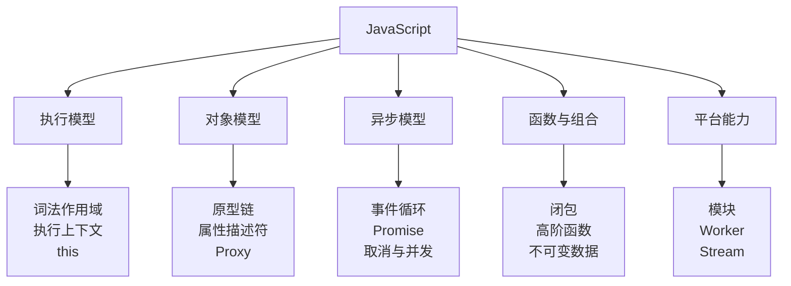
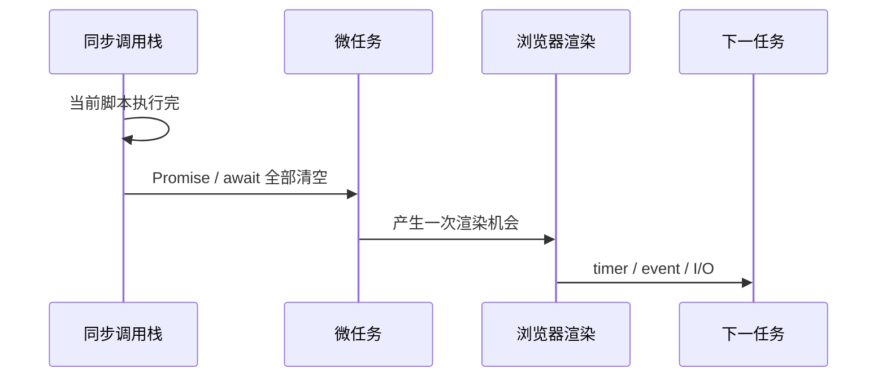
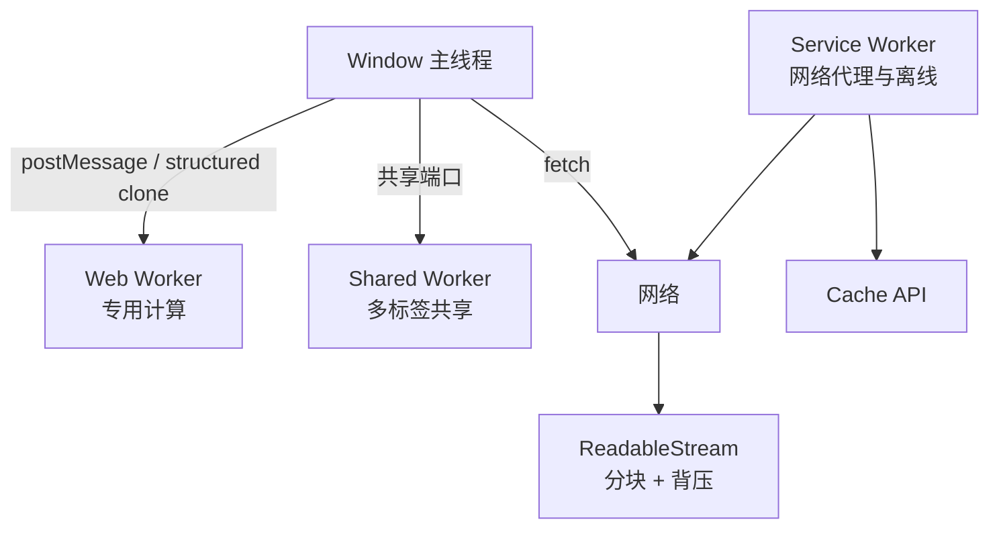

# JavaScript 面试指南

> 本文将本模块的 41 篇主题讲义整理为中文知识地图。复习目标是能解释语言规则背后的模型，并能手写常见异步与函数工具，而不是只记 API。

## 核心模型



## 一、作用域、类型与对象

| 主题 | 核心结论与陷阱 |
| --- | --- |
| [`var`、`let`、`const`、提升与 TDZ](topics/var-let-const-scope-hoisting-tdz.md) | 声明都会被环境记录，但 `let/const` 在初始化前处于暂时性死区；`var` 是函数作用域且初始化为 `undefined`。`const` 禁止重新绑定，不会深度冻结对象。 |
| [数据类型与类型转换](topics/data-types-coercion-vs.md) | 7 种 primitive 加 object；`===` 通常更可预测，`==` 需要掌握抽象相等算法。`typeof null === 'object'` 是历史遗留。 |
| [闭包](topics/closures.md) | 函数保留的是词法环境绑定，不是值快照；用于封装、工厂和回调，也可能因长生命周期引用造成泄漏。 |
| [`this` 的四条绑定规则](topics/this-binding-4-rules.md) | 优先级通常是 `new` > 显式 `call/apply/bind` > 隐式对象调用 > 默认；箭头函数没有自己的 `this`，从外层词法捕获。 |
| [`call`、`apply`、`bind`](topics/call-apply-bind-polyfills.md) | call 逐项传参，apply 接收类数组，bind 返回新函数并支持预置参数；`new` 调用绑定函数时构造语义优先。 |
| [原型与原型链](topics/prototypes-prototype-chain.md) | 属性读取从自身沿 `[[Prototype]]` 向上查找；函数的 `.prototype` 是给 `new` 创建实例时使用的对象，不等于实例的内部原型。 |
| [类与继承](topics/classes-inheritance.md) | class 是基于原型的更严格语法；方法放在 prototype 上且不可枚举；派生构造器访问 `this` 前必须 `super()`。 |
| [对象、描述符与访问器](topics/objects-descriptors-getters-setters.md) | 数据属性有 value/writable，所有属性有 enumerable/configurable；getter 读取时执行代码，复制/枚举行为受描述符影响。 |
| [解构、spread 与 rest](topics/destructuring-spread-rest.md) | rest 收集，spread 展开；对象/数组 spread 只做浅复制，不保留原型和完整描述符。 |
| [可选链与空值合并](topics/optional-chaining-nullish-coalescing.md) | `?.` 只在 null/undefined 时短路；`??` 只把 null/undefined 当缺失，保留 `0`、`false`、空字符串。 |
| [Symbol 与 well-known symbols](topics/symbol-well-known-symbols.md) | Symbol 是唯一 primitive key；`Symbol.iterator`、`toPrimitive` 等协议让对象参与语言行为；普通 JSON 和多数枚举会忽略 Symbol key。 |
| [Map/Set 与 Object/Array](topics/map-set-vs-objects-arrays.md) | Map 支持任意 key、稳定迭代和 size；Object 适合记录型数据。Set 适合成员关系，不应仅为“去重一切”忽视对象引用相等。 |
| [数字、BigInt 与浮点数](topics/numbers-bigint-floating-point.md) | Number 是 IEEE-754 double，`0.1 + 0.2` 误差来自二进制表示；货币用整数最小单位或十进制库；BigInt 不能与 Number 混算。 |
| [正则表达式](topics/regular-expressions.md) | 掌握字符类、量词、分组、断言和 flags；灾难性回溯可造成 ReDoS，不要用复杂正则解析 HTML。 |

### 作用域与 `this` 示意

```mermaid
flowchart LR
  C[调用点] --> N{是否 new?}
  N -- 是 --> A[新实例]
  N -- 否 --> B{call/apply/bind?}
  B -- 是 --> X[显式对象]
  B -- 否 --> I{obj.fn()?}
  I -- 是 --> O[obj]
  I -- 否 --> D[严格模式 undefined<br/>非严格全局对象]
  AR[箭头函数] --> L[忽略调用规则<br/>捕获外层 this]
```

面试时判断 `this` 必须看调用点，不看函数定义位置；箭头函数是唯一需要回到外层词法环境判断的常见例外。

## 二、异步与并发



| 主题 | 核心结论与陷阱 |
| --- | --- |
| [事件循环与微/宏任务](topics/event-loop-micro-macrotasks.md) | 当前任务结束后清空全部微任务，再有渲染机会；递归微任务会饿死 UI。Node 还有 phases 与 `process.nextTick` 细节。 |
| [回调与 callback hell](topics/callbacks-callback-hell.md) | 问题不仅是缩进，还包括控制反转、错误传播和组合困难；Promise 把一次异步结果变成可组合值。 |
| [Promise 状态与链式调用](topics/promises-states-chaining.md) | pending 只能单向变成 fulfilled/rejected；`.then` 返回新 Promise，return 值决定后续状态；遗漏 return 会提前继续。 |
| [`all`、`allSettled`、`race`、`any`](topics/promise-all-allsettled-race-any.md) | all 快速失败且保序；allSettled 等全部；race 取第一个 settled；any 取第一个 fulfilled，全部拒绝时给 AggregateError。它们不会自动取消剩余任务。 |
| [`async/await` 与错误处理](topics/async-await-error-handling.md) | async 总返回 Promise，await 后续进入微任务；并行任务要先创建 Promise 再 await，循环中逐个 await 会串行。 |
| [防抖与节流](topics/debounce-throttle.md) | debounce 等停止触发后执行，适合搜索；throttle 限制时间窗口频率，适合滚动。实现需明确 leading、trailing、cancel、参数和 this。 |
| [AbortController 取消](topics/abortcontroller-cancellation.md) | AbortSignal 是协作式取消广播，不能回滚已发生副作用；请求、流和自定义任务应共同监听同一 signal。 |
| [异步迭代与 `for await`](topics/async-iterators-for-await.md) | AsyncIterable 用 `Symbol.asyncIterator` 按需产生 Promise 值；适合流和分页，`for await` 默认串行消费并提供背压。 |
| [Promise 并发池](topics/concurrency-control-promise-pool.md) | 同时只运行 N 个任务，任务完成再补位；并发不等于并行，主要控制连接、内存、限流和失败范围。 |

```js
async function mapLimit(items, limit, worker) {
  const results = new Array(items.length);
  let next = 0;

  async function run() {
    while (next < items.length) {
      const index = next++;
      results[index] = await worker(items[index], index);
    }
  }

  await Promise.all(Array.from({ length: Math.min(limit, items.length) }, run));
  return results;
}
```

更完整的手写练习见：[Promise polyfill、防抖与节流](promise-polyfills-and-throttle-debounce.md) 和 [输出题](output-based-questions.md)。

## 三、函数式能力与迭代协议

| 主题 | 核心结论与陷阱 |
| --- | --- |
| [高阶函数](topics/higher-order-functions.md) | 接收或返回函数，用于抽取策略、横切逻辑和组合；闭包让返回函数保留配置。 |
| [柯里化与偏函数](topics/currying-partial-application.md) | 柯里化把多参数函数变成逐个参数函数；偏函数固定部分参数。价值是复用与组合，不应牺牲团队可读性。 |
| [`pipe` 与 `compose`](topics/composition-pipe-compose.md) | pipe 从左到右，compose 从右到左，把一元函数串联；异步、错误和多参数边界需要明确约定。 |
| [纯函数与不可变性](topics/pure-functions-immutability.md) | 相同输入得到相同输出且无外部副作用；不可变更新让引用相等可表达变化，但深复制一切成本高，应结构共享。 |
| [记忆化](topics/memoization.md) | 以输入缓存纯函数结果，用内存换计算；必须设计 key、淘汰和失效，不能给有副作用或高基数函数盲目缓存。 |
| [生成器](topics/generators.md) | `function*` 可暂停并由调用方恢复，`yield` 双向传值；适合惰性序列和状态机，但异步数据通常优先 async generator。 |
| [迭代器与可迭代对象](topics/iterators-iterables.md) | iterable 暴露 `Symbol.iterator`，iterator 的 `next()` 返回 `{value, done}`；数组、Map、字符串和生成器都遵循该协议。 |
| [数组方法与 Promise polyfill](topics/polyfills-map-filter-reduce-bind-promise.md) | 手写时关注稀疏数组、thisArg、初始值、thenable assimilation 和微任务，而不是只写 happy path。 |

## 四、模块、元编程、复制与内存

| 主题 | 核心结论与陷阱 |
| --- | --- |
| [ESM 与 CommonJS](topics/modules-esm-vs-cjs.md) | ESM 静态结构、live binding、异步加载，利于 tree shaking；CJS 在运行时同步 `require`，导出对象快照语义不同。循环依赖尤其容易暴露差异。 |
| [Proxy 与 Reflect](topics/proxy-reflect.md) | Proxy 拦截基本对象操作，Reflect 提供对应默认行为；适合响应式、校验和虚拟对象，但破坏优化与调试透明度。 |
| [`structuredClone` 与深拷贝](topics/structuredclone-deep-clone.md) | 支持循环引用、Map、Set、Date、TypedArray 和 transferable；不能复制函数、DOM 节点，类实例原型语义也不应依赖。JSON 往返不是通用深拷贝。 |
| [WeakMap 与 WeakSet](topics/weakmap-weakset.md) | key 必须是对象且为弱引用，不妨碍 GC；不可枚举正是为了避免观察 GC。适合对象关联元数据和私有状态。 |
| [WeakRef 与 FinalizationRegistry](topics/weakref-finalizationregistry.md) | GC 时间不可预测，不能用于正确性、资源释放或业务逻辑；仅适合可丢弃缓存等极少场景。 |
| [JavaScript 内存泄漏](topics/memory-leaks-in-js.md) | 全局容器、未清理监听器/定时器、闭包和 detached DOM 是常见保留链；用快照比较与 retaining path 定位。 |

## 五、Worker、Service Worker 与 Streams



| 主题 | 核心结论与陷阱 |
| --- | --- |
| [Web Worker](topics/web-workers.md) | 提供真正并行的独立线程，不能操作 DOM；传输大二进制数据时用 transferable 避免复制。 |
| [Service Worker](topics/service-workers.md) | 事件驱动的站点网络代理，具有 install/activate/fetch 生命周期；可离线但更新、版本和缓存清理复杂。 |
| [Shared Worker](topics/shared-workers.md) | 同源多个标签页可连接同一 Worker，通过 port 通信；兼容性和生命周期限制使 BroadcastChannel 更常见。 |
| [Streams API](topics/streams-api.md) | 分块处理数据、降低峰值内存并缩短首字节到可用内容时间；背压让生产者适应消费者速度，流被锁定后需正确释放 reader。 |

## 高频面试结论

- 闭包保留绑定；`for (let ...)` 每轮创建新绑定，`var` 共享同一函数级绑定。
- `Object.freeze` 是浅冻结，spread 也是浅复制。
- Promise executor 同步执行，`.then` 回调异步进入微任务。
- `Promise.all` 快速失败但不会取消其他输入 Promise。
- async 函数中没有 await 的并发设计意识，常会把本可并行的请求串行化。
- Map 的对象 key 按引用比较；Set 同理。
- 原型链上的可写数据属性赋值通常在实例上创建自有属性，而不是修改原型。
- ESM export 是 live binding，不是把当前值复制出去。
- Worker 解决 CPU 阻塞，不能让网络请求本身更快。

## 面试前检查清单

- 能画出词法环境、闭包和原型链，并逐步解释一段输出题。
- 能按优先级判断普通函数的 `this`，也能解释箭头函数为何不同。
- 能手写 Promise 组合器、防抖、节流和有限并发池，并说明边界情况。
- 能区分 shallow copy、structured clone、不可变结构共享。
- 能按场景选择 Window、Web Worker、Shared Worker、Service Worker。
- 能解释 ESM/CJS 的静态性、live binding、加载时机和循环依赖差异。

原始入口：[英文模块总览](README.md) · [英文题库](question-bank/README.md) · [仓库总目录](../README.md)
