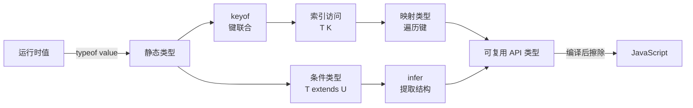
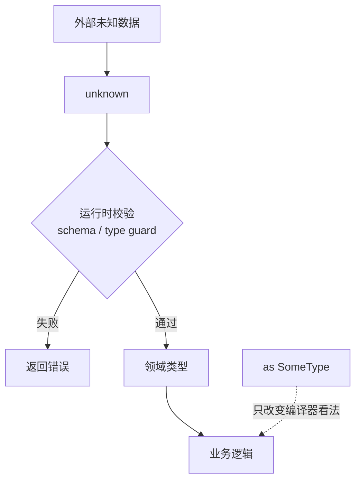
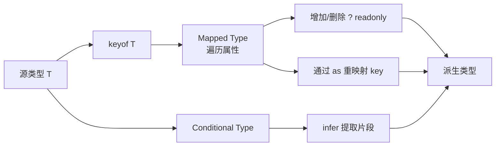

# TypeScript 面试指南

> TypeScript 面试的核心不是背工具类型，而是理解“值世界与类型世界分离、控制流缩窄、泛型关系、类型变换、工程配置”这五层模型。本文覆盖本模块全部 25 个主题。

## 类型系统全景



最重要的边界：TypeScript 类型在编译后被擦除，因此外部 JSON、localStorage、URL 参数和用户输入仍必须在运行时验证。

## 一、基础、推断与严格模式

| 主题 | 核心结论与陷阱 |
| --- | --- |
| [类型基础与推断](topics/type-basics-inference.md) | 让局部变量和返回值尽量由编译器推断，在模块边界、公共参数和推断信息不足处标注。类型断言不会转换或验证数据。 |
| [`unknown`、`any` 与 `never`](topics/unknown-vs-any-vs-never.md) | any 关闭检查并会传播；unknown 接受任意值但使用前必须缩窄；never 表示不可能存在的值，用于穷尽检查。 |
| [严格模式标志](topics/strict-mode-flags.md) | `strict` 是一组检查，最关键是 `strictNullChecks` 和 `noImplicitAny`；还应关注 `noUncheckedIndexedAccess`、`exactOptionalPropertyTypes`。 |
| [`tsconfig` 深入](topics/tsconfig-deep-dive.md) | 配置分别决定纳入哪些文件、如何检查、如何输出；`target` 决定语法降级，`lib` 决定可见平台类型，`module/moduleResolution` 必须匹配运行环境和构建器。 |

### 类型边界示意



面试表达：“`response.json() as User` 只是告诉编译器相信我，不能让不合法数据变合法。系统边界先保持 `unknown`，用 Zod、Valibot 或手写校验解析后再进入领域类型。”

## 二、对象建模、联合与缩窄

| 主题 | 核心结论与陷阱 |
| --- | --- |
| [interface 与 type alias](topics/interfaces-vs-type-aliases.md) | 对象形状大多可互换；interface 可声明合并，适合开放公共 API；type 可命名 union、tuple、primitive、mapped/conditional type，且是封闭的。 |
| [联合与交叉类型](topics/union-intersection-types.md) | `A | B` 是其中之一，缩窄前只能使用共同成员；`A & B` 必须同时满足两者。属性冲突可能把类型压成 never。 |
| [判别联合](topics/discriminated-unions.md) | 用共同字面量字段表达互斥状态，使非法状态无法表示；switch 配合 never 可在新增分支时产生编译错误。 |
| [缩窄与类型守卫](topics/narrowing-type-guards.md) | TS 根据 `typeof`、`instanceof`、`in`、相等和控制流缩窄；用户守卫的 `x is T` 是开发者承诺，编译器不会验证实现是否诚实。 |
| [字面量与 enum](topics/literal-enum-types.md) | 字面量联合和 `as const` 对象通常比 enum 更透明、可擦除；enum 产生运行时对象，数字 enum 还有反向映射等历史特性。 |
| [函数与重载](topics/functions-overloads.md) | 重载签名面向调用方，实现签名不能直接调用且必须兼容所有重载；返回类型随输入变化时重载更清晰，普通 union 更易维护。 |
| [方差与可赋值性](topics/variance-assignability.md) | TS 采用结构类型；返回值通常协变，strictFunctionTypes 下函数参数逆变。可变数组的协变存在不健全性，readonly 能恢复更安全关系。 |

```ts
type RequestState<T> =
  | { status: 'idle' }
  | { status: 'loading' }
  | { status: 'success'; data: T }
  | { status: 'error'; error: Error };

function assertNever(value: never): never {
  throw new Error(`Unhandled state: ${JSON.stringify(value)}`);
}
```

## 三、泛型：表达类型之间的关系

| 主题 | 核心结论与陷阱 |
| --- | --- |
| [泛型](topics/generics.md) | 泛型不是“更安全的 any”，而是保存输入与输出之间的类型关系；类型参数应出现在可推断的参数位置。只出现一次的泛型常不必要。 |
| [泛型约束与默认值](topics/generic-constraints-defaults.md) | `<T extends U>` 限制调用者并让函数体可使用 U 的能力；`<T = U>` 只是无法推断时的默认类型，两者用途不同。 |
| [异步与 API 泛型](topics/typing-async-generics-in-apis.md) | `Promise<T>` 描述解析结果；泛型 fetch wrapper 不能证明 JSON 符合 T，外部响应仍需运行时 schema。错误通道通常不由 Promise 泛型表达。 |
| [React 组件与 Hook 类型](topics/typing-react-components-hooks.md) | 直接标注 props；初值不足时给 `useState<T>`，ref/reducer 明确类型。泛型组件要让 props 推断 T，避免依赖调用方手写类型参数。 |

```ts
function getProperty<T, K extends keyof T>(object: T, key: K): T[K] {
  return object[key];
}
```

这段代码同时展示了泛型捕获、keyof 约束和索引访问：key 必须属于对象，返回值随具体 key 精确变化。

## 四、类型变换工具箱



| 主题 | 核心结论与陷阱 |
| --- | --- |
| [`keyof` 与 `typeof`](topics/keyof-typeof.md) | keyof 从类型得到 key union；类型位置的 typeof 从运行时声明得到静态类型；`keyof typeof` 让类型跟随常量对象。 |
| [索引访问类型](topics/indexed-access-types.md) | `T[K]` 提取属性类型；K 可为联合，`T[keyof T]` 得到全部 value 的联合，数组元素可用 `T[number]`。 |
| [映射类型](topics/mapped-types.md) | `{ [K in keyof T]: ... }` 遍历 key，可修改 `?`/`readonly` 并用 `as` 重命名或过滤 key。只存在于编译期。 |
| [条件类型与 infer](topics/conditional-types-infer.md) | `T extends U ? X : Y` 是类型级分支；裸类型参数面对 union 会分发，方括号包裹可关闭；infer 在模式位置提取内部类型。 |
| [模板字面量类型](topics/template-literal-types.md) | 可组合事件名、路径和 CSS 字符串，也能配合 infer 反向解析；多个大 union 交叉插值会组合爆炸。 |
| [内置工具类型](topics/utility-types-partial-pick-omit-record.md) | Partial/Pick/Omit/Record 从单一源类型派生变体，避免重复声明；Partial 是浅层，Record 不会创建运行时对象。 |
| [类型级编程](topics/type-level-programming.md) | 条件类型像 if，映射类型像循环，递归处理嵌套结构；复杂类型会增加编辑器延迟和认知成本，公共 API 应优先可读错误信息。 |

```ts
type EventHandlers<T> = {
  [K in keyof T as `on${Capitalize<string & K>}`]?: (value: T[K]) => void;
};

type AwaitedValue<T> = T extends PromiseLike<infer U> ? AwaitedValue<U> : T;
```

## 五、工程化与高级能力

| 主题 | 核心结论与陷阱 |
| --- | --- |
| [声明文件 `.d.ts`](topics/declaration-files-d-ts.md) | 声明文件描述运行时已有实现，不包含实现代码；模块增强和全局声明要严格匹配真实运行时，否则只是“高质量的谎言”。 |
| [Decorators](topics/decorators.md) | 装饰器在类定义阶段运行，可替换/包装类和成员；标准装饰器与旧 experimental decorators 语义不同，元数据和初始化时机要确认。 |
| [Project References 与 monorepo](topics/project-references-monorepos.md) | composite 项目输出声明与 `.tsbuildinfo`，下游对编译产物检查；形成可增量、可缓存的构建 DAG，但需维护包边界和引用方向。 |

### 推荐的库 API 原则

- 对外输入尽量宽松、输出尽量精确，但不要用复杂条件类型隐藏无法理解的行为。
- 优先让调用参数驱动推断；只有推断不可能时才要求显式泛型。
- 使用 `unknown` 接收外界，用判别联合表达内部状态，用 `never` 保证穷尽。
- 导出公共类型时写类型测试，防止升级造成推断退化。
- `skipLibCheck` 可缩短依赖声明检查，却会掩盖库之间冲突；它不是修复类型错误。

## 高频自测

1. `any` 与 `unknown` 的传播和使用限制有何区别？
2. 为什么 TypeScript 不能保证 API 返回值安全？
3. interface 的声明合并什么时候是能力，什么时候是风险？
4. 判别联合如何让非法状态无法表示？
5. `keyof typeof` 解决了什么重复维护问题？
6. 条件类型为何会对 union 分发，怎样关闭？
7. overload 与 union 参数分别适合什么情况？
8. `Partial<T>` 为什么不是深度可选？
9. `moduleResolution` 选错会产生什么后果？
10. project references 为什么能加快 monorepo 增量构建？

## 面试前检查清单

- 能从运行时数据边界讲清 unknown、校验、领域类型的转换。
- 能手写泛型 `getProperty`、判别联合穷尽检查和一个映射类型。
- 能解释 structural typing、协变/逆变和可变容器风险。
- 能区分类型推断、类型标注、断言和运行时验证。
- 能说明 tsconfig 中 target、lib、module、moduleResolution、strict 各自职责。

原始入口：[英文模块总览](README.md) · [英文题库](question-bank/README.md) · [仓库总目录](../README.md)
