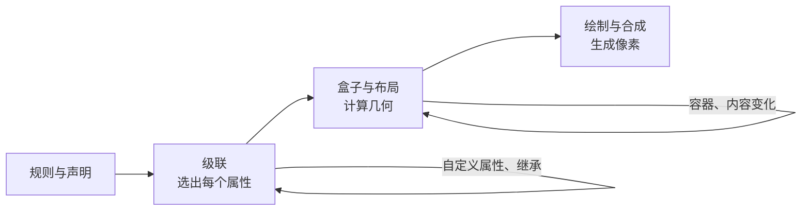
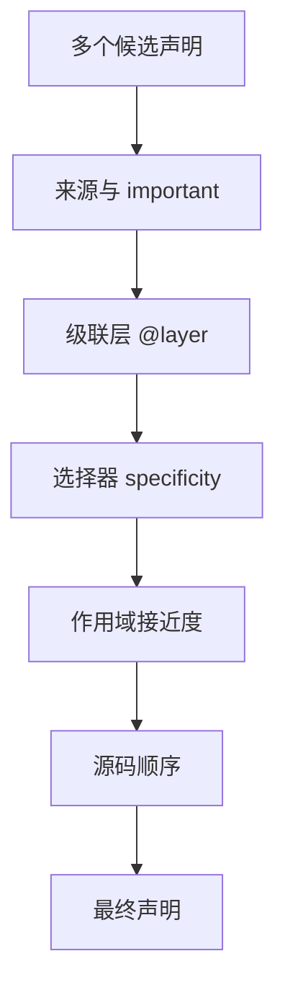
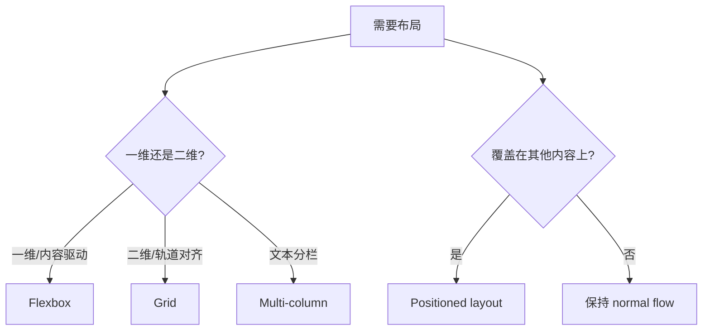
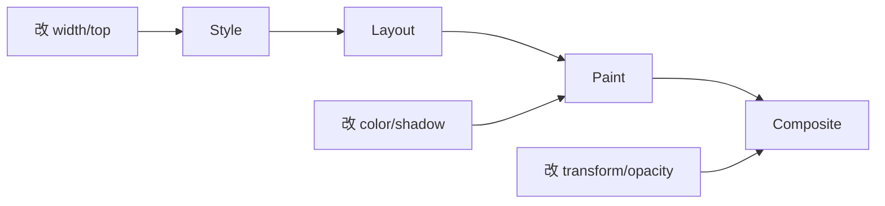

# CSS 面试指南

> CSS 面试应从“级联如何选值、盒子如何布局、像素如何渲染”三个模型出发。本文覆盖本模块 35 个主题，并用图表归纳容易混淆的规则。

## CSS 的三层心智模型



遇到样式问题依次问：声明是否赢得级联？元素属于哪种格式化上下文、包含块和盒模型？变更触发 layout、paint 还是仅 composite？

## 一、级联、选择器与值



| 主题 | 核心结论与陷阱 |
| --- | --- |
| [级联与 specificity](topics/the-cascade-specificity.md) | 级联先比较来源/important，再比较 layer、specificity、作用域和源码顺序；`!important` 不是“最高优先级万能键”。 |
| [级联层 `@layer`](topics/cascade-layers-layer.md) | 普通声明中后声明的 layer 整体优先，无论内部 specificity 多高；未分层的作者样式优先于普通 layer 样式，important 时层顺序反转。 |
| [选择器与组合器](topics/selectors-combinators.md) | 空格、`>`、`+`、`~` 表示后代、子、相邻兄弟、后续兄弟；选择器逻辑从右向左匹配，首先保证语义和可维护性。 |
| [伪类与伪元素](topics/pseudo-classes-pseudo-elements.md) | 伪类选择真实元素的状态/位置，伪元素选择或生成非 DOM 子部分；生成内容不应承载不可替代的信息。 |
| [`:has()`、`:is()`、`:where()`](topics/has-is-where.md) | `:has` 是关系选择器；`:is` 取参数中最高 specificity，`:where` 始终为 0，适合低权重默认规则。 |
| [继承与全局关键字](topics/inheritance-initial-inherit-unset.md) | 文本类属性多可继承；`inherit` 强制继承，`initial` 回规范初值，`unset` 按属性是否继承选择前两者，`revert` 回退到更低来源。 |
| [CSS 自定义属性](topics/custom-properties-variables.md) | 自定义属性是参与级联和继承的运行时 token，不是编译期 Sass 变量；值在使用位置计算，可通过 fallback 和 JS 动态修改。 |

### specificity 快速记忆

按 `(inline, id, class/attribute/pseudo-class, element/pseudo-element)` 比较，不做十进制加法。`:not()` 自身不加权但参数会；`:where()` 权重为零。更好的修复通常是明确 layer 和组件边界，而不是堆 id 或 `!important`。

## 二、盒模型、正常流与定位

| 主题 | 核心结论与陷阱 |
| --- | --- |
| [盒模型与 `box-sizing`](topics/box-model-box-sizing.md) | 默认 width 指 content box；`border-box` 让 width 包含 padding 和 border，通常用全局 `*, *::before, *::after { box-sizing: border-box }`。margin 不计入。 |
| [`display` 与正常流](topics/display-normal-flow.md) | display 同时定义 outer role 和 inner layout；block/inline 描述对兄弟行为，flow/flex/grid 描述子元素布局。`display: none` 从无障碍树和布局移除。 |
| [定位与 sticky](topics/positioning-relative-absolute-sticky.md) | relative 保留原空间；absolute/fixed 脱离流并相对 containing block；sticky 在指定滚动容器达到 inset 后固定。transform 等属性会改变 fixed/absolute 的包含块。 |
| [层叠上下文与 z-index](topics/stacking-context-z-index.md) | z-index 只在当前 stacking context 内比较，子元素无法用巨大数字逃离父上下文；opacity、transform、isolation 等都可能创建新上下文。 |
| [overflow 与滚动容器](topics/overflow-scroll-containers.md) | 非 visible/clip 的 overflow 建立滚动容器和 BFC；sticky 会粘在最近滚动祖先，而不一定是 viewport。`overflow: clip` 裁剪但不提供滚动。 |
| [居中的所有方式](topics/centering-all-the-ways.md) | 普通双轴居中优先 Grid `place-items:center`；有方向/分配需求用 Flex；覆盖层可绝对定位加 translate；文本行内水平居中用 text-align。 |
| [多栏与 aspect-ratio](topics/multi-column-aspect-ratio.md) | multi-column 按纵向再横向分片，适合文章而非二维 UI；aspect-ratio 只在至少一个尺寸为 auto 时参与计算，并应配合图片固有尺寸防 CLS。 |



## 三、Flexbox 与 Grid

| 主题 | 核心结论与陷阱 |
| --- | --- |
| [Flexbox](topics/flexbox.md) | 一维布局，main/cross axis 随 `flex-direction` 改变；`flex: grow shrink basis` 分配剩余空间。长内容溢出的常见修复是 flex item `min-width: 0`。 |
| [Grid](topics/grid.md) | 二维轨道布局；`fr` 分剩余空间，`minmax` 定边界，`repeat(auto-fit, minmax(...))` 可无媒体查询响应。`auto-fill` 保留空轨道，`auto-fit` 折叠。 |

```css
.cards {
  display: grid;
  grid-template-columns: repeat(auto-fit, minmax(min(18rem, 100%), 1fr));
  gap: 1rem;
}

.row {
  display: flex;
  min-width: 0;
}
.row__content {
  min-width: 0;
  overflow-wrap: anywhere;
}
```

选择原则：元素主要沿一个方向排列且尺寸由内容决定时用 Flex；行列都需对齐或页面区域明确时用 Grid。两者可以嵌套，不是竞争关系。

## 四、响应式、单位与用户偏好

| 主题 | 核心结论与陷阱 |
| --- | --- |
| [媒体查询](topics/media-queries.md) | mobile-first 用 min-width；断点根据内容何时失效而非设备型号；同时查询 hover、pointer、orientation、prefers-* 等能力。 |
| [容器查询](topics/container-queries.md) | 组件根据自身容器而非 viewport 响应；祖先需 `container-type: inline-size`，查询容器不能通常根据自己的尺寸直接改自身。 |
| [单位：rem、em、vw、ch](topics/units-rem-em-vw-ch.md) | rem 基于根字号且尊重设置，em 基于当前元素并可能复合；ch 适合文本行宽近似；移动全高优先 dvh/svh 而非固定 100vh。 |
| [流式字号与 `clamp`](topics/fluid-type-clamp.md) | `clamp(min, preferred, max)` 平滑缩放；preferred 应混合 rem 和 vw，不能只用 vw 破坏用户缩放。 |
| [逻辑属性](topics/logical-properties.md) | inline/block 与 start/end 适配 RTL 和竖排；使用 margin-inline、padding-block、inset-inline-start 取代物理方向。 |
| [暗色模式与 `color-scheme`](topics/dark-mode-color-scheme.md) | 自定义 token 负责应用主题，color-scheme 告知浏览器如何绘制表单、滚动条等原生 UI；需要同时设置二者。 |
| [颜色偏好与减少动态效果](topics/prefers-color-scheme-reduced-motion.md) | 尊重系统 dark、reduced-motion、contrast；减少动态不是简单删除一切反馈，而是去掉大幅位移和非必要循环。 |
| [CSS 无障碍：焦点与对比度](topics/accessibility-in-css-focus-contrast.md) | 正文常规文字至少 4.5:1，对焦点和状态不能只靠颜色；用 `:focus-visible` 提供清晰键盘焦点，不要裸删 outline。 |

## 五、渲染性能、变换与动画



| 主题 | 核心结论与陷阱 |
| --- | --- |
| [reflow、repaint 与 composite](topics/reflow-vs-repaint-vs-composite.md) | 触发越早阶段，后续成本越多；读取几何与写样式交错会强制布局。性能判断应以 DevTools 测量为准。 |
| [2D/3D transform](topics/transforms-2d-3d.md) | transform 改视觉坐标而不重排正常流；函数组合顺序不交换，百分比相对元素自身盒子；transform 还创建 stacking context。 |
| [GPU 动画与 `will-change`](topics/gpu-accelerated-animation-will-change.md) | transform/opacity 可只合成；will-change 可预热图层但消耗 GPU 内存，应在即将动画时短暂设置。 |
| [transition](topics/transitions.md) | 在旧、新 computed value 间插值，需要状态变化触发；`transition: all` 会意外动画昂贵或不该动的属性，应列出属性。 |
| [keyframe animation](topics/keyframe-animations.md) | 独立时间线支持多阶段、循环和方向；动画应用后自行开始，需管理 fill-mode、暂停和 reduced-motion。 |
| [滚动驱动动画](topics/scroll-driven-animations.md) | animation progress 绑定 scroll/view timeline，减少 JS scroll handler；只有可合成属性才能真正绕开主线程。 |
| [contain 与 `content-visibility`](topics/content-visibility-containment.md) | containment 承诺子树不影响外界，content-visibility:auto 可跳过视口外布局与绘制；用 intrinsic size 占位避免滚动条跳变。 |

## 六、CSS 架构与设计系统

| 主题 | 核心结论与陷阱 |
| --- | --- |
| [BEM 与 ITCSS](topics/css-architecture-bem-itcss.md) | BEM 用扁平类名控制 specificity，ITCSS 从广泛低权重到局部高权重组织源码；核心是可预测覆盖方向。 |
| [CSS Modules](topics/css-modules-scoping.md) | 构建期重命名类实现局部作用域，无运行时成本但不是真正 Shadow DOM；全局 reset 和跨组件主题仍要设计。 |
| [CSS-in-JS 与 Tailwind](topics/css-in-js-vs-utility-css-tailwind.md) | 关键轴是运行时还是构建时求值；runtime CSS-in-JS 动态强但有注入和 SSR 成本，utility CSS 约束强且零运行时。 |
| [设计 token](topics/design-tokens.md) | token 是平台无关的命名设计决策，可转换为 CSS、原生端和设计工具；分原始、语义、组件层，避免组件引用具体色值。 |

## 高频自测

1. 浏览器如何从多个声明选出最终属性值？
2. 为什么 `z-index: 999999` 仍可能盖不过另一个元素？
3. Flex 子项长文本为什么会溢出，`min-width: 0` 做了什么？
4. `auto-fit` 与 `auto-fill` 有什么区别？
5. sticky 相对哪个滚动容器工作，为什么有时看似失效？
6. 为什么 transform 动画通常比 top/left 流畅？
7. `display:none`、`visibility:hidden`、`opacity:0` 在布局、点击和无障碍上有何不同？
8. CSS Modules、Shadow DOM、BEM 分别通过什么方式隔离样式？
9. `rem`、`em` 和 `clamp()` 怎样影响可访问缩放？
10. 什么时候容器查询比媒体查询更合适？

## 面试前检查清单

- 能按级联完整顺序排查“样式为什么不生效”。
- 能根据一维/二维、内容流/覆盖层选择布局机制。
- 能解释 containing block、BFC、stacking context 和 scroll container。
- 能从 style/layout/paint/composite 解释动画性能。
- 能设计支持主题、RTL、缩放和 reduced-motion 的组件样式。

原始入口：[英文模块总览](README.md) · [英文题库](question-bank/README.md) · [仓库总目录](../README.md)
