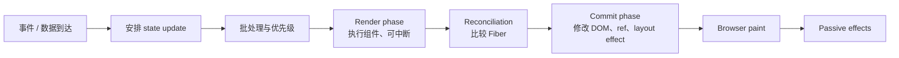
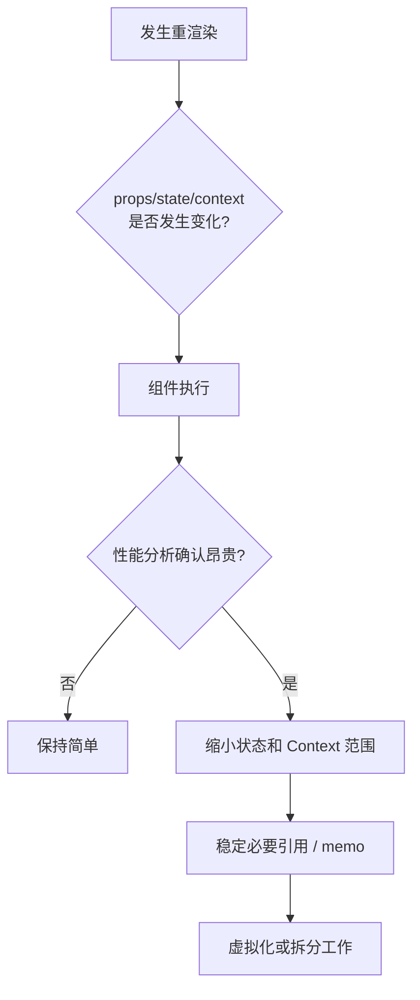

# React 面试指南

> React 面试的主线是：组件只是状态到 UI 的声明，render 可以重复和中断，commit 才产生外部变化。理解这条主线后，Hook、并发、性能和服务端能力会连成一个系统。

## React 更新模型



render 必须保持纯粹，因为它可能执行多次、暂停或被丢弃；DOM 修改、ref 连接、layout effect 发生在 commit，普通 effect 通常在浏览器绘制后执行。

## 一、组件、渲染与协调

| 主题 | 核心结论与陷阱 |
| --- | --- |
| [JSX 与 `createElement`](topics/jsx-createelement.md) | JSX 是语法转换，不是模板字符串；表达式生成 React element 描述对象。小写标签代表宿主元素，大写标识符代表组件。 |
| [组件、props 与组合](topics/components-props-composition.md) | props 是只读输入，组件应保持纯；优先用 children、slot props 和组合表达变化，避免深继承。 |
| [渲染与重渲染模型](topics/rendering-re-render-mental-model.md) | 父组件重渲染默认会执行子组件，但执行组件不等于 DOM 改变；状态应视作某次 render 的快照。 |
| [列表、key 与协调陷阱](topics/lists-keys-reconciliation-pitfalls.md) | key 在同级列表内表达稳定身份；索引 key 在排序/插入后会把本地状态复用给错误数据。 |
| [协调与 key](topics/reconciliation-keys.md) | 元素 type 或 key 改变时 React 会卸载旧子树并挂载新子树；可有意用 key 重置状态，但不能随 render 随机生成。 |
| [受控与非受控输入](topics/controlled-vs-uncontrolled-inputs.md) | 受控值由 React state 驱动，便于联动校验；非受控由 DOM 保存，使用 defaultValue/ref。组件生命周期内不要在两者间切换。 |
| [Portal](topics/portals.md) | DOM 被渲染到另一容器，但仍属于原 React 树，因此 Context 和合成事件按 React 树传播；适合 modal/tooltip，不自动解决焦点与可访问性。 |
| [Fiber 架构](topics/fiber-architecture.md) | Fiber 把渲染工作拆成可暂停单元，并保存父子兄弟、alternate、lanes 等信息；commit 仍是同步且不可中断。 |

## 二、状态与 Hook

| 主题 | 核心结论与陷阱 |
| --- | --- |
| [`useState` 与批处理](topics/usestate-batching.md) | state 在当前 render 内不变；多次基于前值更新要用函数式 updater。React 18 对多数异步来源自动批处理。 |
| [Hook 规则](topics/rules-of-hooks.md) | Hook 必须在 React 函数顶层按相同顺序调用，因为状态槽按调用顺序关联；不能放在条件、循环或普通函数中。 |
| [`useEffect` 时机](topics/useeffect-effect-timing.md) | effect 用于与 React 外部系统同步，不是派生数据工具；依赖项应包含读到的响应式值，cleanup 先于下一次 effect 和卸载。 |
| [`useLayoutEffect` 与 `useEffect`](topics/uselayouteffect-vs-useeffect.md) | layout effect 在 DOM commit 后、paint 前同步运行，可测量并修正布局，但会阻塞绘制；默认用 effect。服务端两者都不执行。 |
| [`useRef` 与命令式句柄](topics/useref-imperative-handles.md) | ref 是跨 render 的可变盒，修改不触发渲染；适合 DOM、timer 和非 UI 值，不能把应驱动界面的数据藏进去。 |
| [`useId` 与 `useImperativeHandle`](topics/useid-useimperativehandle.md) | useId 生成 SSR/水合稳定的无障碍关联 ID，不用于列表 key；命令式句柄只暴露必要能力，避免泄漏内部 DOM。 |
| [ref 与 `forwardRef`](topics/refs-forwardref.md) | ref 不是普通 prop 的历史模型；React 新版本的 ref-as-prop 方向需结合项目版本。组件 API 优先声明式，必要时转发焦点/测量能力。 |
| [`useReducer` 与状态机](topics/usereducer-state-machines.md) | reducer 集中定义 `(state, action) => nextState`，适合关联状态和复杂转换；状态机进一步限制合法状态与事件。 |
| [自定义 Hook](topics/custom-hooks.md) | 自定义 Hook 复用有状态逻辑，不共享状态实例；API 应以领域意图命名，避免只包一层 useEffect 的“配置对象 Hook”。 |

```js
setCount(count + 1);
setCount(count + 1);       // 两次都读取当前快照，通常只增加 1

setCount((n) => n + 1);
setCount((n) => n + 1);    // updater 顺序应用，增加 2
```

## 三、Context、外部状态与性能



| 主题 | 核心结论与陷阱 |
| --- | --- |
| [Context 与性能](topics/usecontext-context-perf.md) | Provider value 变化会更新所有消费组件，React 不按读取字段自动选择；拆分 Context、稳定 value 或使用 selector/external store。 |
| [`useSyncExternalStore`](topics/usesyncexternalstore.md) | 为 React 提供一致的外部 store 订阅协议，getSnapshot 必须缓存且稳定，并提供 SSR snapshot 防水合不一致。 |
| [`React.memo` 与引用相等](topics/react-memo-referential-equality.md) | memo 默认浅比较 props；每次新建对象/函数会破坏跳过。比较也有成本，且自身 state/context 变化仍会渲染。 |
| [`useMemo` 与 `useCallback`](topics/usememo-usecallback.md) | 都是性能提示而非语义保证；前者缓存计算结果，后者缓存函数身份。只在昂贵计算或引用稳定确有下游价值时使用。 |
| [避免无意义重渲染](topics/avoiding-unnecessary-re-renders.md) | 先用 Profiler 定位，再下移状态、拆组件、children 隔离、缩小 Context；不要以全局 memo 化代替架构。 |
| [虚拟化](topics/virtualization-windowing.md) | 只挂载可见区与 overscan，用总高度占位并偏移窗口；固定高度简单，动态高度需 ResizeObserver、缓存和锚点修正。 |
| [代码拆分、lazy 与 Suspense](topics/code-splitting-lazy-suspense.md) | 按路由/重功能拆 chunk；lazy 加载模块，Suspense 显示边界 fallback。过细拆分会增加瀑布和切换闪烁。 |
| [React Compiler](topics/react-compiler.md) | 编译器分析纯组件并自动记忆化，减少手写 memo；依赖 Hook 规则和不可变语义，不会修复副作用或糟糕的状态边界。 |

完整虚拟列表练习：[构建虚拟化列表](build-a-virtualized-list.md)。

## 四、复用模式与错误边界

| 主题 | 核心结论与陷阱 |
| --- | --- |
| [Compound Components 与 render props](topics/compound-components-render-props.md) | Compound Components 共享隐式上下文并提供组合式 API；render prop 把行为显式交给调用者。两者要控制隐藏耦合与嵌套。 |
| [高阶组件 HOC](topics/hocs.md) | 函数接收组件并返回增强组件；需透传 props/ref、保留静态信息和稳定创建位置。新代码常以 Hook 替代逻辑复用，但 HOC 仍适合组件级包装。 |
| [错误边界](topics/error-boundaries.md) | 捕获后代 render/lifecycle 错误并显示 fallback，不捕获事件处理、异步回调、SSR 或边界自身错误；按路由/关键区域布置并上报 component stack。 |

## 五、并发、SSR 与服务端能力

| 主题 | 核心结论与陷阱 |
| --- | --- |
| [并发渲染](topics/concurrent-rendering.md) | React 可暂停、恢复、丢弃 render，并按 lane 调度；不是多线程。可见 commit 仍保持一致，不会展示半棵树。 |
| [`useTransition` 与 `useDeferredValue`](topics/usetransition-usedeferredvalue.md) | transition 把状态更新标为非紧急；deferred value 延迟消费某值。它们改善响应性而非减少总计算量，受控输入更新不能放 transition。 |
| [SSR 与水合](topics/ssr-hydration.md) | SSR 先输出 HTML，hydrate 绑定行为；服务端/客户端首轮输出必须一致。时间、随机数、浏览器存储是常见 mismatch 来源。 |
| [Suspense 与 Streaming](topics/suspense-streaming.md) | 边界让服务器先发送 shell/fallback，再流式补齐内容并选择性水合；边界设计影响瀑布、布局稳定和错误隔离。 |
| [React Server Components](topics/react-server-components-rsc.md) | RSC 只在服务器执行，能直接访问数据源且组件代码不进客户端 bundle；不可用 state/effect/浏览器 API，通过序列化边界传给 Client Component。 |
| [Server Actions](topics/server-actions.md) | 把服务器 mutation 暴露为可由表单/客户端调用的函数；仍是不可信网络入口，必须认证、授权、校验并处理幂等与缓存失效。 |

## 六、测试

| 主题 | 核心结论与陷阱 |
| --- | --- |
| [测试 React](topics/testing-react.md) | 以用户可观察行为测试，优先 role/name 查询和真实事件；避免断言内部 state、组件实例和实现细节。异步更新要正确 await。 |

## 高频自测

1. 组件函数执行、DOM 更新和浏览器绘制有什么区别？
2. key 如何决定组件身份，为什么索引 key 会错配 state？
3. useEffect 是什么同步机制，哪些逻辑不该放 effect？
4. memo、useMemo、useCallback 各缓存什么，什么时候反而更慢？
5. Context 更新为何会造成大范围渲染，怎样缩小影响？
6. Fiber 如何支持可中断 render，为什么 commit 不能中断？
7. transition 与 debounce 有什么根本区别？
8. SSR、hydration、RSC 和 streaming 分别解决什么问题？
9. 错误边界不能捕获哪些错误？
10. 如何设计可访问、可测试的 modal portal？

## 面试前检查清单

- 能画出 update → render → reconciliation → commit → effect 流程。
- 能用“状态快照”解释批处理、闭包旧值和函数式 updater。
- 能先用 Profiler 证明瓶颈，再选择状态下移、memo、虚拟化或拆包。
- 能清楚划分 Server/Client Component 边界及可序列化数据。
- 能用用户行为测试组件，而不是测试内部实现。

原始入口：[英文模块总览](README.md) · [英文题库](question-bank.md) · [仓库总目录](../README.md)
