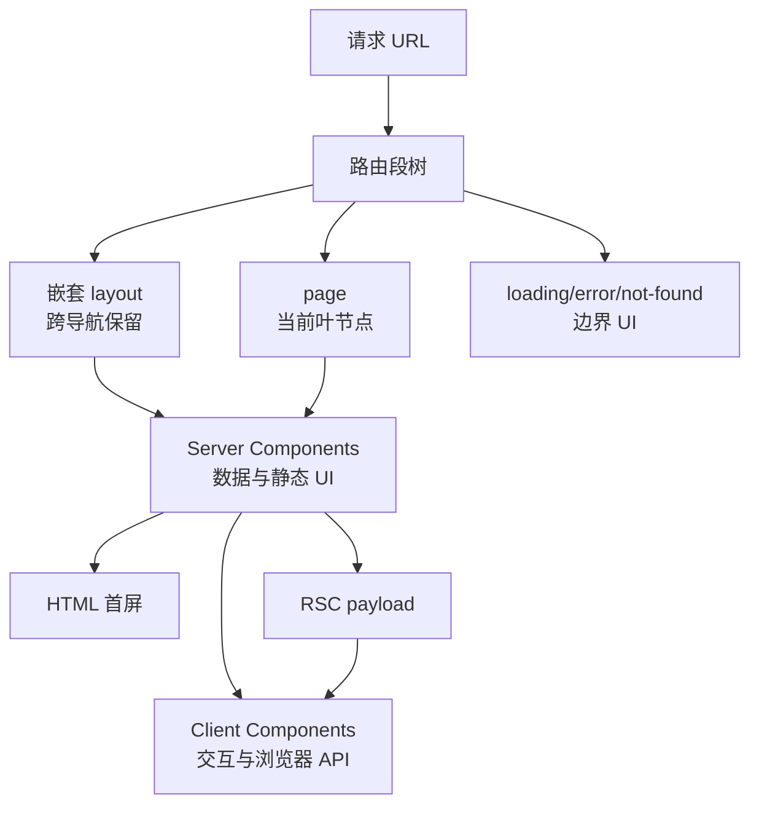
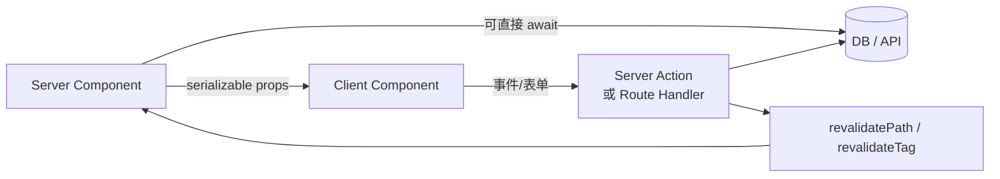
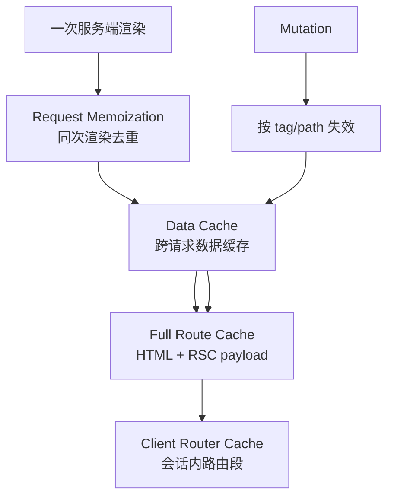

# Next.js 面试指南

> 本文聚焦 App Router 的路由树、Server/Client Component 边界、渲染与缓存。Next.js 缓存默认值会随大版本变化，面试时先说明版本，再解释稳定的分层模型。

## App Router 心智模型

默认使用 Server Component，只有需要 state、effect、事件处理或浏览器 API 的边界才加 `'use client'`。一旦文件成为 Client Component，它导入的客户端依赖也会进入相应 bundle，因此边界应尽量靠近交互叶节点。

## 一、路由与界面结构

| 主题 | 核心结论与陷阱 |
| --- | --- |
| [App Router 基础](topics/app-router-fundamentals.md) | 文件系统目录形成 route segments；`page` 暴露路由，`layout` 包裹后代并跨导航保留状态，route group 可组织而不进入 URL。 |
| [Layout 与嵌套路由](topics/layouts-nested-routing.md) | 每段 layout 逐层嵌套；模板 template 通常在导航时重建而 layout 保留。不要在共享 layout 中读取只属于叶页面的易变状态。 |
| [动态与 catch-all 路由](topics/dynamic-catch-all-routes.md) | `[id]`、`[...slug]`、`[[...slug]]` 分别捕获单段、必选多段和可选多段；参数仍是不可信字符串，需要验证。 |
| [Loading 与 Error UI](topics/loading-error-ui.md) | `loading.js` 自动形成 Suspense fallback，`error.js` 是客户端错误边界并提供 reset；not-found 与全局错误有不同作用域。 |
| [Parallel 与 Intercepting Routes](topics/parallel-intercepting-routes.md) | parallel slot 让同一 layout 同时渲染多个独立子树；interception 可在当前上下文覆盖导航，常用于“列表上打开详情 modal”。刷新后仍应有完整独立页面。 |
| [Pages Router（旧）](topics/pages-router-legacy.md) | `getServerSideProps`、`getStaticProps` 属于 Pages Router，不与 App Router 的 RSC 数据模型混用。维护旧项目要能说明迁移边界。 |

## 二、Server/Client Components 与数据获取

| 主题 | 核心结论与陷阱 |
| --- | --- |
| [Server 与 Client Components](topics/server-vs-client-components.md) | Server Component 能访问服务端资源且代码不下发，但不能使用客户端 Hook；Client Component 可交互但 props 必须可序列化。`use client` 是模块图边界。 |
| [数据获取模式](topics/data-fetching-patterns.md) | 服务端组件就近 await 数据；独立请求并行启动避免瀑布，相关查询可下推。敏感 token 留在服务端，并在请求边界做认证授权。 |
| [Streaming 与 Suspense](topics/streaming-suspense.md) | 先发送 layout/shell，再按边界流式补内容；边界应对应有意义的加载单元，既避免全页等待也避免大量跳动 fallback。 |
| [Server Actions 与 mutation](topics/server-actions-mutations.md) | Action 是服务端入口，不因定义在组件附近就可信；必须校验表单、认证授权、处理幂等，并在成功后失效缓存或重定向。 |
| [Route Handlers](topics/route-handlers-api.md) | `route.ts` 使用 Web Request/Response 实现 HTTP endpoint；适合 webhook、BFF 和非 UI 客户端接口，注意与 page 不能占同一路由段。 |

## 三、四层缓存模型

| 主题 | 核心结论与陷阱 |
| --- | --- |
| [请求、数据与整页缓存](topics/caching-layers-request-data-full-route.md) | Request memoization 只在一次渲染中去重；Data Cache 可跨请求；Full Route Cache 保存静态输出；客户端 Router Cache 保存已访问/预取路由段。失效方向要明确。 |
| [ISR](topics/isr-incremental-static-regeneration.md) | 静态页面按时间或按需在后台重生成，旧页面可先服务；适合可容忍短暂陈旧的大量内容。必须设计 revalidate、失败回退和一致性预期。 |
| [Partial Prerendering](topics/partial-prerendering-ppr.md) | 静态 shell 在构建时生成，动态洞由 Suspense 在请求时流式填充；目标是静态 TTFB 与动态个性化兼得，支持度取决于版本。 |

面试时避免笼统说“Next 会自动缓存”。应明确缓存对象、生命周期、失效方式、用户数据能否共享，以及当前 Next 版本的默认策略。

## 四、平台、部署与优化

| 主题 | 核心结论与陷阱 |
| --- | --- |
| [Middleware](topics/middleware.md) | 在路由完成前做重写、重定向、轻量鉴权和实验分流；运行约束严格，不应执行慢数据库查询或作为完整授权层。 |
| [Edge Runtime](topics/edge-runtime.md) | 靠近用户、冷启动低，但 Node API、依赖和长任务受限；适合轻量个性化和鉴权，不代表所有服务端逻辑都应放 edge。 |
| [Image 优化](topics/image-optimization.md) | `next/image` 提供尺寸占位、响应式 srcset、格式转换和懒加载；必须正确给 sizes，首屏 LCP 图用 priority/fetchPriority 且不能 lazy。 |
| [Font 优化](topics/font-optimization.md) | `next/font` 自托管并生成预加载/字体 CSS，减少第三方连接与 CLS；仍需控制字重、子集和 fallback metric。 |
| [Metadata 与 SEO](topics/metadata-seo.md) | 静态 metadata 或 `generateMetadata` 输出 title、canonical、OG 等；动态 metadata 也可能触发数据依赖，错误状态需返回真实 status。 |

## 高频自测

1. `'use client'` 声明的是组件本身，还是一条模块依赖边界？
2. layout、template、page 的生命周期有何不同？
3. 为什么 Server Component 可以减少客户端 JavaScript？
4. RSC payload 与 HTML 分别做什么？
5. 如何避免嵌套 Server Component 的数据请求瀑布？
6. 四层缓存各缓存什么，作用域多久？
7. Server Action 为什么仍需认证、授权和 CSRF/Origin 考量？
8. ISR 与 SSR、SSG 的新鲜度和成本有何区别？
9. middleware 与 route handler 分别适合什么逻辑？
10. modal intercept route 如何保证刷新和深链接仍可用？

## 面试前检查清单

- 能从 URL 画出 route segment、layout、page 和边界 UI。
- 能把交互叶节点放在小的 Client Component 边界内。
- 能分别说明 Request Memoization、Data、Full Route、Router Cache。
- 能按页面新鲜度、个性化、SEO 和部署环境选择渲染策略。
- 能说明图片、字体、metadata 和 streaming 对 Core Web Vitals 的影响。

原始入口：[英文模块总览](README.md) · [英文题库](question-bank/README.md) · [仓库总目录](../README.md)
