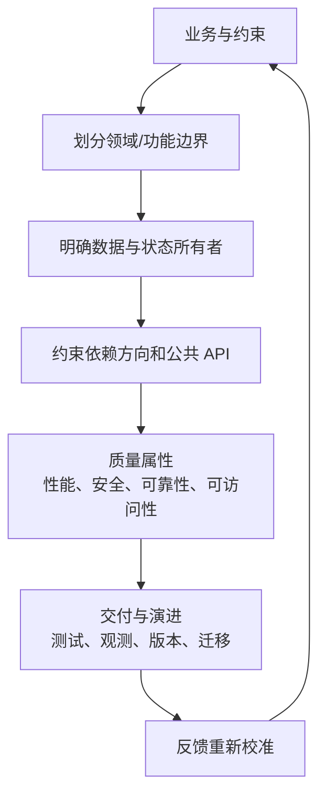
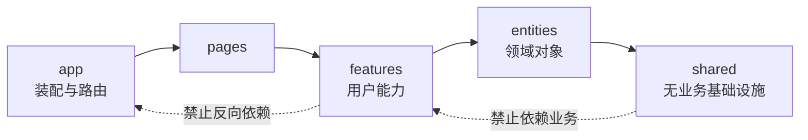
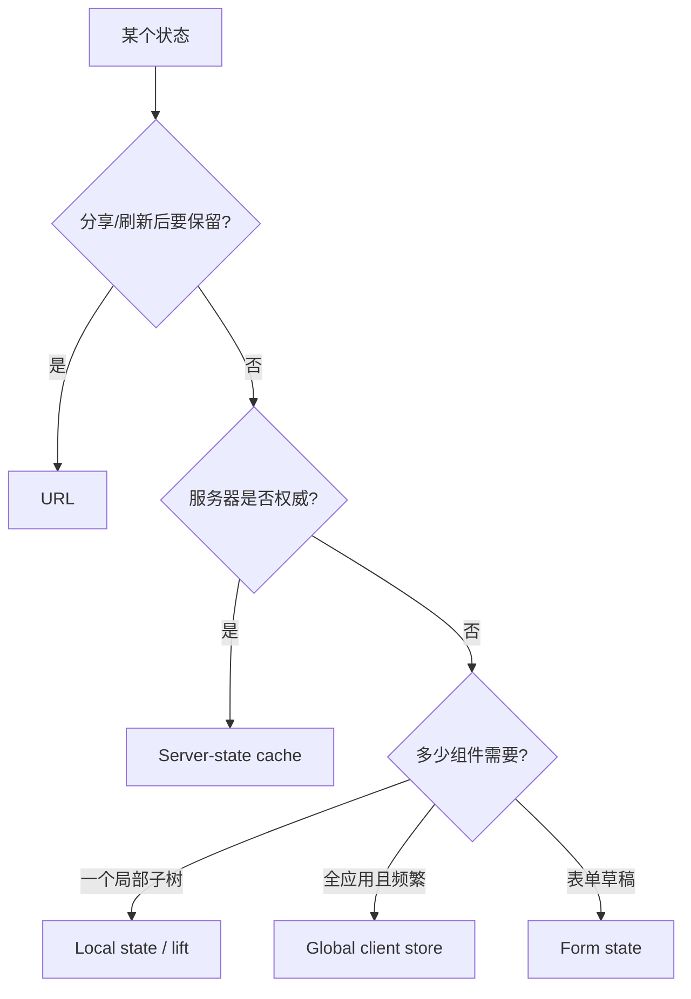
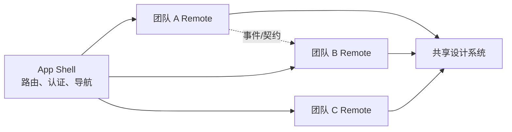

# 前端架构面试指南

> 架构题没有唯一框架答案。好的回答先明确规模、团队、变更频率和质量目标，再设计边界、依赖方向、数据所有权和演进路径。本文覆盖本模块 22 个主题。

## 架构决策主线

架构价值应以可验证结果表达：变更是否局部、团队能否独立发布、错误是否隔离、性能预算是否守住，而不是目录看起来是否“高级”。

## 一、组件与设计系统

| 主题 | 核心结论与陷阱 |
| --- | --- |
| [组件架构与组合](topics/component-architecture-composition.md) | 组件围绕单一职责和变化原因拆分；用 children、slots 和受控状态组合，避免布尔 props 组合爆炸与过早抽象。 |
| [Container 与 Presentational](topics/container-vs-presentational.md) | 分离数据协调和展示有助测试复用，但现代 Hook 已使边界更灵活；重点是副作用与 UI 是否解耦，不是文件名。 |
| [Atomic Design](topics/atomic-design.md) | atom/molecule/organism/template/page 提供设计沟通词汇，不等于代码依赖层；组件应按产品语义和变化模式决定边界。 |
| [组件库 API 设计](topics/component-libraries-api-design.md) | 默认可访问、可组合、受控/非受控一致，明确 escape hatch；避免 prop 矩阵，用子组件或 slots 表达结构。 |
| [Design Tokens](topics/design-tokens.md) | 原始 token → 语义 token → 组件 token，平台无关数据生成多端产物；语义层让换主题不等于全局查找替换。 |
| [Design Systems](topics/design-systems.md) | 不只是组件包，还包括设计语言、token、文档、治理、贡献和发布流程；成功指标是采用率、一致性与交付效率。 |
| [MVC/MVVM 在前端](topics/mvc-mvvm-in-the-frontend.md) | 不同框架对名词映射不同；应说明模型、视图、用户意图和状态同步的实际边界，不要强行套经典桌面定义。 |

## 二、代码组织与依赖方向

| 主题 | 核心结论与陷阱 |
| --- | --- |
| [Feature-based / Feature-Sliced 结构](topics/feature-based-feature-sliced-structure.md) | 按业务变化聚合 UI、状态、API 和测试，使删除功能可删除一个目录；公共层只放稳定复用物，防止 shared 变垃圾场。 |
| [Clean Architecture 与分层](topics/clean-architecture-layering.md) | 业务规则不依赖框架和网络，接口适配器在边界转换 DTO/领域模型；复杂领域收益高，简单 CRUD 套全套会制造仪式。 |
| [前端领域驱动设计](topics/domain-driven-design-frontend.md) | bounded context 允许同名概念有不同模型；anti-corruption layer 隔离后端 DTO。适合复杂长期业务，不是每个页面都要 entity/value object。 |
| [依赖注入](topics/dependency-injection.md) | 业务代码依赖端口，由 composition root 注入 fetch、storage、analytics 实现，便于测试和替换；简单函数参数通常胜过重量容器。 |
| [状态架构：状态放在哪里](topics/state-architecture-where-state-lives.md) | 状态放在最小需要共享的所有者：局部 UI、URL、服务端缓存、表单、全局客户端状态各自不同；派生值不重复存储。 |
| [Plugin/Extension 系统](topics/plugin-extension-systems.md) | 定义稳定注册协议、能力与生命周期；第三方插件需权限、隔离、版本兼容和故障边界，不能让任意代码访问全部宿主。 |
| [BFF](topics/backend-for-frontend-bff.md) | 针对特定客户端聚合和塑形后端数据、保存密钥与协议转换；它不是通用 API gateway，也不应复制完整业务领域。 |

### 状态归属决策

## 三、多团队与部署边界

| 主题 | 核心结论与陷阱 |
| --- | --- |
| [Monorepo、Nx 与 Turborepo](topics/monorepos-nx-turborepo.md) | monorepo 统一依赖、原子变更和共享工具；任务图、远程缓存和 affected builds 控制规模。代码共库不代表所有包都应互相依赖。 |
| [Micro-frontends](topics/micro-frontends.md) | 用运行时与部署复杂度换团队自治；按业务垂直切分并明确路由、通信、样式、依赖和故障隔离。单团队产品通常不值得。 |
| [Module Federation](topics/module-federation.md) | 运行时从 remote 加载模块，可独立发布；shared singleton 的版本协商、remote 不可用、类型同步和安全供应链是主要风险。 |
| [构建工具：Vite/Webpack/esbuild](topics/build-tooling-vite-webpack-esbuild.md) | 开发期原生 ESM/预构建与生产 bundle 是不同问题；esbuild/SWC 快在原生实现，Webpack 生态和定制成熟，选择基于需求而非跑分。 |

微前端回答必须说明替代方案：如果只需代码所有权和独立 CI，monorepo 中的模块边界可能已经足够，不必承担运行时拼装成本。

## 四、交付、可靠性与演进

| 主题 | 核心结论与陷阱 |
| --- | --- |
| [渲染策略选择](topics/rendering-strategy-selection-csr-ssr-ssg-isr.md) | 按路由的 SEO、新鲜度、个性化、TTFB、缓存和基础设施成本选择 CSR/SSR/SSG/ISR，可混合而非全站押注一种。 |
| [错误处理与可观测性](topics/error-handling-observability.md) | 区分预期业务错误与程序错误；边界显示可恢复 UI，日志/指标/trace 带版本、路由和 correlation ID，并控制隐私及采样。 |
| [Feature Flags 与实验](topics/feature-flags-experimentation.md) | 发布与启用解耦，支持灰度和回滚；flag 要有 owner、到期日、默认安全值，服务端与客户端分桶一致，避免组合爆炸。 |
| [版本与发布策略](topics/versioning-release-strategy.md) | 库用 semver 与 changelog，应用用渐进发布、canary 和自动回滚；数据库/API/客户端部署不同时要采用 expand-contract 兼容迁移。 |

## 系统性面试回答模板

1. 明确用户、规模、团队和关键质量属性。
2. 画出模块边界、数据流和依赖方向。
3. 指定状态与数据所有权，定义跨边界契约。
4. 说明渲染、缓存、失败、权限和可访问性策略。
5. 给出测试、观测、发布、回滚和迁移方案。
6. 主动讲成本、适用阈值和更简单替代方案。

## 高频自测

1. 何时组件抽象是复用，何时只是增加间接层？
2. shared 目录为何会退化，怎样用依赖规则治理？
3. server state 为什么不应默认复制进全局客户端 store？
4. BFF 与 API gateway 有什么区别？
5. monorepo 与 micro-frontend 分别解决代码管理还是部署自治？
6. Module Federation remote 挂掉时宿主如何降级？
7. 如何让 feature flag 分桶稳定并避免长期技术债？
8. 错误监控怎样从一次前端异常关联到后端请求？

## 面试前检查清单

- 每个架构选择都能关联到一个明确约束，并说出成本和替代方案。
- 能画出模块依赖、状态所有权和跨边界数据流。
- 能区分代码边界、构建边界、部署边界和运行时隔离。
- 能覆盖正常路径之外的失败、观测、发布、回滚和迁移。
- 不用“为了扩展性”作为没有规模数据支撑的万能理由。

原始入口：[英文模块总览](README.md) · [英文题库](question-bank/README.md) · [仓库总目录](../README.md)
