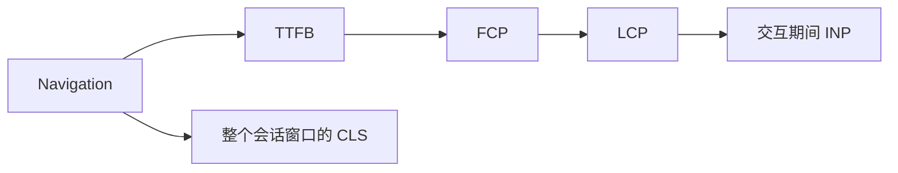
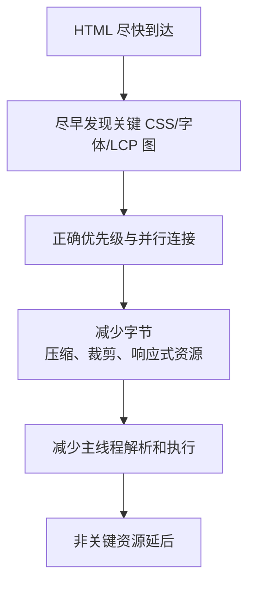

# Web 性能面试指南

> 性能回答必须从用户指标开始，用数据定位瓶颈，再选择作用于正确阶段的优化。不要把所有问题都回答成“压缩和 CDN”。本文覆盖本模块 22 个主题。

## 性能诊断闭环

## 一、指标：加载、响应、稳定

| 主题 | 核心结论与陷阱 |
| --- | --- |
| [Core Web Vitals 总览](topics/core-web-vitals-overview.md) | LCP、INP、CLS 分别衡量加载、响应和视觉稳定，以真实用户 p75 判断；需按设备、网络、地区、页面类型分群。 |
| [LCP](topics/lcp-largest-contentful-paint.md) | 良好 ≤2.5s，可拆成 TTFB、资源加载延迟、资源下载和元素渲染延迟；首图不懒加载，尽早在 HTML 中发现并提高优先级。 |
| [INP](topics/inp-interaction-to-next-paint.md) | 良好 ≤200ms，包含输入延迟、事件处理和下一次绘制延迟；拆长任务、减少同步工作、尽早让出主线程。 |
| [CLS](topics/cls-cumulative-layout-shift.md) | 良好 ≤0.1；为图片、广告、嵌入内容预留尺寸，字体使用兼容 fallback，避免在现有内容上方插入 UI。 |
| [FCP 与旧 FID](topics/fcp-fid-legacy.md) | FCP 是首个内容绘制，不代表主要内容或可交互；FID 只测首次输入延迟，已由覆盖整个会话且包含呈现的 INP 替代。 |
| [TTFB](topics/ttfb.md) | 包含重定向、DNS/连接、服务器处理和首字节传输；用 CDN、缓存、连接复用、流式响应和后端优化针对不同子阶段。 |
| [Lab、Field 与 RUM](topics/lab-vs-field-data-rum.md) | Lab 可控、适合调试；field 反映真实长尾但噪声大。CrUX 提供聚合数据，自建 RUM 可关联版本、路由与业务上下文。 |

## 二、加载性能

| 主题 | 核心结论与陷阱 |
| --- | --- |
| [Bundle 优化与代码拆分](topics/bundle-optimization-code-splitting.md) | 先用 bundle analyzer 找大依赖，再按路由/重功能拆分；过细 chunk 会制造请求瀑布和运行时开销。预算应看压缩后字节与解析/执行成本。 |
| [Tree Shaking](topics/tree-shaking-dead-code.md) | 依赖静态 ESM 和可证明无副作用；动态 require、错误 sideEffects 声明、聚合入口可能阻碍消除。它不等于代码拆分。 |
| [懒加载路由、组件与图片](topics/lazy-loading-routes-components-images.md) | 推迟非首屏资源，但必须避免把 LCP 和导航后立即需要的功能推迟；结合预取和稳定 skeleton 控制等待与 CLS。 |
| [图片优化](topics/image-optimization-formats-responsive.md) | 正确尺寸通常比格式更重要；用 AVIF/WebP、`srcset/sizes`、尺寸属性、质量压缩和 CDN 变体。首图 eager + 高优先级。 |
| [字体加载策略](topics/font-loading-strategy.md) | 子集化并减少字重，预加载关键字体，自托管；`font-display` 与 metric override 平衡闪烁、阻塞和布局偏移。 |
| [关键 CSS](topics/critical-css-above-the-fold.md) | 内联极少首屏 CSS，异步加载其余；重复内联会增加 HTML 且不能长期缓存，自动提取可能误判动态首屏。 |
| [`preload`、`prefetch`、`preconnect`](topics/preload-prefetch-preconnect.md) | preload 是当前导航确定需要，prefetch 是未来可能需要，preconnect 提前连接；优先级提示会争用带宽，必须节制。 |
| [gzip 与 Brotli](topics/compression-gzip-brotli.md) | 文本资源压缩收益高，Brotli 通常更小；图片/视频已压缩。动态高等级压缩耗 CPU，静态资源应预压缩并正确 `Vary: Accept-Encoding`。 |
| [CDN 与边缘交付](topics/cdn-edge-delivery.md) | 降低网络距离并卸载源站，可做 TLS、缓存和图片转换；cache key、个性化、失效和源站回源风暴是关键设计点。 |
| [HTTP 与 Service Worker 缓存](topics/http-caching-service-worker-cache.md) | HTTP cache 由声明式响应头管理，SW Cache 是脚本控制的独立存储；哈希静态资源长期缓存，HTML 验证，SW 明确版本和淘汰。 |

### 加载瀑布优化顺序

## 三、运行时性能

| 主题 | 核心结论与陷阱 |
| --- | --- |
| [避免 Layout Thrashing](topics/avoid-layout-thrashing.md) | 样式写入后读取几何会强制同步布局；先统一读再写，视觉批次放 rAF，并缩小 layout 影响范围。 |
| [列表虚拟化](topics/list-virtualization-windowing.md) | 只渲染可见项与 overscan；动态高度要测量缓存并维持滚动锚点。会影响浏览器查找、打印和无障碍，应提供语义信息。 |
| [无限滚动与分页](topics/infinite-scroll-vs-pagination.md) | 无限滚动适合探索流，分页适合定位和返回；用 IntersectionObserver、游标分页、请求去重、虚拟化和可恢复滚动位置。 |
| [Web Worker 卸载](topics/web-workers-offloading.md) | 适合大计算，不能操作 DOM；序列化和线程通信有成本。用 transferable 传大 buffer，任务太小则得不偿失。 |
| [内存泄漏与分析](topics/memory-leaks-profiling.md) | 观察多次操作和 GC 后基线是否持续增长；用 allocation timeline、heap comparison、retaining path 定位监听器、缓存、闭包和脱离节点。 |

## 四、性能预算与落地

- 按页面类型设 p75 LCP/INP/CLS SLO，同时设 JS、CSS、图片和第三方脚本字节预算。
- RUM 记录版本、路由、设备、连接和实验组，但不收集敏感数据；比较发布前后分布而非单一平均值。
- CI 检查 bundle diff 和可重复的 Lab 指标；生产告警以滚动窗口避免噪声。
- 每个优化都记录基线、假设、变更和结果，防止凭感觉长期保留复杂方案。

## 高频自测

1. LCP 四段时间怎样拆，分别由前后端哪些手段改善？
2. 为什么 INP 不只是事件处理函数耗时？
3. 哪些布局变化不计入 CLS，为什么？
4. preload、prefetch、preconnect 的资源时机有何区别？
5. tree shaking 与 code splitting 各减少什么成本？
6. 为什么首屏图片不能 lazy load？
7. 如何证明页面存在内存泄漏而非正常 GC 波动？
8. 虚拟列表怎样支持可访问性、动态高度和滚动恢复？

## 面试前检查清单

- 先说指标和数据，再说工具与优化手段。
- 能把加载瀑布拆成服务器、发现、下载、解析执行和渲染阶段。
- 能把每个 CSS/JS 变化映射到 layout、paint 或 composite。
- 能解释实验室数据与真实用户 p75 为什么可能相反。
- 能讨论优化的成本：缓存陈旧、代码拆分瀑布、Worker 通信、虚拟化可访问性。

原始入口：[英文模块总览](README.md) · [英文题库](question-bank/README.md) · [仓库总目录](../README.md)
