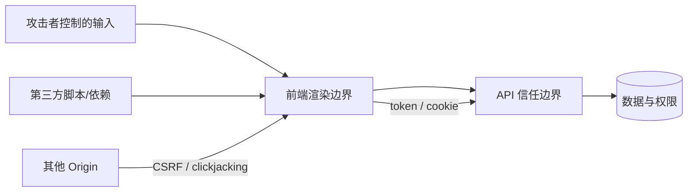
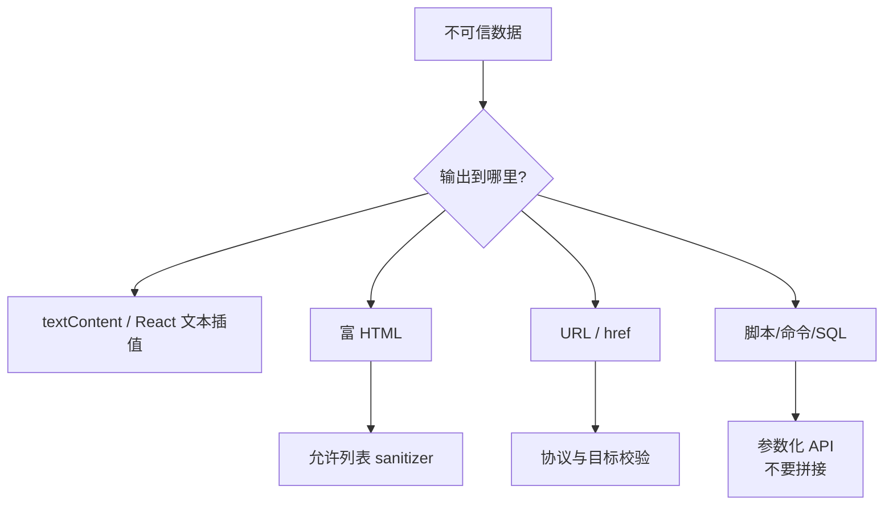
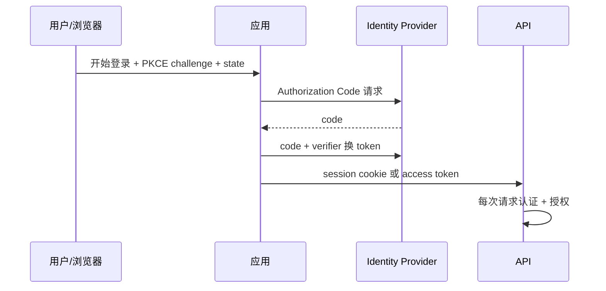

# 前端安全面试指南

> 安全的基本假设是：浏览器中的用户、输入、URL、存储和客户端代码都不可信。先画信任边界与数据流，再针对威胁分层防御。本文覆盖本模块 18 个主题。

## 威胁模型



每跨过一个边界都要做与上下文匹配的验证、编码和授权。前端校验改善体验，真正的权限判断必须在服务端执行。

## 一、攻击与输入防御

| 主题 | 核心结论与陷阱 |
| --- | --- |
| [OWASP Top 10](topics/owasp-top-10-overview.md) | 用访问控制、注入、配置、供应链、认证、日志等风险类别建立检查表；排名不是逐条安装库，必须结合资产和威胁模型。 |
| [存储型、反射型与 DOM XSS](topics/xss-stored-reflected-dom.md) | 三者区别在恶意数据保存/反射/前端处理的位置，结果都是攻击脚本在受信任 origin 执行。DOM XSS 的 source 到 sink 可完全不经过服务器。 |
| [XSS：转义、净化与防御](topics/xss-defenses-escaping-sanitization.md) | 输出编码必须匹配 HTML、属性、URL、JS、CSS 上下文；允许富文本时用成熟 sanitizer。自动转义框架不保护 `innerHTML` 和危险 URL。 |
| [Trusted Types](topics/trusted-types.md) | 通过 CSP 强制 `innerHTML` 等危险 sink 只接收受策略创建的 TrustedHTML，将 DOM XSS 审计集中到少数策略；需渐进 report-only 迁移。 |
| [CSRF](topics/csrf.md) | 利用浏览器自动携带认证 Cookie 发出非用户意图请求；使用 SameSite、同步/双提交 token、Origin 校验，状态变更不用 GET。XSS 可绕过多数 CSRF 防线。 |
| [CORS 的安全视角](topics/cors-security-view.md) | CORS 限制跨源脚本读取响应，不是认证、授权或 CSRF 防御；带凭证时不能使用 `*`，反射 Origin 必须先查白名单并 `Vary: Origin`。 |
| [注入与输入验证](topics/injection-input-validation.md) | SQL/命令/模板注入来自把数据拼进代码；服务端参数化查询和允许列表是根本。只做客户端校验可被绕过，黑名单通常不完整。 |
| [原型污染](topics/prototype-pollution.md) | 不安全深合并 `__proto__`、`constructor.prototype` 可改变全局对象行为；过滤危险 key、使用无原型字典、修补依赖并避免递归任意合并。 |



## 二、浏览器策略与响应头

| 主题 | 核心结论与陷阱 |
| --- | --- |
| [Content Security Policy](topics/content-security-policy-csp.md) | 以 nonce/hash 允许可信脚本，配合 `strict-dynamic`、`object-src 'none'`、`base-uri`；先 Report-Only 收集违规，再强制。`unsafe-inline` 会削弱价值。 |
| [安全响应头](topics/security-headers-hsts-x-frame-options.md) | HSTS 强制 HTTPS，`nosniff` 禁止 MIME 猜测，Referrer-Policy 控制来源泄露；frame-ancestors 是现代防嵌套方式。 |
| [Clickjacking](topics/clickjacking-frame-protection.md) | 攻击者透明 iframe 覆盖诱导点击；CSP `frame-ancestors` 或旧 `X-Frame-Options` 控制谁能嵌入，敏感动作仍需确认和重新认证。 |
| [Permissions Policy](topics/permissions-policy.md) | 限制顶层页和 iframe 使用摄像头、定位、全屏等强能力；它缩小能力面，不替代用户权限提示和业务授权。 |
| [Subresource Integrity](topics/subresource-integrity-sri.md) | 外部 script/link 带哈希，内容被篡改即拒绝执行；跨源需正确 CORS。频繁变化的第三方脚本不适合固定哈希，更稳是自托管与锁版本。 |

### 推荐基线

```http
Content-Security-Policy: default-src 'self'; script-src 'nonce-...'; object-src 'none'; base-uri 'none'; frame-ancestors 'none'
Strict-Transport-Security: max-age=31536000; includeSubDomains
X-Content-Type-Options: nosniff
Referrer-Policy: strict-origin-when-cross-origin
Permissions-Policy: camera=(), microphone=(), geolocation=()
```

具体 CSP 必须按应用资源、第三方和内联策略定制，不能不经观测直接复制到生产。

## 三、认证、授权与 token



| 主题 | 核心结论与陷阱 |
| --- | --- |
| [认证模式](topics/authentication-patterns.md) | 认证回答“你是谁”；Web 应用优先考虑服务端 session + Secure/HttpOnly/SameSite Cookie，敏感操作可重认证，多因素降低凭据风险。 |
| [授权：RBAC 与 ABAC](topics/authorization-rbac-abac.md) | 授权回答“你能做什么”；RBAC 按角色，ABAC 结合主体、资源、动作和环境。前端隐藏按钮不是授权，API 必须对每个对象检查。 |
| [JWT 使用陷阱](topics/jwt-usage-pitfalls.md) | JWT 是签名声明容器，不自动加密、撤销或安全存储；校验签名算法、iss/aud/exp，短生命周期并设计轮换/撤销。不要把敏感数据放 payload。 |
| [OAuth 2.0 与 OIDC](topics/oauth-2-0-oidc.md) | OAuth 是委托授权，OIDC 在其上提供身份；浏览器公共客户端用 Authorization Code + PKCE，校验 state/nonce/issuer/audience，隐式流已不推荐。 |

## 四、供应链

| 主题 | 核心结论与陷阱 |
| --- | --- |
| [依赖与供应链安全](topics/dependency-supply-chain-security.md) | 锁文件、最小依赖、自动审计、来源/签名、SBOM、隔离构建和快速补丁共同降低风险；自动升级仍需测试与审查 install scripts。 |

## 事件响应要点

1. 先控制影响：禁用密钥/token、关闭高风险功能、回滚或部署缓解规则。
2. 保存证据并确定入口、受影响用户/数据和时间窗口。
3. 修复根因而不只过滤一个 payload，轮换所有可能泄露凭据。
4. 按法规和流程通知，增加检测与回归测试，复盘信任边界。

## 高频自测

1. 存储型、反射型、DOM XSS 的 source 与 sink 分别在哪里？
2. HTML escape 为什么不能安全处理 JS 字符串或 URL 上下文？
3. HttpOnly、SameSite、CSP 各防什么、不防什么？
4. CORS 为什么不是授权，也不能阻止 CSRF 请求发出？
5. JWT 签名与加密有什么区别，怎样撤销？
6. OAuth Authorization Code + PKCE 防什么攻击？
7. RBAC 和 ABAC 如何处理“用户只能修改自己的订单”？
8. CSP nonce 怎样与 SSR 页面配合？
9. SRI 为什么不能完全解决第三方脚本风险？
10. 发现 token 泄露后第一小时做什么？

## 面试前检查清单

- 每种威胁能说出资产、攻击入口、影响和至少两层防御。
- 不把前端校验、隐藏 UI、CORS 或 HttpOnly 描述成完整安全边界。
- 能画出 session 与 OAuth/OIDC 登录流，说明 token 存储和更新策略。
- 能给出一套合理的安全响应头基线及迁移方法。
- 能讨论依赖、第三方脚本和构建系统的供应链风险。

原始入口：[英文模块总览](README.md) · [英文题库](question-bank/README.md) · [仓库总目录](../README.md)
