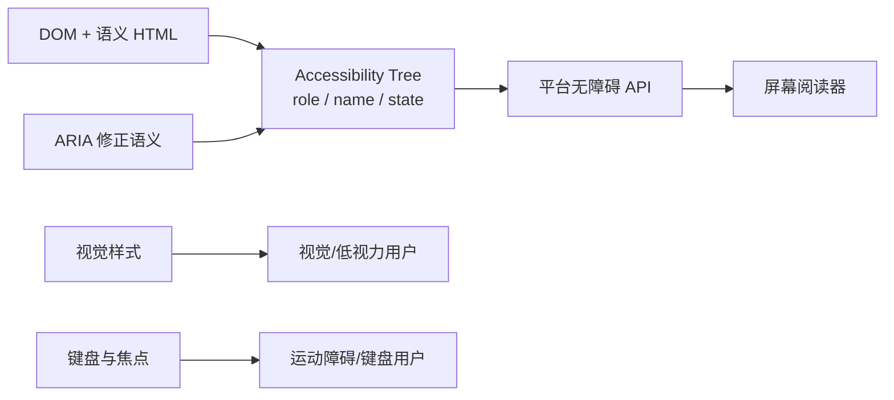
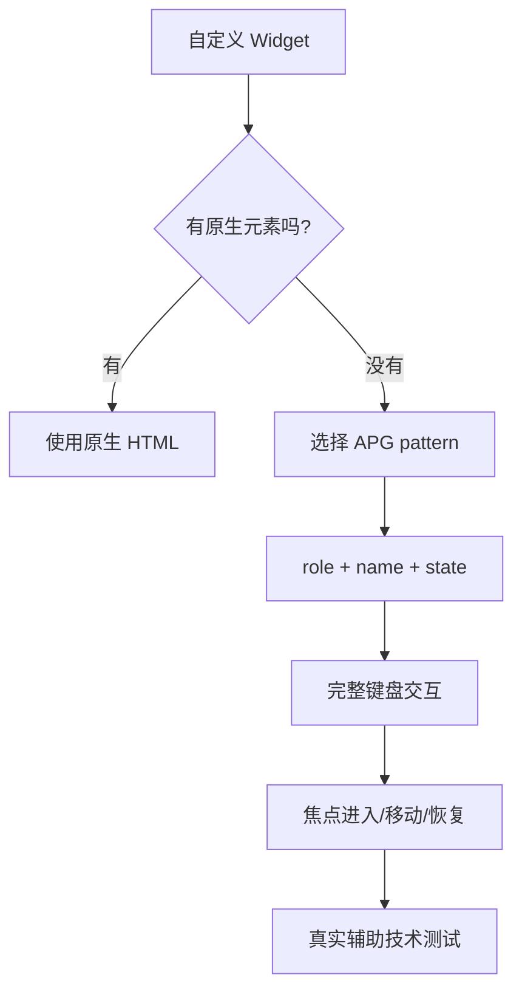
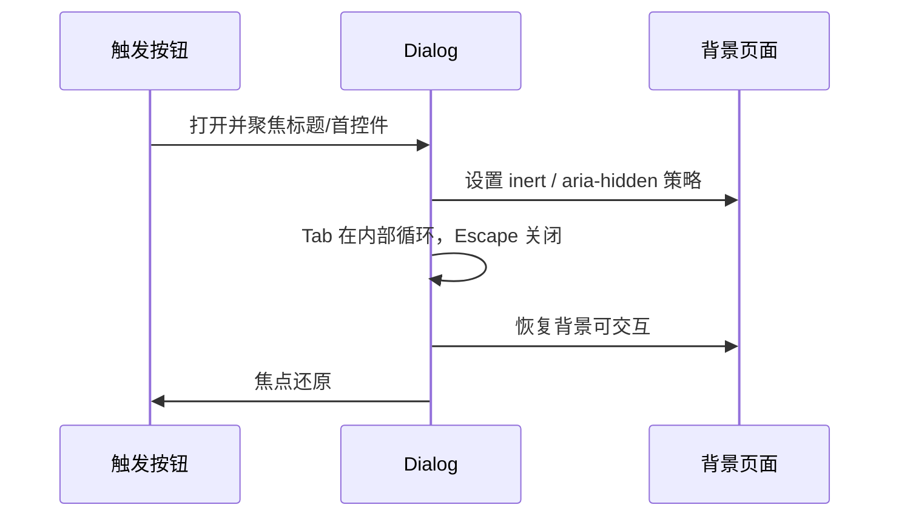

# Web 无障碍面试指南

> 无障碍不是最后补 ARIA，而是从语义、键盘、焦点、名称、状态和视觉感知开始设计。本文覆盖本模块 20 个主题，并以 WCAG POUR 原则组织回答。

## 从 DOM 到用户

ARIA 只能改变辅助技术看到的语义，不会增加键盘行为、焦点管理或视觉样式。原生元素通常一次提供全部能力。

## 一、基础原则与语义

| 主题 | 核心结论与陷阱 |
| --- | --- |
| [WCAG POUR 原则](topics/wcag-pour-principles.md) | Perceivable、Operable、Understandable、Robust 是组织需求的四原则；A/AA/AAA 是成功准则等级，常见法务目标是 AA。 |
| [Accessibility Tree](topics/the-accessibility-tree.md) | 从 DOM、CSS 和 ARIA 计算 role/name/state/value；`display:none`、hidden、某些 aria-hidden 会移除节点。错误语义会让可见 UI 与树分裂。 |
| [屏幕阅读器如何工作](topics/screen-readers-how-they-work.md) | 用户通过标题、地标、链接和表单控制浏览虚拟缓冲区；测试不能只 Tab，还要用浏览/表单模式和常用快捷导航。 |
| [语义 HTML 优先](topics/semantic-html-first.md) | button、a、input、table 等提供角色、键盘与状态；`div role=button` 仍需 tabindex、Enter/Space、disabled 和焦点样式。 |
| [何时不使用 ARIA](topics/when-not-to-use-aria.md) | “No ARIA is better than bad ARIA”；不覆盖正确原生语义，不添加矛盾 role，不用 aria-label 隐藏可见文字差异。 |
| [Skip Links 与 Landmarks](topics/skip-links-landmarks.md) | 跳过重复导航的链接应成为首个可聚焦项并指向可聚焦 main；每页一个 main，多个 nav/region 需要可访问名称。 |
| [文本替代](topics/text-alternatives-alt-labels.md) | alt 描述图片在当前上下文的功能；装饰图 `alt=""`，图标按钮通过可见文本、aria-labelledby 或谨慎使用 aria-label 命名。复杂图提供邻近说明。 |

## 二、ARIA、键盘与焦点

| 主题 | 核心结论与陷阱 |
| --- | --- |
| [ARIA role、state 与 property](topics/aria-roles-states-properties.md) | role 表示类型，state/property 表示当前状态与关系；可访问名称来自 label/内容/关联算法，不应重复或与可见文字冲突。 |
| [ARIA Authoring Practices](topics/aria-authoring-practices-patterns.md) | APG 提供交互设计模式，不是复制属性清单；实现必须包含键盘模型、焦点、状态同步和高对比度支持。 |
| [键盘导航与 Tab 顺序](topics/keyboard-navigation-tab-order.md) | DOM 顺序应匹配视觉顺序；`tabindex=0` 加入自然顺序，`-1` 可编程聚焦，正数 tabindex 制造难维护顺序。复合组件常用 roving tabindex。 |
| [焦点管理](topics/focus-management.md) | SPA 导航、删除当前项、异步错误和弹层都要决定焦点去向；只在上下文确实变化时移动焦点，并提供明显 `:focus-visible`。 |
| [Modal 焦点陷阱](topics/focus-trapping-modals.md) | 打开时保存触发器并把焦点移入，Tab 在内部循环，背景 inert，Escape 关闭，结束时还原到触发器或合理后继。 |
| [Live Regions](topics/live-regions-announcements.md) | 动态状态用预先存在的 `aria-live=polite`，紧急错误才用 assertive/alert；只播报有意义变化，避免重复和整区替换。 |

### Modal 焦点生命周期

## 三、可访问组件

| 主题 | 核心结论与陷阱 |
| --- | --- |
| [可访问表单](topics/accessible-forms.md) | 每个控件有持久 label，说明与错误通过 aria-describedby 关联；错误同时用文字表达并聚焦第一个无效字段。placeholder 不是标签。 |
| [Dialog/Modal](topics/accessible-dialogs-modals.md) | 优先原生 `<dialog>` 并正确命名；`aria-modal` 只告诉辅助技术，不会自动阻止背景点击、滚动或焦点。 |
| [Tabs](topics/accessible-tabs.md) | tablist/tab/tabpanel 角色与 aria-controls/selected 对应；方向键在 tab 间移动，Tab 进入 panel。自动激活只适合内容立即可用。 |
| [Menus 与 Combobox](topics/accessible-menus-comboboxes.md) | menu 是应用式命令菜单，不是普通站点导航；combobox 需要输入、popup、active descendant、过滤与键盘模型，优先成熟库。 |
| [Tables](topics/accessible-tables.md) | 数据表用 caption、th、scope，复杂表才用 headers/id；响应式不能破坏单元格关系。布局不要使用 table 语义。 |

## 四、视觉、动态效果与测试

| 主题 | 核心结论与陷阱 |
| --- | --- |
| [颜色对比度](topics/color-contrast.md) | 常规文本至少 4.5:1，大文本 3:1，UI 边界/状态 3:1；不能只靠颜色表达状态，品牌色需要在实际背景和状态下测量。 |
| [减少动态效果](topics/reduced-motion-prefers.md) | `prefers-reduced-motion: reduce` 下移除大幅移动、视差和自动播放，保留必要即时反馈；不要用 `animation: none` 破坏依赖结束事件的逻辑。 |

### 测试顺序

1. 仅键盘完成每条核心流程，检查焦点可见、顺序和无陷阱。
2. 放大到 200%/400%，测试 reflow、文本裁切和水平滚动。
3. 运行 axe/Lighthouse 捕获可自动检测的问题。
4. 使用至少一种主流屏幕阅读器检查名称、角色、状态、标题和动态播报。
5. 覆盖高对比度、减少动态、触摸目标、错误和加载状态。

自动化只能发现部分规则，不能判断 alt 是否有意义、焦点是否符合任务或播报是否清晰。

## 高频自测

1. 浏览器怎样计算一个按钮的 accessible name？
2. 为什么 role=button 不能替代 button？
3. `aria-hidden`、hidden、inert 有什么区别？
4. modal 打开、操作、关闭三个阶段如何管理焦点？
5. tab 组件的 Tab 键与方向键职责分别是什么？
6. `aria-live=polite` 和 `role=alert` 如何选择？
7. 装饰图片、功能图片、复杂图表的替代文本分别怎么做？
8. 为什么自动化无障碍得分 100 仍不能证明页面可访问？

## 面试前检查清单

- 回答任何组件题都覆盖语义、键盘、焦点、名称/状态和视觉反馈。
- 能用 DOM → accessibility tree → 平台 API → 辅助技术解释 ARIA。
- 能说明原生元素优先以及 ARIA 不增加行为的边界。
- 能现场描述 dialog、tabs、combobox 中至少一种完整键盘模式。
- 测试策略同时包含自动化、键盘、缩放和屏幕阅读器。

原始入口：[英文模块总览](README.md) · [英文题库](question-bank/README.md) · [仓库总目录](../README.md)
