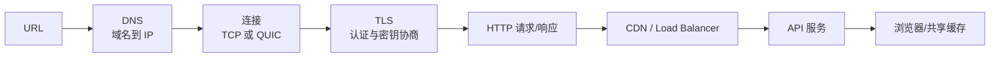
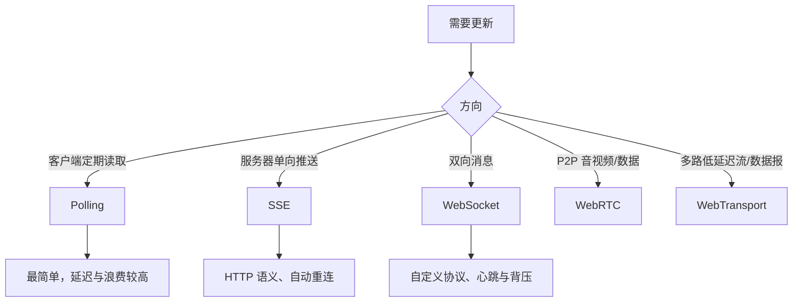
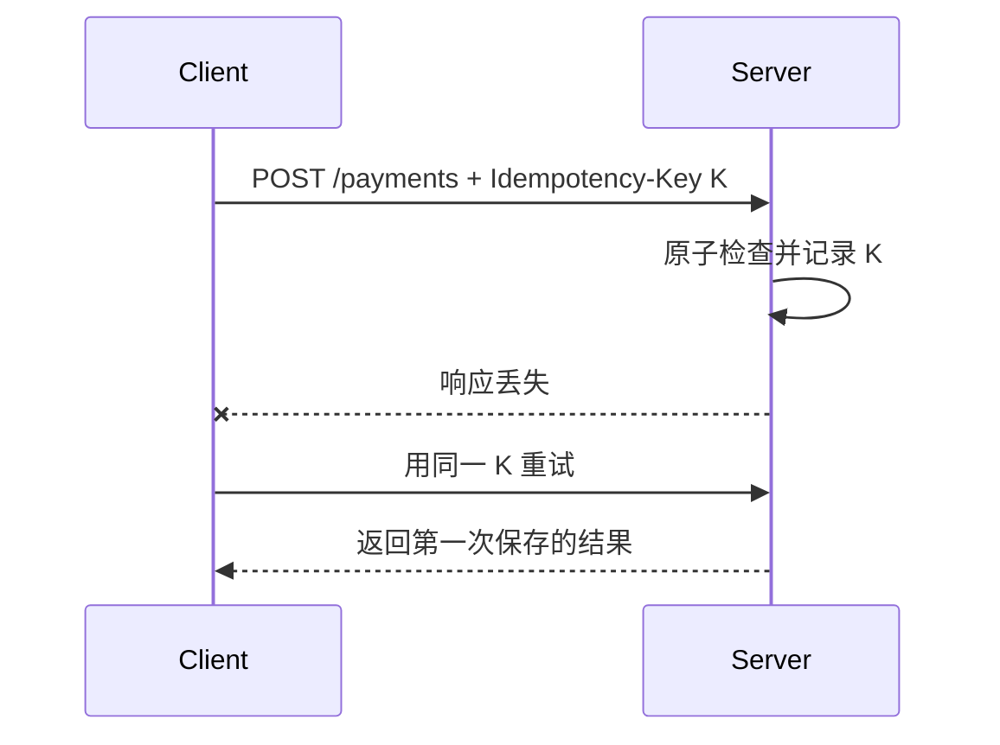

# 前端网络面试指南

> 网络题要能从 DNS、连接、TLS、HTTP 一直讲到 API、缓存和实时传输，并能按可靠性需求选择协议。本文覆盖本模块 21 个主题。

## 从 URL 到响应

## 一、协议与连接

| 主题 | 核心结论与陷阱 |
| --- | --- |
| [DNS](topics/dns.md) | resolver 递归查询 root/TLD/authoritative，结果按 TTL 在多层缓存；A/AAAA/CNAME 含义不同。DNS 不返回 URL path，切换记录也不会瞬间全球生效。 |
| [TLS 握手](topics/tls-handshake.md) | 证书链认证服务器，ECDHE 协商共享密钥，后续对称加密；TLS 1.3 常规 1-RTT，session resumption 可更快，0-RTT 有重放风险。 |
| [HTTP 方法、状态码与 Header](topics/http-methods-status-codes-headers.md) | safe 与 idempotent 语义影响缓存、预取和重试；401/403、301/302/307/308、200/201/204 要准确区分。 |
| [HTTP/1.1 与 HTTP/2](topics/http-1-1-vs-http-2.md) | H2 在一条 TCP 连接上二进制多路复用并压缩 header，消除应用层队头阻塞；TCP 丢包仍阻塞所有 stream。域名分片在 H2 下通常有害。 |
| [HTTP/3 与 QUIC](topics/http-3-quic.md) | QUIC 基于 UDP 在用户态实现 TLS 1.3、多路流和连接迁移；单流丢包不阻塞其他流。首次连接、UDP 被阻断和服务器支持仍有成本。 |
| [压缩：gzip/Brotli](topics/compression-gzip-brotli.md) | 文本使用 Brotli/gzip，媒体通常已压缩；静态预压缩，动态压缩平衡 CPU；`Content-Encoding` 配合 `Vary: Accept-Encoding`。 |
| [Fetch、XHR 与取消](topics/fetch-xhr-request-cancellation.md) | fetch 在 headers 到达时 resolve，4xx/5xx 不 reject；AbortSignal 协作取消。XHR 仍常用于上传进度，取消不能回滚服务端副作用。 |

## 二、API 设计与分页

| 主题 | 核心结论与陷阱 |
| --- | --- |
| [REST API 设计](topics/rest-api-design.md) | 以资源 URL 和 HTTP 语义建模，返回真实状态码；处理过滤、分页、版本、错误结构和幂等。JSON-over-HTTP 不自动等于 REST。 |
| [GraphQL](topics/graphql.md) | 客户端精确选择字段、一个 schema 与类型系统，减少 over/under-fetch；代价是服务端复杂度、N+1、字段授权、查询成本和 HTTP 缓存不直观。 |
| [gRPC 与 gRPC-Web](topics/grpc-grpc-web.md) | Protobuf 强类型、HTTP/2 streaming 和生成代码适合服务间通信；浏览器不能直接控制原生 gRPC 所需帧/trailer，通常经 gRPC-Web proxy。 |
| [Cursor 与 Offset 分页](topics/pagination-cursor-vs-offset.md) | offset 简单且可跳页，但大偏移慢、并发插入会重复/遗漏；cursor 基于稳定排序键，适合动态 feed，但不可任意跳页且 cursor 应 opaque。 |

### API 选择

- 公共资源与 HTTP 缓存友好、模型稳定：REST。
- 多客户端字段需求差异大、图关系复杂：GraphQL，但必须控制查询成本和授权。
- 内部强类型高吞吐服务：gRPC；浏览器入口通过 BFF/gRPC-Web 转换。
- 无论风格，外部输入都需校验，认证不等于对象级授权。

## 三、实时与流式通信

| 主题 | 核心结论与陷阱 |
| --- | --- |
| [Polling、Long Polling 与 Push](topics/polling-vs-long-polling-vs-push.md) | 短轮询简单但空请求多；长轮询保持请求直到有数据并立即重连；推送降低延迟但需要连接治理。先按频率和复杂度选最简单方案。 |
| [SSE](topics/server-sent-events-sse.md) | 基于 HTTP 的服务器到客户端文本事件流，EventSource 自动重连并支持 Last-Event-ID；不能原生自定义请求 header，二进制和双向场景不适合。 |
| [WebSocket](topics/websocket.md) | Upgrade 后全双工消息通道；需自定义认证、协议版本、心跳、重连退避、顺序/去重和背压。连接存在不等于消息可靠送达。 |
| [WebRTC](topics/webrtc-p2p.md) | 浏览器实时媒体/数据，信令不在标准内；ICE 用 STUN 发现地址、TURN 中继穿透失败流量。P2P 不保证无需服务器或更便宜。 |
| [WebTransport](topics/webtransport.md) | 基于 HTTP/3 提供可靠多路 stream 与不可靠 datagram，避免单一 WebSocket 流队头阻塞；支持度和部署成熟度仍需评估。 |

## 四、缓存、CDN 与可靠性

| 主题 | 核心结论与陷阱 |
| --- | --- |
| [HTTP 缓存](topics/http-caching-cache-control-etag.md) | max-age 决定 fresh，ETag/Last-Modified 负责过期验证；`no-cache` 是每次验证，`no-store` 才是不保存。哈希资源长期缓存，HTML 验证。 |
| [CDN 与边缘缓存](topics/cdn-edge-caching.md) | 按 cache key 在 PoP 缓存降低延迟；设计 TTL、purge、stale、Vary、鉴权内容和 origin shield，防止缓存投毒与回源风暴。 |
| [负载均衡（客户端视角）](topics/load-balancing-client-view.md) | DNS/L4/L7 在不同层分发；健康检查、连接排空、sticky session 和跨区故障影响客户端。无状态服务更易水平扩展。 |
| [限流、重试与退避](topics/rate-limiting-retries-backoff.md) | 客户端尊重 429/Retry-After，指数退避加 jitter；只自动重试幂等或有幂等键的请求，并设置总时间预算和次数上限。 |
| [幂等与请求去重](topics/idempotency-request-dedupe.md) | GET/PUT/DELETE 语义幂等不代表响应码相同；非幂等创建/支付用客户端生成 key，服务端原子保存 key 与结果，去重窗口明确。 |

## 高频自测

1. HTTP/2 为什么仍有 TCP 队头阻塞，HTTP/3 如何改变？
2. TLS 提供哪三项保证，证书链怎样建立信任？
3. `no-cache` 与 `no-store` 有何区别？
4. cursor 分页怎样在数据插入时避免重复？
5. SSE 与 WebSocket 如何按方向、格式和部署成本选择？
6. WebSocket 断线重连后如何保证消息不重不漏？
7. 何时能重试 POST，请求幂等键如何工作？
8. CDN cache key 漏掉 Cookie/语言会发生什么？
9. GraphQL N+1 和字段级授权如何解决？
10. AbortController 能否取消服务器已开始的写操作？

## 面试前检查清单

- 能完整讲出 DNS → 连接 → TLS → HTTP → CDN/API → 缓存。
- 能按数据方向、延迟、可靠性、二进制和兼容性选择实时协议。
- 能设计包含 timeout、retry budget、backoff、jitter、idempotency 的客户端请求策略。
- 能明确区分 HTTP cache、CDN cache、应用数据缓存。
- 能讨论网络断开、重复、乱序、背压和服务降级，而不只讲正常连接。

原始入口：[英文模块总览](README.md) · [英文题库](question-bank/README.md) · [仓库总目录](../README.md)
