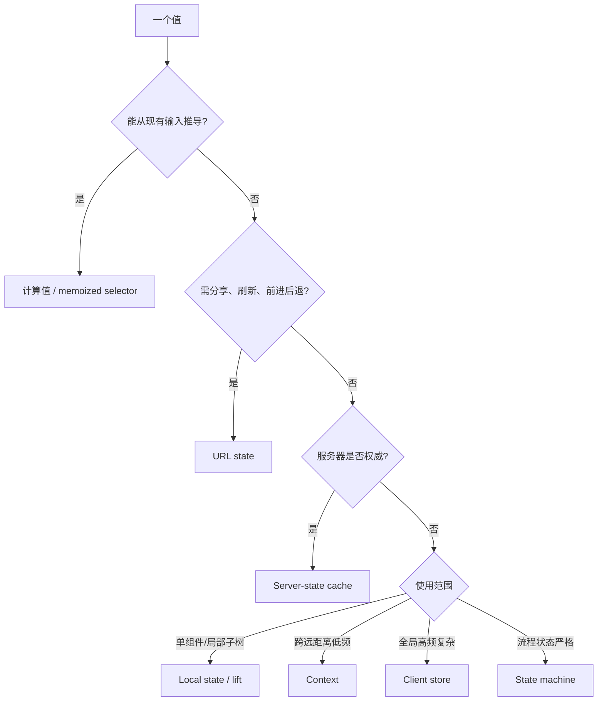
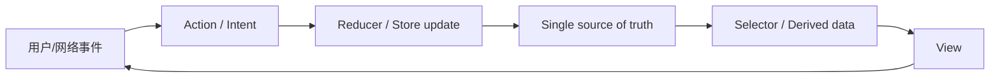
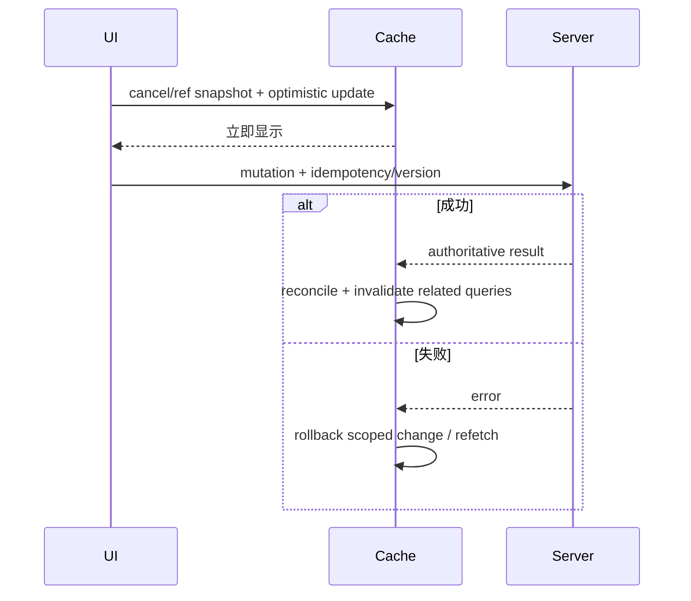

# 前端状态管理面试指南

> 状态管理的第一问不是“Redux 还是 Zustand”，而是“这是不是状态、谁拥有它、是否已有权威来源、生命周期多久”。本文覆盖本模块 19 个主题。

## 状态归属决策图

状态越靠近使用点越容易理解。不要把 URL、服务端缓存、表单草稿和临时 UI 一股脑复制进一个全局 store。

## 一、基础模型

| 主题 | 核心结论与陷阱 |
| --- | --- |
| [局部状态与提升](topics/local-component-state-lifting.md) | 从最局部状态开始，只有多个同级确实需要同一真相时提升到最近共同祖先；提升过高会扩大渲染和耦合。组合和 children 可减少 prop drilling。 |
| [Client State 与 Server State](topics/client-vs-server-state-the-key-distinction.md) | server state 远程、共享、会过期且需同步；client state 本地且由应用拥有。前者需要缓存、重取、去重和失效，后者需要可预测更新。 |
| [派生状态与 Selector](topics/derived-state-selectors.md) | 能由 source state/props 计算的值不要重复存储，否则产生同步 bug；昂贵计算用 memoized selector，缓存 key 和引用稳定要明确。 |
| [Context 的能力与限制](topics/context-as-state-and-its-limits.md) | Context 是依赖注入/广播，不是自动优化的 store；value 引用变化会更新全部 consumer，适合主题、认证等低频全局值。 |
| [Flux 单向数据流](topics/flux-unidirectional-data-flow.md) | action → dispatcher/reducer → store → view 的单向循环让变化可追踪；严格流程增加样板，简单局部状态不需要全套。 |
| [不可变性与结构共享](topics/immutability-structural-sharing.md) | 创建变化路径上的新对象、复用未变化分支，使引用相等能快速判断变化；深拷贝全部数据浪费且破坏 memo。Immer 用代理记录写法并产出结构共享。 |
| [规范化](topics/normalization.md) | 以 `byId/allIds` 或 entity adapter 保存实体，关系用 ID，避免同一实体多份副本；读取需 selector 组合，简单嵌套数据不必强行规范化。 |

## 二、客户端状态库

| 主题 | 模型、优势与边界 |
| --- | --- |
| [Redux 与 Redux Toolkit](topics/redux-redux-toolkit.md) | 单 store、显式 action/reducer、DevTools 与 middleware 成熟；RTK/Immer 减少样板，适合复杂跨域客户端状态。不要把 server cache 手工复制进 slice。 |
| [Zustand](topics/zustand.md) | 小型 external store，selector 精确订阅、API 简洁；需要团队自行建立 action、模块、持久化和调试规范，避免变成无边界全局对象。 |
| [Jotai](topics/jotai-atomic.md) | atom 作为最小状态/派生单元，依赖图自动更新；组合灵活，但大量动态 atom 的身份和调试需要纪律。 |
| [MobX](topics/mobx.md) | observable/action/computed 自动追踪读取依赖，写法直接；隐式依赖和可变模型对调试、SSR、团队约定要求更高。 |
| [Signals](topics/signals.md) | 细粒度响应式容器，读取建立依赖、写入精准通知；避免整组件重算，但逃逸到普通变量或跨框架边界时语义需明确。 |
| [Recoil](topics/recoil.md) | atom/selector 图与 React 集成，支持细粒度更新；选型必须评估项目维护状态、生态和迁移成本，而非只看 API。 |
| [RxJS Streams](topics/rxjs-streams.md) | Observable 表达随时间多值流，操作符处理组合、取消、重试和背压式策略；适合复杂事件流，普通 CRUD 使用会过度抽象。 |
| [XState 状态机](topics/xstate-state-machines.md) | 显式 state、event、transition、guard、effect，让非法转换不可达；适合支付、认证、多步流程，并支持图示与测试，简单 toggle 不必上机器。 |

### 选型维度

- 状态规模与更新频率：全局对象、细粒度 atom/signal 还是显式 machine。
- 业务转换复杂度：需要审计、时间旅行、middleware 还是少量 setter。
- 团队可调试性：隐式追踪与显式 action 哪种更匹配经验。
- SSR/并发/持久化：store 是否按请求隔离，水合数据如何同步。
- 生态与长期维护：工具成熟度、版本路线、迁移出口。

## 三、Server State 与 GraphQL Cache

| 主题 | 核心结论与陷阱 |
| --- | --- |
| [TanStack Query](topics/react-query-tanstack-query.md) | query key 定义缓存身份，staleTime 决定何时过期，gcTime 决定未使用缓存保留；支持去重、重试、失效和 mutation。key 必须包含所有参数。 |
| [SWR](topics/swr.md) | stale-while-revalidate：先显示缓存再后台刷新；key 同时是身份和依赖，适合轻量读取。mutation、一致性和复杂分页要明确处理。 |
| [Apollo Client GraphQL Cache](topics/apollo-client-graphql-cache.md) | 按 `__typename:id` 规范化实体，查询保存引用；mutation 返回足够实体字段可自动合并，列表插入/删除仍需 field policy 或 cache update。 |
| [乐观更新](topics/optimistic-updates.md) | 立即更新 UI，失败回滚或重取；并发 mutation 需唯一临时 ID、版本/冲突策略和上下文快照，不能简单保存整个旧列表覆盖后续成功。 |

## 高频自测

1. 哪些值应该放 URL，而不是全局 store？
2. server state 与 client state 的生命周期和一致性需求有什么区别？
3. 为什么派生数据重复存储会产生 bug？
4. Context value 更新为何影响全部 consumer？
5. 结构共享怎样帮助浅比较？
6. 规范化缓存如何处理实体更新和列表关系？
7. Redux、Zustand、Jotai、Signals、XState 分别适合什么复杂度？
8. query key、staleTime 与 gcTime 各自控制什么？
9. 两个乐观更新并发且一个失败时怎样避免错误回滚？
10. SSR 时为何不能让所有请求共享一个可变 store？

## 面试前检查清单

- 先判断是否为派生值、URL 或 server state，再讨论状态库。
- 能画出单向数据流与乐观更新的成功/失败路径。
- 能说明每种库的更新粒度、调试方式、并发和 SSR 边界。
- 能设计稳定 query key、缓存失效和冲突处理。
- 不用“避免 prop drilling”作为把所有东西全局化的唯一理由。

原始入口：[英文模块总览](README.md) · [英文题库](question-bank/README.md) · [仓库总目录](../README.md)
