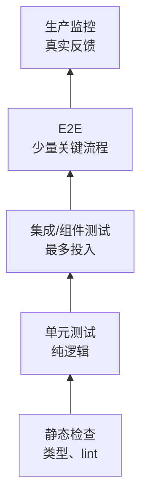
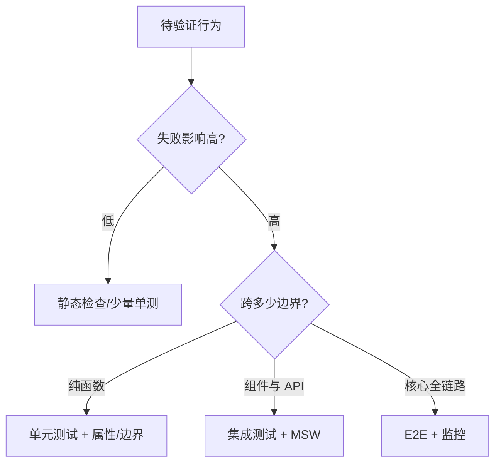
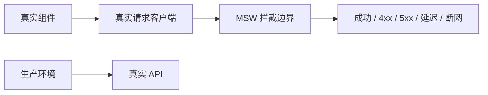

# 前端测试面试指南

> 测试的目标不是最大覆盖率，而是以合理成本获得对关键用户行为和系统契约的信心。越接近用户，测试越有代表性；越隔离，定位越快。本文覆盖本模块 20 个主题。

## 测试奖杯



前端通常采用“测试奖杯”而非机械金字塔：大量静态检查和集成测试，精确的单元测试，少量高价值 E2E。比例随产品风险调整。

## 一、策略与测试边界

| 主题 | 核心结论与陷阱 |
| --- | --- |
| [测什么与不测什么](topics/what-to-test-and-what-not-to.md) | 测用户可观察行为、业务分支、边界、失败和契约；不测框架内部、私有 state、纯样式实现和第三方库已经保证的行为。覆盖率用于发现盲区，不是质量目标。 |
| [测试金字塔与奖杯](topics/the-testing-pyramid-trophy.md) | 单元快且定位准，集成最贴近前端价值，E2E 覆盖真实栈但慢且脆；按反馈速度、代表性和维护成本组合。 |
| [TDD](topics/test-driven-development.md) | red-green-refactor 适合规则明确的逻辑与 bug 修复；探索性 UI 可先 spike 再补测试。TDD 是设计反馈循环，不是“测试先写”教条。 |
| [集成测试](topics/integration-testing.md) | 在真实组件/路由/store 与模拟网络之间验证协作；mock 系统边界而非内部函数，能抓住单元测试遗漏的契约和状态问题。 |

### 风险驱动矩阵



## 二、单元、组件与 React 测试

| 主题 | 核心结论与陷阱 |
| --- | --- |
| [Jest 单元测试](topics/unit-testing-with-jest.md) | arrange-act-assert，表驱动覆盖边界；明确 mock restore/reset/clear 差异，异步断言必须 return/await，避免测试未实际执行就通过。 |
| [Vitest](topics/vitest.md) | 与 Vite 配置/转换共享、ESM 优先、API 类 Jest；迁移注意 hoisted mock、ESM live binding、环境和覆盖率 provider 差异。 |
| [React Testing Library](topics/react-testing-library-rtl.md) | 以用户视角渲染和交互；不查询组件实例或内部 state。优先 `getByRole(name)`，异步出现用 findBy，消失用 waitForElementToBeRemoved。 |
| [用户中心查询优先级](topics/query-priorities-user-centric-tests.md) | role + accessible name 最接近辅助技术；其次 label、placeholder/text，最后才 testid。查询困难往往暴露真实语义问题。 |
| [测试 Hook](topics/testing-hooks.md) | 如果 Hook 只为组件服务，优先通过组件行为测试；独立复杂 Hook 可 renderHook，操作放 act，wrapper 提供 provider，并测试 cleanup 与并发变化。 |
| [组件测试与 Storybook](topics/component-testing-storybook.md) | stories 是可复用状态样本，play function 做交互；覆盖 loading/error/empty/long content/a11y，并可被视觉回归和文档复用。 |
| [Snapshot 测试陷阱](topics/snapshot-testing-and-its-traps.md) | 大 DOM snapshot 变化频繁且评审者会盲更新；只对小、稳定、语义明确的结构使用，优先具体行为断言。 |

```js
render(<Login />);
await user.type(screen.getByLabelText(/邮箱/), 'user@example.com');
await user.click(screen.getByRole('button', { name: /登录/ }));
expect(await screen.findByRole('heading', { name: /欢迎/ })).toBeVisible();
```

## 三、Mock 与异步时间

| 主题 | 核心结论与陷阱 |
| --- | --- |
| [Mock 模块、函数与 Timer](topics/mocking-modules-timers-functions.md) | mock 外部非确定边界，不 mock 被测对象内部协作者；过度 mock 会让重构失败但真实 bug 通过。恢复全局和 spy，防测试泄漏。 |
| [MSW 网络 Mock](topics/mocking-network-with-msw.md) | 在请求层拦截 fetch/XHR，让应用使用真实客户端逻辑；handler 返回现实 status/header/body/delay，未处理请求应报错以发现漏 mock。 |
| [Fake Timers 与异步测试](topics/fake-timers-async-testing.md) | 适合 debounce、retry、过期；推进 timer 和 flush microtask 是不同动作。与 user-event 配置协作并在每个测试后恢复真 timer。 |



## 四、E2E 与专项测试

| 主题 | 核心结论与陷阱 |
| --- | --- |
| [Cypress E2E](topics/e2e-with-cypress.md) | 命令队列与自动重试带来良好调试体验；不要混入普通 Promise 思维，选择器用可访问角色或稳定 data 属性，避免固定 sleep。 |
| [Playwright E2E](topics/e2e-with-playwright.md) | 多浏览器、多 context、自动等待与 trace；locator 在动作时重新解析，使用 web-first assertions。测试隔离、认证 state 和并行数据必须设计。 |
| [无障碍测试](topics/accessibility-testing.md) | axe 可发现规则型问题，但需键盘、缩放和屏幕阅读器人工验证；在组件、E2E 和 CI 多层运行，阻断新增严重问题。 |
| [视觉回归](topics/visual-regression-testing.md) | 截图 diff 捕获布局/样式变化；固定 viewport、字体、动画、时间和数据降低噪声，设置审查流程而非盲目更新 baseline。 |
| [性能测试与预算](topics/performance-testing-budgets.md) | CI 用 bundle/Lighthouse budget 防明显退化，生产 RUM 守 p75 SLO；实验室不能替代真实设备和网络分布。 |

## 五、稳定性与 CI

| 主题 | 核心结论与陷阱 |
| --- | --- |
| [Flaky Tests 与确定性](topics/flaky-tests-determinism.md) | 根因通常是竞态、共享状态、时间/网络、错误等待和不稳定数据；修复同步条件而非增加 sleep。重试只作临时诊断信号，不能掩盖。 |

稳定测试的原则：每个测试独立数据与用户、等待可观察条件、固定真正需要固定的时钟/随机源、并行时不共享可变资源、失败时保存 trace/screenshot/network/log。

## 高频自测

1. 测试奖杯为何强调集成测试？
2. 什么是实现细节测试，为什么重构时脆弱？
3. `getBy`、`queryBy`、`findBy` 分别用于什么时机？
4. 为什么 role/name 查询同时改善可访问性？
5. MSW 相比直接 mock API client 有什么价值？
6. fake timer 为什么不自动清空 Promise 微任务？
7. Playwright 的 locator 和 element handle 有何差异？
8. 为什么固定 `waitForTimeout` 是 flaky 信号？
9. snapshot 什么时候有价值，什么时候应拆成具体断言？
10. CI Lighthouse 通过为何不能证明真实用户性能达标？

## 面试前检查清单

- 能按风险为一个功能设计静态、单元、集成、E2E 和生产监控层。
- 能写以角色和名称查询、包含成功/失败/加载状态的组件测试。
- 能说明 mock 边界、网络和时间，同时保持应用内部协作真实。
- 能用条件等待、隔离数据和 trace 排查 flaky test。
- 能区分代码覆盖率、行为覆盖和生产质量信号。

原始入口：[英文模块总览](README.md) · [英文题库](question-bank/README.md) · [仓库总目录](../README.md)
