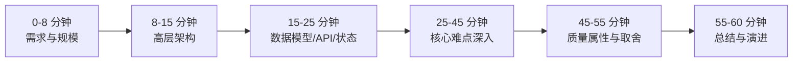
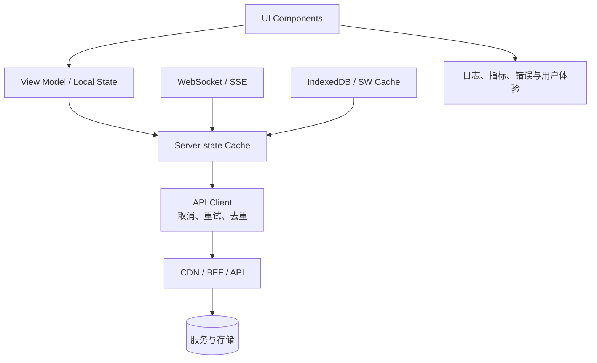
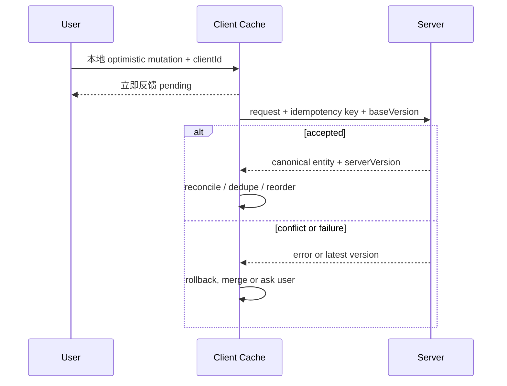

# 前端系统设计面试指南

> 前端系统设计考察的是你能否在模糊需求下主导讨论：澄清范围、画出数据流、选择渲染与状态方案、深入难点，并主动说明性能、可靠性、无障碍和成本。模块含 7 篇完整范例与 353 道分类问题。

## 60 分钟答题路线

## 一、先问清楚什么

### 功能需求

- 核心用户旅程是什么？必须支持哪些操作，哪些明确不做？
- 数据是只读、可编辑、实时还是离线？需要搜索、排序、筛选、分页吗？
- 是否需要跨设备同步、多人协作、撤销、通知、上传或媒体播放？

### 非功能需求

- 用户量、数据量、更新频率和单屏可见量级。
- 首屏、交互、内存、流量和离线目标。
- 浏览器/设备范围、SEO、无障碍、国际化、安全与隐私。
- 一致性容忍度：能否暂时陈旧、重复、乱序或最终一致？

不要一上来选择 React/Redux/WebSocket。技术选择只有在约束明确后才有理由。

## 二、通用高层架构

回答时逐层明确：组件边界、状态所有者、缓存 key、API 契约、更新方向、失败回退和监控信号。图中的层不是每题都需要，按需求删减比全部堆上去更专业。

## 三、七篇完整范例

| 范例 | 主要难点 | 面试中应主动深入 |
| --- | --- | --- |
| [新闻流与无限滚动](design-news-feed.md) | 游标分页、大列表、实时更新 | IntersectionObserver、虚拟化、稳定排序、去重、滚动恢复、feed 缓存 |
| [Autocomplete / Typeahead](design-autocomplete.md) | 高频输入与竞态 | debounce、AbortController、序列号防旧响应覆盖、缓存、键盘 combobox、IME |
| [Web 聊天应用](design-chat-whatsapp-web.md) | 长连接、离线和消息状态 | WebSocket、临时 ID、ack、排序/去重、重连补洞、虚拟列表、多标签页 |
| [协作编辑器](design-google-docs.md) | 并发编辑与收敛 | OT/CRDT、操作日志、presence、离线同步、undo 语义、文档分片 |
| [大规模图片轮播](design-image-carousel.md) | 媒体性能与交互 | 响应式图片、邻近预取、transform 动画、手势、焦点、自动播放控制 |
| [通知系统](design-notification-system.md) | 多来源、优先级和一致性 | in-app/push、未读计数、去重、批量、权限、live region、跨标签页同步 |
| [视频播放器](design-video-player.md) | 自适应流媒体与播放状态 | HLS/DASH、MSE、ABR、buffer、字幕、DRM、画质切换、QoE 指标 |

推荐先完整演练这些范例，再把其中模式迁移到相似题，而不是为每个产品背一张固定架构图。

## 四、高频难点选择表

| 需求信号 | 优先考虑 | 必须说明的代价 |
| --- | --- | --- |
| 公开内容、SEO | SSR/SSG/ISR、streaming | TTFB、水合、缓存新鲜度与服务器成本 |
| 超长列表 | cursor pagination、virtualization | 动态高度、查找/打印、可访问性、滚动恢复 |
| 搜索输入 | debounce、取消、缓存 | IME、空值、旧响应竞态、服务端限流 |
| 双向实时 | WebSocket | 心跳、重连、认证、背压、乱序与去重 |
| 单向事件流 | SSE | 单向与文本限制、连接数、Last-Event-ID |
| 离线编辑 | IndexedDB、outbox、sync | 冲突、迁移、配额、失败可见性 |
| 乐观更新 | 临时 ID、mutation log | 回滚、并发、幂等、服务端拒绝 |
| 多人协作 | OT 或 CRDT | 算法/元数据成本、undo、服务端权威与收敛 |
| 媒体播放 | CDN、分片、ABR | buffer/清晰度权衡、DRM、字幕与带宽 |
| 可扩展组件系统 | token、组合 API、版本 | 破坏性升级、主题、无障碍默认值、治理 |

## 五、数据与一致性

设计每次写入都要回答：谁是权威、如何标识请求、如何处理重试、旧响应、重复和冲突、用户何时看到 pending/failed、断网后怎样恢复。

## 六、质量属性检查

- **性能：** LCP/INP/CLS 目标、bundle、图片、列表和主线程长任务。
- **可靠性：** timeout、重试预算、指数退避、幂等、降级、错误边界和恢复入口。
- **安全：** 认证、对象级授权、XSS/CSRF、上传与富文本、敏感日志。
- **无障碍：** 语义、键盘、焦点、动态播报、对比度和减少动态效果。
- **可观测性：** 错误率、延迟、连接状态、缓存命中、业务成功率与版本关联。
- **可演进性：** API/数据迁移、feature flag、渐进发布、兼容窗口和回滚。

## 七、题型地图

完整的 19 类、353 道题见[英文题库](question-bank/README.md)。可按下面顺序练习：

1. 核心 UI：Autocomplete、无限滚动、通知、设计系统、表单流程。
2. Feed/社交：新闻流、评论、点赞、关注、Stories。
3. 实时通信：聊天、presence、直播评论、视频会议。
4. 协作生产力：文档、表格、看板、日历、编辑器、白板。
5. 媒体：播放器、图片库、断点续传、音频。
6. 商业系统：商品列表、购物车、结算、预订、配送、地图联动。
7. 数据密集：Grid、Dashboard、日志查看、行情和地图。
8. 平台能力：登录授权、feature flag、埋点、错误监控、国际化。

## 高频追问

1. 为什么选择这种渲染策略，首屏和交互分别何时可用？
2. 数据量增长 100 倍时第一个瓶颈在哪里？
3. 断网、重复、乱序、跨标签页和多设备如何处理？
4. 缓存何时失效，用户怎样知道数据陈旧？
5. 长列表怎样同时兼顾性能、键盘和屏幕阅读器？
6. 实时连接失败时如何退化，重连后如何补齐消息？
7. 第三方脚本、富文本、上传和 token 的信任边界在哪里？
8. 用哪些指标证明设计成功，如何灰度和回滚？

## 面试前检查清单

- 任何 Design X 都先明确范围、规模和质量目标。
- 高层图包含数据流，不只是组件方框。
- 能选择一到两个题目特有难点深入到算法和失败路径。
- 主动覆盖性能、无障碍、安全、离线、监控与成本。
- 总结时能指出 MVP、下一阶段演进和暂不解决的问题。

原始入口：[英文模块总览](README.md) · [仓库总目录](../README.md)
