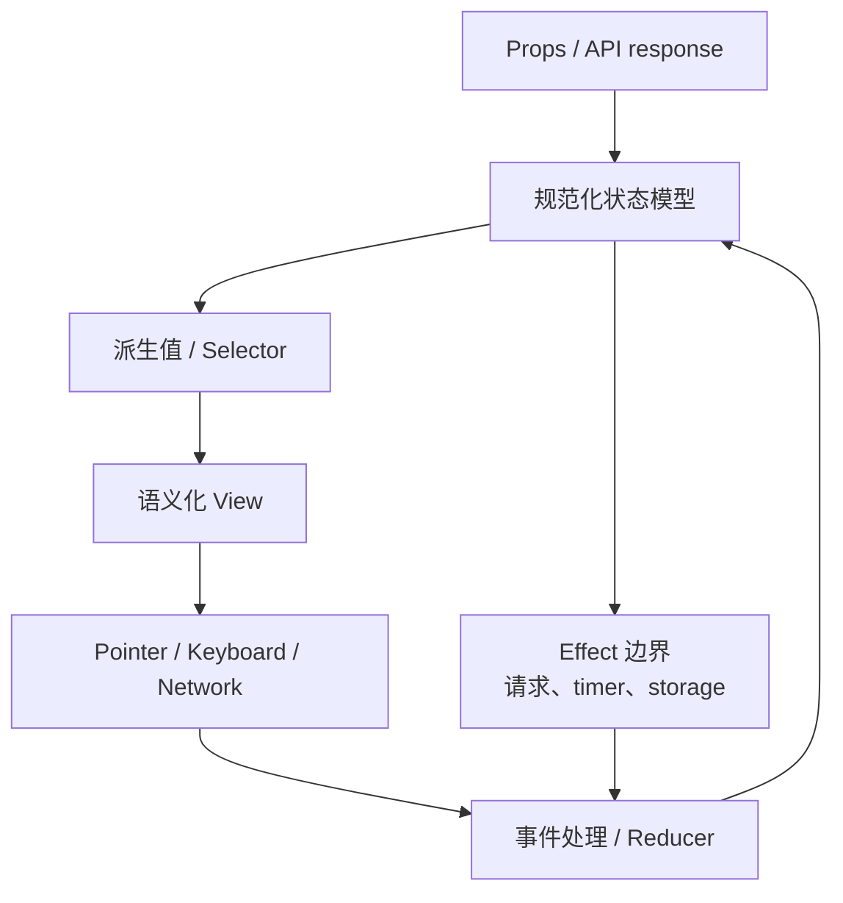

# 前端机试面试指南

> 机试不是看你能否在 45 分钟堆完所有功能，而是观察需求澄清、状态建模、组件 API、增量交付、边界处理和沟通。模块含 7 篇完整实现方案与 1,200+ 道分类练习。

## 45 分钟节奏


优先交付一个端到端可用的窄切片，再扩展功能。不要先花 20 分钟搭“完美架构”，也不要沉默编码后才解释设计。

## 一、开局澄清清单

- 数据由 props、静态数据还是 API 提供？是否分页、实时、可失败？
- 组件受控还是非受控？哪些事件通知父级？
- 键盘、触摸、焦点、屏幕阅读器需要支持到什么程度？
- loading、empty、error、disabled、长文本、大数据有哪些要求？
- 是否允许使用库？浏览器范围、测试工具和样式要求是什么？
- 时间不够时功能优先级如何排序？把假设写在代码附近或口头确认。

## 二、通用组件结构



状态只保存不可推导的最小集合。事件处理表达用户意图，派生筛选/排序在 render 或 selector 中计算，网络和计时器集中在副作用边界并正确清理。

## 三、七篇完整范例

| 范例 | 建模重点 | 必须覆盖的边界 |
| --- | --- | --- |
| [Autocomplete](autocomplete-component.md) | query、results、activeIndex、request status | debounce、取消/旧响应、IME、缓存、Arrow/Enter/Escape、combobox ARIA |
| [Nested Comments](nested-comments.md) | 规范化节点或递归树、展开与回复状态 | 深树、稳定 key、递归删除/插入、懒加载、键盘与语义列表 |
| [Kanban Drag & Drop](kanban-drag-and-drop.md) | columns/items、拖拽来源和目标、顺序 | 同列/跨列、空列、取消、乐观保存、键盘拖拽、触摸 |
| [Star Rating](star-rating.md) | committed value 与 hover/focus preview | 半星、清空、只读、方向键、radio 语义、受控 API |
| [Data Grid](data-grid.md) | columns、sort/filter、selection、viewport | 稳定排序、大数据虚拟化、列宽、键盘 grid、空/加载状态 |
| [Modal / Dialog](modal-dialog.md) | open、触发器 ref、portal 与层级 | 初始焦点、focus trap、Escape、背景 inert、滚动锁、嵌套弹层 |
| [Command Palette](command-palette.md) | open、query、grouped results、active item | 全局快捷键、焦点恢复、模糊搜索、虚拟化、异步命令、dialog/combobox 语义 |

## 四、题型与首要能力

| 题型 | 高频组件 | 首要能力 |
| --- | --- | --- |
| 输入与表单 | date picker、OTP、multi-select、validation | 受控 API、IME、校验时机、键盘与 label |
| 列表与数据 | pagination、tree、grid、infinite list | 数据建模、排序过滤、递归、虚拟化 |
| Overlay 与反馈 | tooltip、toast、popover、accordion | portal、定位、焦点、Escape、层级和动画 |
| 导航与布局 | tabs、breadcrumb、sidebar、carousel | URL/状态同步、roving tabindex、响应式 |
| 编辑器与 Canvas | rich text、whiteboard、cropper | 坐标变换、history、selection、大量事件性能 |
| 游戏与互动 | tic-tac-toe、memory、timer | 状态机、确定性、timer cleanup、重置 |
| JavaScript 工具 | Promise、debounce、deep clone、event emitter | 语言边界、复杂度、错误与取消 |
| 异步数据组件 | upload、chat、feed、progress | 请求竞态、重试、幂等、optimistic UI |

完整分类练习见[英文题库](question-bank/README.md)。

## 五、关键实现模式

### 防止旧响应覆盖

```js
let requestId = 0;

async function search(query) {
  const id = ++requestId;
  setStatus('loading');
  try {
    const data = await fetchResults(query);
    if (id !== requestId) return;
    setResults(data);
    setStatus('success');
  } catch (error) {
    if (id === requestId) setStatus('error');
  }
}
```

实际项目更应配合 AbortController；请求序号仍可防服务端已经返回、取消未及时生效等竞态。

### 复合组件键盘模型

- Tab 进入/离开整个组件，方向键在内部选项间移动。
- active item 与 selected item 分开建模。
- 使用 roving `tabindex` 或 `aria-activedescendant`，不要让所有选项同时进入 Tab 顺序。
- Home/End、Enter/Space、Escape 行为遵循相应 ARIA APG 模式。

### 大列表

- 分页解决数据传输，虚拟化解决 DOM 数量，两者是不同层。
- 使用稳定业务 ID 作为 key；固定高度先做正确，动态高度再加测量缓存。
- loading/empty/error/end-of-list 都是正式状态，不是临时补丁。

## 六、现场测试矩阵

| 维度 | 至少检查 |
| --- | --- |
| 数据 | 空、一条、多条、重复、超长文本、大数量 |
| 交互 | 鼠标、键盘、快速连续操作、点击外部、取消 |
| 异步 | loading、错误、慢响应、乱序、卸载后返回 |
| 状态 | 初始值、重置、受控更新、disabled/read-only |
| UI | 小屏、滚动、溢出、焦点可见、reduced motion |
| 可访问性 | role/name/state、Tab 顺序、焦点恢复、动态播报 |

## 七、评审时主动说明的取舍

- 当前为完成时间选择固定行高；生产版会测量动态高度并保留滚动锚点。
- 当前内存数据足够；接 API 后加入取消、缓存、重试和错误恢复。
- 当前用原生能力实现；复杂 combobox/date picker 在生产中优先采用成熟无障碍 primitive。
- 当前测试关键交互；后续补 reducer 边界、请求竞态和跨浏览器 E2E。

## 高频自测

1. 组件状态中哪些可以由其他值推导，不应重复存？
2. 受控与非受控 API 怎样避免生命周期中切换？
3. 异步搜索如何同时处理 debounce、取消和乱序？
4. modal 与 combobox 的焦点策略分别是什么？
5. 分页、无限滚动、虚拟化各解决哪一层问题？
6. 拖拽如何提供等价键盘操作？
7. 计时器、监听器和请求在卸载时如何清理？
8. 时间不足时怎样保留一个可运行、可解释的交付？

## 面试前检查清单

- 开始编码前写出 state shape、组件 API 和优先级。
- 先跑通窄切片，每 5-10 分钟保持代码可运行。
- 所有异步逻辑考虑 loading、error、cancel、race 和 cleanup。
- 所有交互组件考虑语义、键盘、焦点和屏幕阅读器名称。
- 最后实际操作 happy path 与至少两个边界，并总结生产化工作。

原始入口：[英文模块总览](README.md) · [仓库总目录](../README.md)
