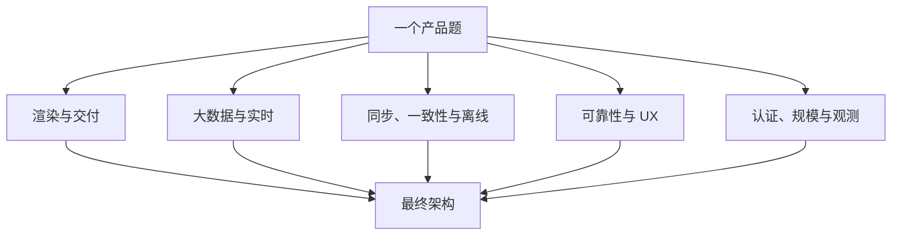
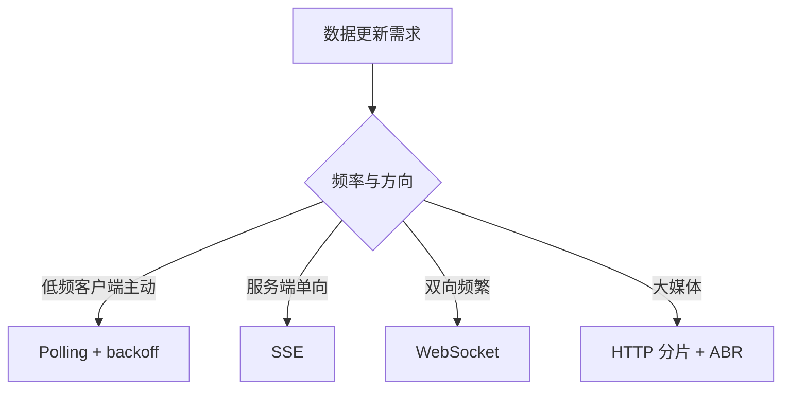
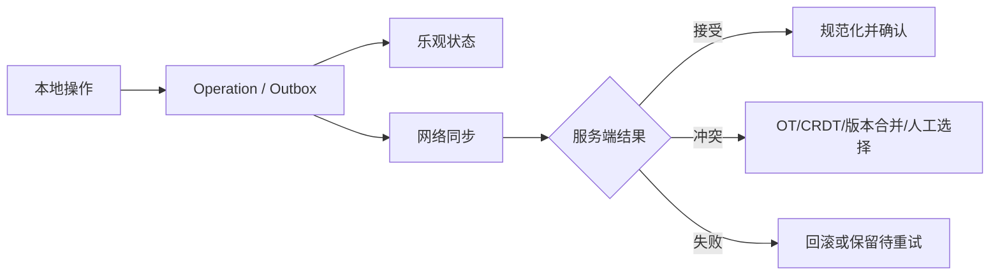

# 前端面试模式指南

> 大多数系统设计题只是若干可复用模式的组合。先识别信号，再选择模式，最后补齐失败路径和取舍，比按产品背答案更可靠。

## 模式组合图

## 一、渲染与数据交付

| 模式 | 适用信号 | 核心取舍 |
| --- | --- | --- |
| CSR/SSR/SSG/ISR | SEO、新鲜度、个性化 | 首屏、TTFB、水合、缓存、服务器成本，没有全局最优 |
| 客户端缓存与失效 | 重复读取、弱网、页面切换 | query key、staleTime、失效、后台刷新、陈旧 UI |
| Prefetch/Preload | 下一步高度可预测或当前关键资源发现晚 | 提前换延迟，但会争带宽与流量；需概率和优先级约束 |
| Skeleton/Loading | 异步等待 | 保持布局稳定并表达结构；过度 skeleton 会闪烁且掩盖真实慢 |
| Streaming/渐进渲染 | 页面不同部分准备时间不同 | 先 shell 后边界内容；边界粒度、错误隔离与 CLS 要设计 |

## 二、大数据、搜索与实时

| 模式 | 适用信号 | 核心取舍 |
| --- | --- | --- |
| Virtualization | DOM 节点太多 | 固定/动态高度、overscan、滚动锚点、查找/打印/无障碍 |
| Pagination vs Infinite Scroll | 长列表 | pagination 可定位，infinite 适合探索；数据层优先 cursor |
| Search/Typeahead | 高频输入、结果变化 | debounce、取消、缓存、旧响应、IME、键盘 combobox |
| WebSocket/SSE/Polling | 服务器数据持续变化 | 方向、延迟、连接治理、兼容性与部署复杂度 |
| Polling + Backoff | 低频状态、实时设施不值 | interval、页面可见性、429、指数退避+jitter |
| Media Streaming | 大媒体、带宽波动 | 分片、ABR、buffer、CDN、字幕、DRM、QoE |
| Debounce/Throttle | 高频事件 | debounce 等静默，throttle 限频；leading/trailing/cancel 必须定义 |

## 三、同步、离线与一致性

| 模式 | 适用信号 | 核心取舍 |
| --- | --- | --- |
| Optimistic UI | 用户期待即时反馈 | 临时 ID、pending、rollback/reconcile、并发 mutation |
| Offline-first | 核心任务离线可继续 | 本地数据库、outbox、重连、冲突、配额与迁移 |
| OT/CRDT | 多人同时编辑同一结构 | 转换或可交换数据类型保证收敛，增加算法与元数据成本 |
| Normalization | 多视图引用相同实体 | 单份实体、关系用 ID；写一致但读需 selector 组合 |
| Idempotency/Dedupe | 请求重试与重复消息 | 稳定 key、服务端原子保存结果、窗口和 payload 一致性 |
| Undo/Redo | 编辑器和复杂操作 | Command 或 past/present/future；合并连续操作、内存和远端协作语义 |

## 四、可靠性与用户体验

| 模式 | 回答要点 |
| --- | --- |
| 错误处理与重试 | 区分网络/认证/限流/验证/服务器错误；幂等才重试，总预算、backoff、jitter、取消和可恢复 UI。 |
| Error Boundary | 按路由或关键区域隔离 render 错误并上报；事件、异步、SSR 错误需其他路径。 |
| 表单与校验 | 原生语义、客户端即时 UX、服务器权威校验、字段/表单级错误、焦点与防重复提交。 |
| 状态机 | 显式 state/event/guard/effect，让非法状态不可达；适合 wizard、播放器、支付、上传。 |
| 60fps 交互 | 每帧约 16.7ms；批量读写、transform/opacity、rAF、事件合并，复杂计算下放 Worker。 |
| 无障碍 | 语义、键盘、焦点、名称/状态、live region、对比度和 reduced motion 是所有组件的设计输入。 |
| 国际化 | 完整消息、Intl、复数、RTL、时区、长文本和 SSR locale 一致性。 |

## 五、认证、扩展与生产反馈

| 模式 | 回答要点 |
| --- | --- |
| Authentication/Session | Secure HttpOnly SameSite cookie 或严格 token 流；刷新、过期、注销、跨标签页和敏感操作重认证。 |
| Authorization/Gating | 服务端对象级授权是边界；前端 gate 只改善 UX。RBAC/ABAC 与 feature flag 不是同一概念。 |
| Feature Flag/A-B | 稳定分桶、曝光事件、服务端/客户端一致、默认安全值、owner/过期日和清理。 |
| 前端代码规模 | 业务边界、依赖规则、monorepo task graph；只有多团队独立部署需求才考虑 micro-frontend。 |
| Observability | error、log、metric、trace 与版本/路由/用户会话关联；采样、隐私、source map 和告警 SLO。 |

## 六、五类面试方法题

原题库按五组整理，可直接练习：

- [编码与 DSA 策略](question-bank/coding-dsa-strategy.md)：澄清、例子、复杂度、边界、沟通。
- [沟通与面试流程](question-bank/communication-logistics.md)：卡住时如何推进、如何接收提示和管理时间。
- [面试形式与轮次](question-bank/formats-rounds.md)：电话筛选、知识面、行为、交叉面。
- [机试方法](question-bank/machine-coding-approach.md)：API、状态模型、增量交付、测试与无障碍。
- [系统设计方法](question-bank/system-design-approach.md)：需求、架构、深入、取舍、扩展与观测。

完整索引见[英文题库](question-bank/README.md)。

## 高频自测

1. 一个 feed 由哪些模式组合，模式之间如何互相影响？
2. optimistic mutation 与请求幂等分别解决客户端和服务端什么问题？
3. 离线 outbox 重放时怎样处理重复和冲突？
4. Skeleton 为什么也可能造成 CLS 或更差体验？
5. WebSocket 重连后怎样补洞、去重和恢复顺序？
6. 状态机相比多个 boolean 的价值是什么？
7. feature flag 和授权检查为什么不能互相替代？
8. 如何从生产观测判断某个模式值得保留？

## 面试前检查清单

- 能从题目需求识别 3-5 个模式，不按产品名背固定架构。
- 每个模式都能说出触发条件、实现核心、失败路径和成本。
- 能把客户端体验与服务端一致性、幂等和授权连接起来。
- 能用图表达事件、状态、缓存和网络之间的关系。
- 能指出更简单方案以及何时才需要升级复杂度。

原始入口：[英文模块总览](README.md) · [仓库总目录](../README.md)
