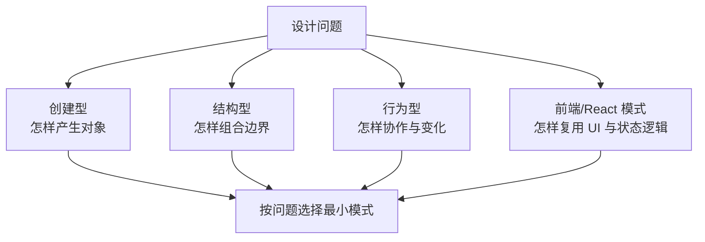
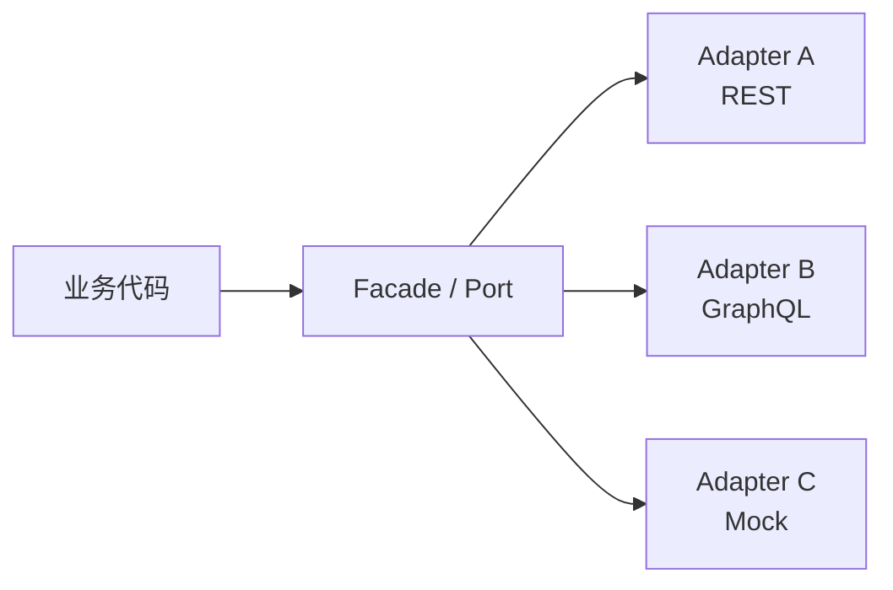

# 前端设计模式面试指南

> 设计模式是对重复设计问题的命名，不是必须套用的类模板。JavaScript 的函数、闭包、模块和组件组合经常能以更轻的方式实现同一意图。

## 模式地图



## 一、创建型模式

| 模式 | 前端语境 | 适用与风险 |
| --- | --- | --- |
| Singleton | 配置、连接、客户端 store | ES module 本身常已单例；隐藏全局状态会污染测试和 SSR 请求，优先显式注入。 |
| Factory | 按类型创建 adapter、组件或解析器 | 隔离构造细节和条件分支；只有一种简单对象时工厂是多余间接层。 |
| Builder | 查询、请求、复杂配置逐步构造 | 提供链式校验和可读步骤；普通对象 literal 足够时不要造 fluent API。 |
| Prototype | 通过原型共享行为或复制模板 | 是 JavaScript 对象模型基础；业务层通常使用 class/组合，不手动模拟 GoF 克隆语义。 |

## 二、结构型模式

| 模式 | 前端语境 | 适用与风险 |
| --- | --- | --- |
| Module | ESM 导入导出与私有作用域 | 最自然的边界，静态依赖利于 tree shaking；避免 barrel 造成循环依赖和意外 bundle。 |
| Adapter | 将后端 DTO/第三方 API 转换为领域模型 | 阻止外部变化扩散；转换应位于边界并有契约测试。 |
| Facade | 对复杂 SDK、浏览器 API 提供小接口 | 降低调用方耦合；facade 过宽会变 god service。 |
| Decorator | middleware、函数包装、HOC | 不改核心对象而叠加日志、缓存、权限；包装顺序和错误栈可能难追踪。 |
| Proxy | 响应式追踪、校验、远程对象 | 拦截 get/set 等语言操作；有运行时成本并可能破坏身份、私有字段和调试直觉。 |
| Composite | DOM/React 组件树、菜单树 | 叶子和容器共享统一接口，递归操作；需要防循环、深度与大树性能。 |
| Flyweight | 虚拟列表、共享图标/样式数据 | 共享内在状态以减少大量对象成本；外在状态管理会增加复杂度，先测量。 |
| Bridge | 渲染器与平台实现分离 | 抽象和实现独立变化，例如同一图表模型输出 Canvas/SVG；双重层次可能过度设计。 |



## 三、行为型模式

| 模式 | 前端语境 | 适用与风险 |
| --- | --- | --- |
| Observer / Pub-Sub | DOM 事件、store 订阅、EventEmitter | 一对多通知、发布者不依赖订阅者；需 unsubscribe、错误隔离、顺序和内存治理。 |
| Strategy | 可替换排序、校验、定价、重试策略 | 用同一接口注入行为，通常一个函数参数就够。 |
| Command | undo/redo、快捷键、action | 把动作及参数对象化，可排队、记录和逆向；保存完整快照可能耗内存。 |
| Mediator | 表单协调、event bus、对话框管理器 | 中央协调减少组件互相引用；mediator 易膨胀成隐式全局控制器。 |
| Chain of Responsibility | Express/Redux middleware、校验链 | 请求沿 handler 链传播，每步处理或继续；顺序、短路和错误通道必须清晰。 |
| Iterator | 数组、生成器、自定义集合 | 将遍历协议与容器内部表示分离；JS 已原生支持 `Symbol.iterator`。 |
| State | upload、wizard、player、auth 流 | 行为随显式状态变化，限制合法 transition；简单 toggle 不需要 state machine。 |
| Template Method | 框架 lifecycle、基类流程 | 固定算法骨架并让子类覆盖步骤；JavaScript/React 更常用组合和 callback，避免脆弱继承。 |
| Visitor | AST、虚拟 DOM、文档树变换 | 在不修改节点类型时增加操作；新增节点类型需更新 visitor，双分派对业务开发偏重。 |

## Observer / Event Bus 深入

完整实现见[Observer / Event Bus](observer-event-bus.md)。最小 API 通常包括 `on`、`off`、`emit`，并让 `on` 返回取消订阅函数。

```js
function createEmitter() {
  const events = new Map();
  return {
    on(type, listener) {
      const listeners = events.get(type) ?? new Set();
      listeners.add(listener);
      events.set(type, listeners);
      return () => listeners.delete(listener);
    },
    emit(type, payload) {
      for (const listener of [...(events.get(type) ?? [])]) listener(payload);
    },
  };
}
```

实现时要定义：订阅中取消是否影响当前 emit、新订阅是否参与当前轮、监听器抛错如何隔离、once、异步 listener 和最大监听器策略。

## 四、架构与 React 模式

| 模式 | 核心用途与边界 |
| --- | --- |
| Dependency Injection | 业务依赖接口/函数，装配点提供实现；测试、替换与平台适配方便。优先参数/Context，重量容器需有规模理由。 |
| HOC | 组件输入输出变换，适合权限、路由等包装；透传 ref/props、避免 render 内创建 HOC。逻辑复用多用 Hook。 |
| Render Props | 调用方函数决定渲染，控制反转清晰；层级过深时可读性下降。 |
| Hooks | 复用有状态逻辑和副作用协议，不共享状态实例；遵守调用顺序并设计语义 API。 |
| Container/Presentational | 分离数据协调与展示；现代代码按副作用边界灵活使用，不强制每个组件成对。 |
| Compound Components | Tabs/Select 等子组件共享 Context，API 接近自然标记；隐式依赖、子组件合法组合和 Context 性能需约束。 |

## 五、反模式识别

- 为了“用了模式”创建大量 class，而闭包或函数参数即可表达策略。
- 用 Singleton 保存请求级用户数据，导致 SSR 跨用户泄漏。
- 用全局 Event Bus 替代清晰数据流，事件来源无法追踪。
- HOC/Decorator 层层包装导致 props 冲突、DevTools 和错误栈难读。
- 把简单 boolean 流程建成庞大状态机，或反过来用十几个 boolean 表达复杂互斥状态。
- Adapter 只是字段原样转发，没有真正隔离外部模型。

## 六、题库入口

- [创建型模式](question-bank/creational-patterns.md)
- [结构型模式](question-bank/structural-patterns.md)
- [行为型模式](question-bank/behavioral-patterns.md)
- [React 组件模式](question-bank/react-component-patterns.md)
- [异步反模式](question-bank/async-anti-patterns.md)
- [完整题库索引](question-bank/README.md)

## 高频自测

1. Observer 与 Pub-Sub 的直接依赖关系有何差异？
2. Adapter、Facade、Bridge 分别隔离哪种变化？
3. Strategy 在 JavaScript 中为什么通常只是一个函数？
4. Command 怎样支持 undo/redo 与持久化历史？
5. Proxy 响应式的依赖追踪发生在 get 还是 set？
6. Singleton 为什么在 SSR 和测试中危险？
7. State 模式与一组 boolean 的可达状态有何不同？
8. Hook、render prop、HOC 分别适合什么复用层级？

## 面试前检查清单

- 先描述问题和变化轴，再命名模式。
- 每个模式能给出前端实例、最小实现、代价和更简单替代。
- 能区分 Observer、Mediator、全局 Event Bus 的耦合差异。
- 能将经典面向对象模式翻译成 JavaScript 函数与组件组合。
- 能指出模式何时已经过度设计。

原始入口：[英文模块总览](README.md) · [仓库总目录](../README.md)
