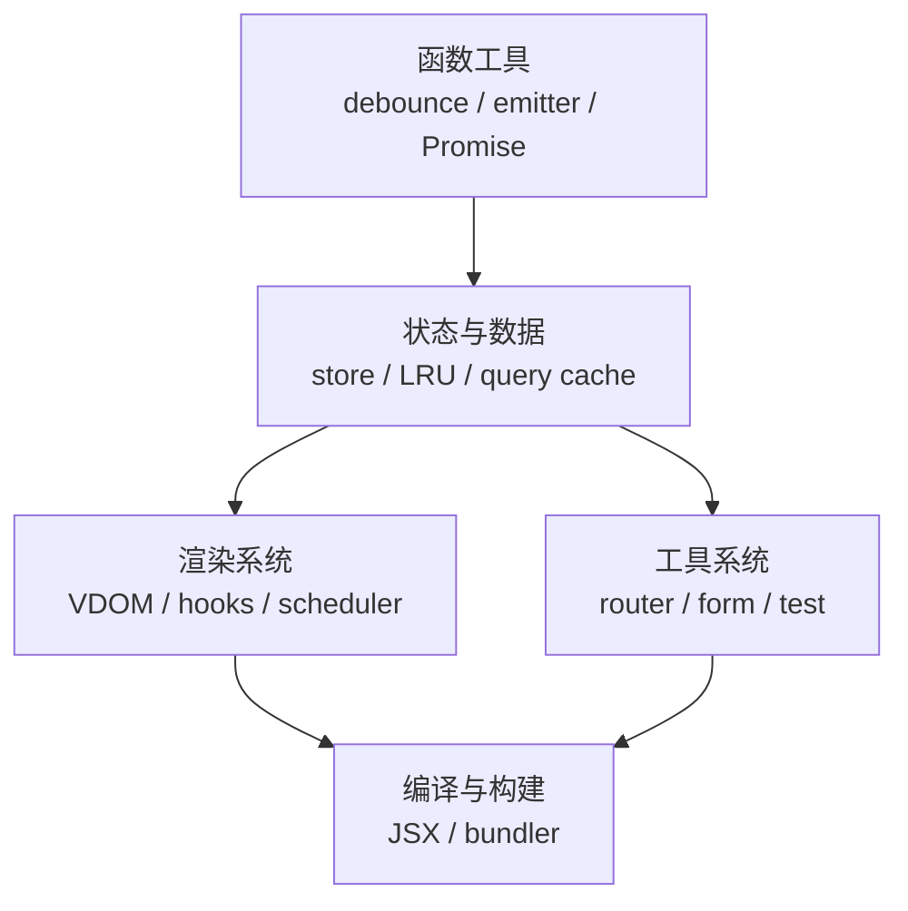
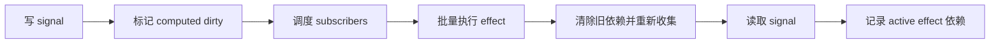
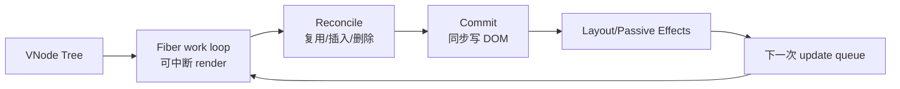
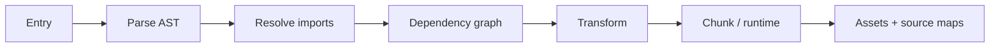

# 从零实现（Build Your Own）面试指南

> 重造工具的目的不是生产替代，而是暴露抽象背后的不变量。每个练习都应先写最小契约，再实现核心循环，最后补边界、复杂度、测试和与成熟库的差距。

## 推荐学习阶梯

## 通用实现方法

1. **定义契约：** 输入、输出、错误、同步/异步、取消和生命周期。
2. **写最小模型：** 用数据结构表达核心不变量，先不优化。
3. **实现主循环：** 让 happy path 端到端可运行。
4. **补语义边界：** 重入、异常、循环引用、顺序、清理、并发与资源上限。
5. **写行为测试：** 与规范/成熟实现做 differential testing。
6. **分析复杂度：** 时间、空间、调度、公平性和最坏情况。
7. **说明生产差距：** 兼容性、诊断、插件、SSR、安全和长期维护。

## 一、函数、异步与数据结构

| 项目 | 核心不变量 | 关键边界 |
| --- | --- | --- |
| Debounce/Throttle | 时间窗口内何时允许执行 | leading/trailing、cancel/flush、this/args、timer 漂移 |
| Event Emitter | type 到 listeners 的一对多映射 | off/once、emit 时增删、错误隔离、泄漏 |
| Promise | 状态只转换一次，then 链解析程序 | thenable assimilation、自解析循环、微任务、异常传播 |
| LRU Cache | 最近访问移到链表头，超容量淘汰尾 | Map + 双向链表 O(1)、容量 0、更新已有 key |
| Deep Clone | 对象图复制并保持共享/循环关系 | WeakMap、descriptor、prototype、Map/Set/typed array、函数不可复制 |

相关原始材料：[JavaScript 手写题](../03-javascript/promise-polyfills-and-throttle-debounce.md) · [Observer/Event Bus](../18-design-patterns/observer-event-bus.md)。

## 二、状态与数据系统

| 项目 | 最小架构 | 进阶难点 |
| --- | --- | --- |
| Redux | `getState/dispatch/subscribe` + reducer | dispatch 重入、listener 快照、middleware、replaceReducer |
| Zustand-like Store | state + set/get + selector subscription | equality、批处理、React external-store tearing、SSR 隔离 |
| React Query | queryKey → cache entry + observer | stale/gc、请求去重、retry、取消、失效、mutation、optimistic update |
| Signals | signal、computed、effect 依赖图 | 动态依赖清理、批处理、拓扑顺序、循环、glitch-free 更新 |
| Form Library | 字段 registry、value/error/touched | 非受控订阅粒度、数组字段、async validation、焦点与无障碍 |

## 三、React 与渲染系统

| 项目 | 最小架构 | 进阶难点 |
| --- | --- | --- |
| JSX → DOM Renderer | vnode type/props/children → DOM | 事件、属性 vs property、文本、fragment、清理 |
| Virtual DOM Diff | 比较 type/key/props/children 并生成 mutation | keyed reorder、最少移动、组件状态身份、事件更新 |
| Mini React | element → fiber work units → commit | alternate、effect flags、调度、中断、错误与 context |
| `useState/useEffect` | fiber 上按调用顺序保存 Hook 链 | update queue、依赖比较、cleanup、stale closure、render-phase update |
| Scheduler | 按 deadline/priority 执行可中断 work | starvation、取消、yield、浏览器 paint、优先级继承 |
| Virtualization | viewport 算可见区，spacer 保持总尺寸 | overscan、动态高度测量、滚动锚点、键盘与查找 |

学习资料入口：[构建虚拟列表](../06-react/build-a-virtualized-list.md)。成熟 React 还包含错误边界、并发 lanes、Suspense、hydration、server renderer 与 DevTools，最小实现必须明确不覆盖这些内容。

## 四、路由、编译与工具

| 项目 | 核心循环 | 关键边界 |
| --- | --- | --- |
| Client Router | URL 匹配 → loader → render，拦截导航 | History API、popstate、嵌套路由、取消、滚动/焦点恢复、404 |
| Module Bundler | 入口 → parse AST → resolve imports → dependency graph → emit | ESM/CJS、循环、loader/plugin、chunk、source map、缓存 |
| JS Template Engine | tokenize/parse → AST → render | escaping、条件循环、作用域、错误位置；禁止用不可信模板 eval |
| Mini Jest | register tests → hooks → execute → report | async completion、timeout、isolation、matcher、mock、并行 |
| CSS-in-JS | style object/template → stable class → stylesheet | hashing、dedupe、dynamic values、SSR extraction、insertion order、CSP |

## 五、练习项目总表

原模块给出的项目建议：

- React/渲染：Virtual DOM、Fiber + Hooks、JSX renderer、diff、scheduler、virtualization。
- 状态/数据：Redux、Zustand-like store、React Query、Signals、Event Emitter、Promise、LRU。
- 工具/框架：Router、mini-webpack、模板引擎、form library、mini-Jest、CSS-in-JS、debounce/throttle。

对应的 30 道实现追问按五类整理：

- [DOM 与浏览器](question-bank/dom-browser.md)
- [框架内部原理](question-bank/framework-internals.md)
- [函数工具](question-bank/function-utilities.md)
- [对象与数据](question-bank/objects-data.md)
- [Promise 与异步](question-bank/promises-async.md)
- [完整题库索引](question-bank/README.md)

## 代码评审清单

- API 是否有清晰的不变量和错误语义？
- 订阅、timer、reader、网络和 DOM listener 是否可清理？
- 同步回调抛错、异步 reject、取消和重入如何处理？
- 是否保留顺序？何处允许并发？有没有 starvation 或无限递归？
- 数据结构复杂度是否符合目标，缓存是否有上限？
- 是否可通过小而稳定的公共 API 测试，而非窥探内部变量？

## 高频自测

1. Promise resolution procedure 为什么比三个状态复杂得多？
2. EventEmitter 在 emit 过程中 off listener 应如何定义？
3. LRU 如何同时实现 O(1) get 和 put？
4. keyed diff 怎样区分移动与重新创建？
5. Hook 为什么依赖固定调用顺序？
6. scheduler 怎样主动让出主线程并防低优先级饥饿？
7. query cache 的 stale 与 garbage collection 是同一时间吗？
8. bundler 为什么必须先构建依赖图，tree shaking 又需要什么静态信息？

## 面试前检查清单

- 至少完整实现 Promise、EventEmitter、LRU、store 和 mini renderer 中三个。
- 能从测试反推规范边界，而不是只写演示代码。
- 能分析核心操作的时间/空间复杂度与资源上限。
- 能说明最小实现与生产库在兼容性、诊断和并发上的差距。
- 遇到复杂项目先缩小范围，完成正确核心再逐层增强。

原始入口：[英文模块总览](README.md) · [仓库总目录](../README.md)
