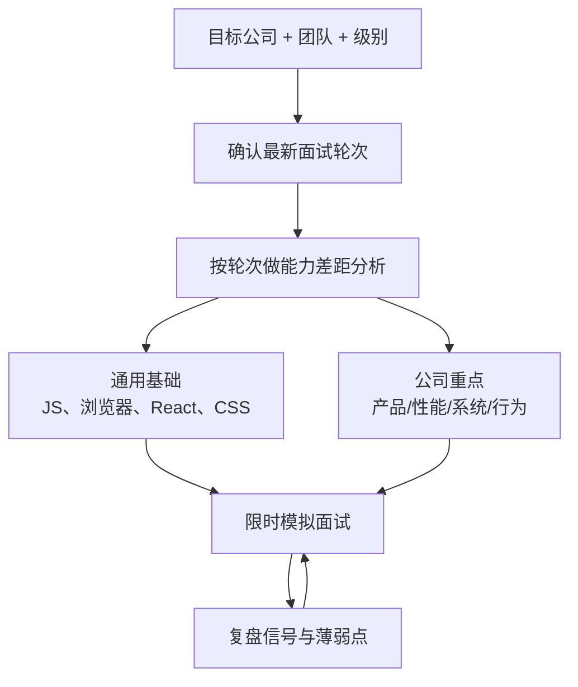
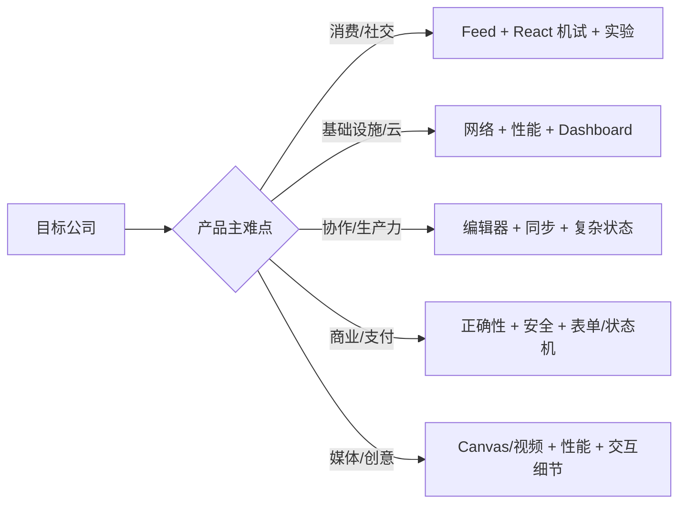

# 前端公司面试准备指南

> 本模块信息来自社区经验，公司流程会随团队、级别、地区和年份变化。把各公司页面当作准备方向，不要当作保证出现的题库；面试前应向 recruiter 确认最新轮次和允许技术栈。

## 通用准备模型

## 公司侧重点对照

| 公司 | 常见前端信号 | 优先准备 | 详细指南 |
| --- | --- | --- | --- |
| Google | 框架无关基础、DOM/Web API、算法、无障碍、性能 | 原生 JS、浏览器渲染、DSA、可访问组件、清晰推导 | [Google](google.md) |
| Meta | React 机试、产品思维、前端系统设计 | 高频组件、状态与性能、feed/chat、行为故事 | [Meta](meta.md) |
| Amazon | Leadership Principles、实用 UI、可扩展设计 | STAR 故事、组件机试、顾客影响、取舍和 ownership | [Amazon](amazon.md) |
| Netflix | 资深系统设计、性能、自治与高质量判断 | 大规模媒体、可观测性、架构取舍、影响力案例 | [Netflix](netflix.md) |
| Airbnb | UI 完成度、设计系统、无障碍 | 组件 API、视觉细节、键盘/焦点、设计协作 | [Airbnb](airbnb.md) |
| Uber | 实时、地图、数据密集 Dashboard | WebSocket、位置更新、虚拟化、离线和故障恢复 | [Uber](uber.md) |
| Stripe | API 设计、正确性、支付表单与开发者体验 | 状态机、幂等、安全、表单边界、清晰 API taste | [Stripe](stripe.md) |
| Adobe | Canvas/编辑器、复杂状态与性能 | 坐标系统、undo/redo、图层、Worker、内存 | [Adobe](adobe.md) |
| Microsoft | 基础、TypeScript、无障碍 | TS 类型建模、浏览器/React、键盘与 Windows 辅助技术 | [Microsoft](microsoft.md) |
| Atlassian | 机试、设计系统、产品工程 | 复杂组件、协作产品、a11y、测试与工程质量 | [Atlassian](atlassian.md) |
| LinkedIn | Feed、无限滚动、国际化和无障碍 | cursor、虚拟化、缓存、i18n/RTL、社交图 UI | [LinkedIn](linkedin.md) |
| Apple | 基础、性能、细节与平台体验 | 原生能力、动画/媒体、性能测量、交互完成度 | [Apple](apple.md) |
| Cloudflare | 网络、边缘、性能与运维 Dashboard | HTTP/TLS/CDN、缓存、实时指标、故障与安全 | [Cloudflare](cloudflare.md) |
| DoorDash | 地图/实时、结算与配送流程 | 位置数据、订单状态机、可靠 mutation、移动体验 | [DoorDash](doordash.md) |
| Pinterest | 图片 Feed、瀑布流与加载性能 | 图片 pipeline、虚拟化、布局稳定、无限滚动 | [Pinterest](pinterest.md) |
| Dropbox | 文件 UI、同步、离线与大数据 | 上传分片、冲突、文件树、缓存、跨设备一致性 | [Dropbox](dropbox.md) |

## 按公司类型准备

### 消费与社交产品

Meta、LinkedIn、Pinterest 等通常值得重点练 feed、搜索、通知、媒体加载、实验和大列表。回答要结合用户留存、弱网、滚动体验与内容新鲜度。

### 基础设施与平台

Cloudflare 等更看重网络协议、缓存、边缘执行、可靠性和监控界面。不要只会调用 fetch，要能讲 HTTP/2/3、TLS、CDN cache key、重试和指标。

### 协作与生产力

Atlassian、Dropbox、Adobe 等常涉及编辑器、文件树、离线同步、undo/redo、权限和复杂交互。状态模型、冲突解决和可访问键盘操作很重要。

### 商业、支付与物流

Stripe、DoorDash、Amazon、Uber 等需要正确性、幂等、状态机、地图/实时和错误恢复。UI 快不够，还要说明重复扣款、库存/价格变化与权限边界。

### 设计与媒体体验

Airbnb、Apple、Netflix 等通常更关注视觉/交互完成度、媒体性能和高级产品判断。应能解释设计系统、动画、图片/视频 pipeline 与无障碍。

## 面试轮次准备矩阵

| 轮次 | 训练方式 | 可交付信号 |
| --- | --- | --- |
| Recruiter/Manager | 2 分钟经历概述、动机和范围确认 | 级别匹配、沟通清晰、目标一致 |
| JavaScript/Browser | 限时输出题和原理追问 | 能推导而非猜结果，知道运行时边界 |
| DSA | 读题、例子、复杂度、实现、测试 | 澄清、正确性、边界、渐进优化 |
| Machine Coding | 45-60 分钟真实组件 | 状态/API、增量交付、a11y、测试、沟通 |
| Frontend System Design | 需求到取舍完整模拟 | 数据流、状态、性能、可靠性、演进 |
| Behavioral | STAR + 追问，使用真实指标 | ownership、冲突、失败学习、跨团队影响 |
| Hiring Manager | 项目 deep dive 与反事实 | 决策质量、技术深度、业务影响、成熟度 |

## 行为面试故事库

准备 6-8 个可复用故事，每个包含 Situation、Task、Action、Result，并能接受深入追问：

- 主导一个模糊项目并澄清优先级。
- 发现并解决性能/稳定性事故。
- 与产品、设计、后端发生分歧并达成方案。
- 做过错误决策、如何发现和修正。
- 改善工程效率、质量、无障碍或安全。
- 跨团队推动标准或迁移。
- 指导同事并提升团队能力。
- 在紧迫时间下做明确取舍。

结果尽量量化，但不能杜撰数字。重点描述“你”采取了什么判断和行动，也说明团队贡献。

## 四周准备建议

1. **第 1 周：** 根据目标指南确认流程，补 JavaScript、浏览器、CSS、React/TS 基础。
2. **第 2 周：** 每天一题 DSA + 一次 45 分钟机试，建立可复用组件骨架。
3. **第 3 周：** 完整演练 4-6 道公司相关系统设计，准备项目和行为故事。
4. **第 4 周：** 多轮模拟、复盘表达与时间，针对薄弱点收敛，不再广泛开新主题。

## 信息可信度检查

- 确认指南记录的年份、地区、职位和级别是否匹配。
- 同一公司不同团队可能完全不同，以 recruiter 的当前说明为准。
- “经常问”不代表题目泄露或必考；练能力迁移，不背答案。
- 遇到保密信息遵守 NDA，不请求或传播私密题目。
- 用真实面试反馈更新仓库时去除候选人、面试官和内部系统敏感信息。

## 面试前检查清单

- 已阅读目标公司详细指南并向 recruiter 核对最新 loop。
- 技术准备同时包含通用核心和公司产品特有难点。
- 至少完成两次连续全流程模拟，而不只是零散刷题。
- 每个项目故事能讲清个人判断、取舍、指标与复盘。
- 面试当天能主动澄清、持续沟通、接受提示并管理时间。

原始入口：[英文模块总览](README.md) · [系统设计](../15-system-design/) · [机试](../16-machine-coding/) · [仓库总目录](../README.md)
