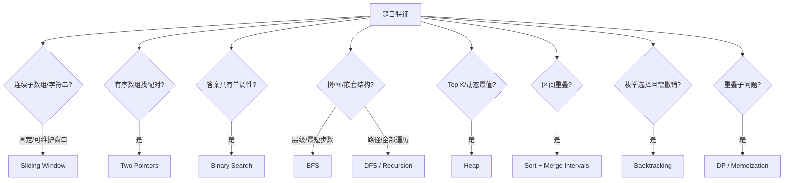

# 前端 DSA 面试指南

> 前端 DSA 的高频范围是数组、字符串、哈希、树/递归、队列与实际 UI 数据处理。目标是从题目特征识别模式，说明复杂度，再写出可验证实现，而不是盲目覆盖所有竞赛算法。

## 解题流程


## 一、复杂度基础

| 主题 | 核心结论与陷阱 |
| --- | --- |
| [Big-O 时间与空间](topics/big-o-notation-time-space.md) | 描述输入增长时主导项上界，忽略常数和低阶项；分别分析时间、辅助空间与输出空间。Map 操作平均 O(1) 不等于最坏永远 O(1)。 |
| [循环与递归分析](topics/analyzing-loops-recursion.md) | 顺序循环相加、嵌套依赖判断相乘或求和；递归写 recurrence，看分支数、深度和每层工作。递归栈也算空间。 |
| [摊还分析与动态数组](topics/amortized-analysis-dynamic-arrays.md) | push 通常 O(1)，扩容一次 O(n)，但几何扩容使一串 push 的平均成本为摊还 O(1)；摊还不是概率平均。 |

### 常见复杂度阶梯

```mermaid
flowchart LR
  O1[O(1)] --> OL[O(log n)]
  OL --> ON[O(n)]
  ON --> ONL[O(n log n)]
  ONL --> ON2[O(n^2)]
  ON2 --> EXP[O(2^n) / O(n!)]
```

面试时说明 n 的含义。例如树问题的 n 是节点数，字符串算法还可能需要字符集大小 k，图算法常写 O(V+E)。

## 二、核心数据结构

| 主题 | 关键操作 | 前端对应场景 |
| --- | --- | --- |
| [数组与字符串](topics/arrays-string-manipulation.md) | 下标 O(1)，中间插删 O(n)，sort O(n log n) | 列表转换、区间、文本解析；JS 字符串按 UTF-16，用户字符需注意 grapheme |
| [Hash Map 与 Set](topics/hash-maps-sets.md) | 平均查找/插入 O(1)，空间 O(n) | 去重、频率、按 ID 索引、两数之和、memo/cache |
| [Stack 与 Queue](topics/stacks-queues.md) | 栈 LIFO、队列 FIFO | undo/redo、括号/解析、BFS、任务调度；JS queue 避免反复 `shift()` |
| [Linked List](topics/linked-lists.md) | 已知节点 O(1) 插删，查找 O(n) | LRU 双向链表、历史链；快慢指针找环/中点 |
| [Tree 与 Binary Tree](topics/trees-binary-trees.md) | DFS/BFS O(n)，BST 平均查找 O(log n) | DOM、组件树、评论/菜单、文件系统；普通 BST 最坏退化 O(n) |
| [Trie](topics/tries-autocomplete.md) | 插入/前缀查找 O(L)，空间与字符总量相关 | autocomplete、路由、字典；大字符集节点结构可能很耗内存 |
| [Heap / Priority Queue](topics/heaps-priority-queues.md) | peek O(1)，push/pop O(log n)，build O(n) | Top K、任务优先级、合并流；JS 需自己实现或使用可靠库 |
| [Graph BFS/DFS](topics/graphs-bfs-dfs-basics.md) | 邻接表遍历 O(V+E) | 依赖图、模块图、社交关系、状态路径；有环时必须 visited |

## 三、从题目特征选择模式



| 模式 | 识别信号 | 模板要点 |
| --- | --- | --- |
| Two Pointers | 有序数组、两端夹逼、原地去重 | 明确左右移动条件与循环不变量 |
| Sliding Window | 最长/最短连续区间 | right 扩张，条件不满足时 left 收缩，维护计数/和 |
| Prefix Sum | 多次区间和、子数组和 | `prefix[r+1]-prefix[l]`；配合 Map 处理目标和 |
| Binary Search | 有序数据或“可行性”单调 | 明确闭区间/半开区间，定义循环后边界含义 |
| Sorting | 需要顺序、去重邻接、区间合并 | JS comparator 必须返回负/零/正；默认按字符串排序 |
| Intervals | 日历、重叠、会议室 | 先按 start 排序，再合并或用 heap 追踪 end |
| Recursion/Backtracking | 嵌套树、组合、排列 | 定义 base case、选择、递归、撤销；注意指数复杂度 |
| BFS/DFS | 树/图遍历、最短无权路径 | visited 的时机；BFS 入队即标记，避免重复入队 |
| Dynamic Programming | 最优值/计数、重叠子问题 | 定义 state、transition、base、计算顺序和空间压缩 |

## 四、前端高频落地题

| 问题 | 核心模式 | 面试要点 |
| --- | --- | --- |
| 扁平化数组/对象 | DFS recursion | 深度、路径格式、循环引用、稀疏数组 |
| Deep Clone / Deep Equal | 图 DFS + WeakMap | cycle、共享引用、Map/Set/Date、prototype、descriptor |
| DOM BFS/DFS | Tree traversal | element vs node、Shadow DOM 边界、迭代避免深栈 |
| 从 parentId 构树 | Hash Map + 两次遍历 | 缺失 parent、多个 root、cycle、保持顺序 |
| DOM 最低公共祖先 | parent chain 或 tree LCA | 节点是否同树、ShadowRoot、复杂度 |
| LRU Cache | Map + 双向链表 | O(1) get/put、移动头部、淘汰尾、容量 0 |
| Virtual DOM Diff | Tree + keyed map | type/key 身份、props、插入删除移动、状态复用 |
| Event Emitter | Map<type, Set<fn>> | off/once、emit 时变更、错误和 cleanup |
| Promise Pool | Queue + async workers | 最大并发、结果顺序、快速失败/全收集、取消 |
| Rate Limiter | Queue/token bucket | 突发容量、补充速率、公平性、时间精度 |
| Memoize | Hash Map / Trie key | 多参数、对象身份、淘汰、Promise rejection |
| Autocomplete | Trie / index + debounce | 前缀、排名、缓存、取消与竞态；服务端搜索通常更实际 |
| Calendar Merge | Sort + intervals | 端点是否相邻算重叠、时区、稳定排序 |
| Undo/Redo | Two stacks / Command | 新操作清空 redo、操作合并、内存上限 |

## 五、关键 JavaScript 实现注意

```js
// O(1) 摊还队列：不用 shift() 反复移动数组
class Queue {
  #items = [];
  #head = 0;
  enqueue(value) { this.#items.push(value); }
  dequeue() { return this.#items[this.#head++]; }
  get size() { return this.#items.length - this.#head; }
}
```

- `Array.prototype.sort()` 必须为数字提供 `(a, b) => a - b`，且会原地修改数组。
- 对象作 key 使用 Map/WeakMap，不要隐式转为 `[object Object]`。
- 字符串 `length` 是 UTF-16 code unit，不一定是用户感知字符数。
- 深递归可能超出调用栈，可改显式 stack；但面试先写清晰递归，再按约束优化。
- 不能依赖对象属性枚举处理所有 symbol/non-enumerable 语义，先澄清题目要求。

## 六、题库练习顺序

完整 900+ 题见[英文题库](question-bank/README.md)。建议按模式而非随机刷题：

1. [Arrays/Hashing](question-bank/arrays-hashing.md)、[Strings](question-bank/strings.md)、[Two Pointers](question-bank/two-pointers.md)。
2. [Sliding Window](question-bank/sliding-window.md)、[Stack/Queue](question-bank/stack-queue.md)、[Binary Search](question-bank/binary-search.md)。
3. [Trees/BST](question-bank/trees-bst.md)、[Linked List](question-bank/linked-list.md)、[Heap](question-bank/heap-priority-queue.md)。
4. [Graphs](question-bank/graphs.md)、[Tries](question-bank/tries.md)、[Backtracking](question-bank/backtracking.md)。
5. [Intervals](question-bank/intervals.md)、[Sorting](question-bank/sorting.md)、[Matrix](question-bank/matrix.md)。
6. [Greedy](question-bank/greedy.md)、[Dynamic Programming](question-bank/dynamic-programming.md)。
7. 进阶补充：[Bit](question-bank/bit-manipulation.md)、[Math/Geometry](question-bank/math-geometry.md)、[Design](question-bank/design.md)。

## 高频自测

1. O(n²) 双循环何时不能简化为 O(n²)？
2. 摊还 O(1) 与平均 O(1) 有何区别？
3. sliding window 的有效条件为什么必须可随左指针修复？
4. BFS 为什么通常在入队而非出队时标记 visited？
5. LRU 为何需要 Map 和双向链表两种结构？
6. 二分答案需要怎样的单调谓词？
7. 深拷贝为什么是图问题而不只是树递归？
8. 如何保持并发 Promise pool 的输出顺序？
9. 动态规划的 state 与 transition 如何从暴力递归中提取？
10. 虚拟化中的可见区计算复杂度是多少，动态高度怎样查找起始项？

## 面试前检查清单

- 每题先确认输入规模、是否有序、是否允许修改、重复和空值规则。
- 先给正确暴力解并分析，再依据瓶颈选择数据结构。
- 编码时持续说明循环不变量和边界含义。
- 至少用正常、空、单元素、重复、极端和反例手动测试。
- 对前端题额外考虑 Unicode、对象引用、异步顺序和浏览器 API 边界。

原始入口：[英文模块总览](README.md) · [仓库总目录](../README.md)
